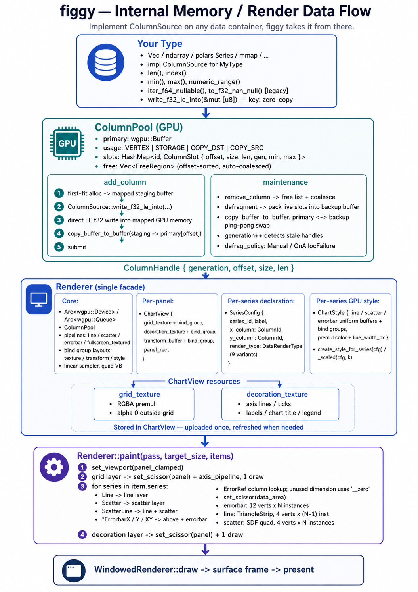
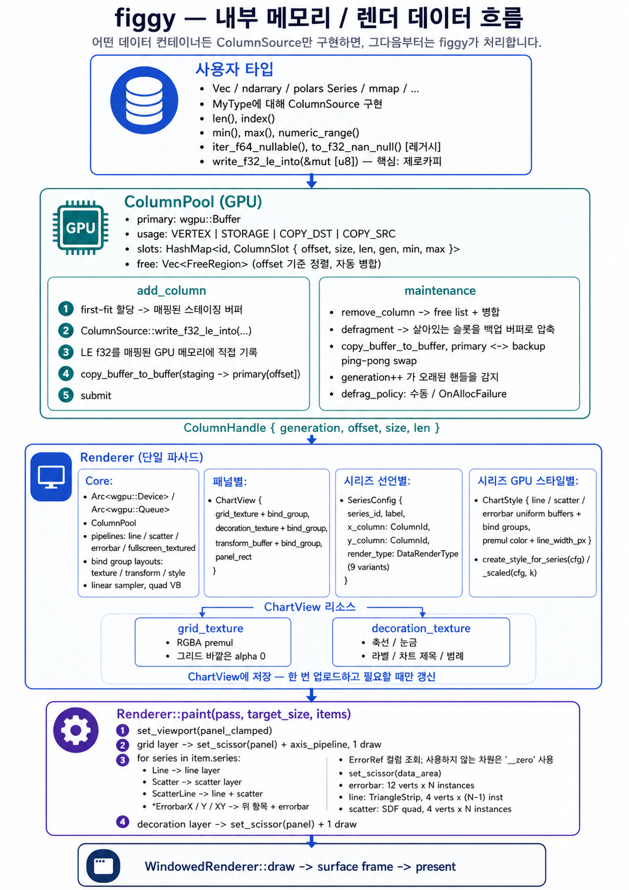

# figgy

Rust scientific chart library. **CPU skia (axes / labels / grid) + GPU wgpu (large data) hybrid** rendering.
Embed in egui / iced / winit / any other wgpu host.

> [한국어 문서](#한국어-문서) is available below.

- **GPU columnar pool**: all data columns share a single GPU buffer with first-fit alloc + ping-pong defrag on fragmentation.
- **Layered compositing**: grid → data → axis/label/legend, so grid never covers the data.
- **Headless PNG export**: GPU offscreen raster at arbitrary DPI → RGBA / PNG bytes in memory.
- **Single wgpu major (27)**: aligned with iced 0.14 + eframe 0.33 ecosystem.

---

## 1. Usage

### Adding the dependency

```toml
[dependencies]
figgy = { path = "..." }   # or git URL — currently 0.1.0, not on crates.io.
wgpu  = "27"
```

The library itself depends on neither winit, egui, nor iced. Pull in only the host you actually use:

```toml
# winit standalone
winit = "0.30"

# egui embedded
eframe    = { version = "0.33", default-features = false, features = ["wgpu"] }
egui      = "0.33"
egui-wgpu = "0.33"

# iced embedded
iced      = { version = "0.14", features = ["wgpu"] }
iced_wgpu = "0.14"
```

### Shortest standalone example (winit + figgy alone with wgpu)

```rust
use std::sync::Arc;
use figgy::{
    Chart, ChartDrawItem, DataLineStyleConfig, DataRenderType, Renderer, Series, SeriesConfig,
    color::Color, default, layout::{ChartArea, Rect}, line::LineStylePreset,
};

let window = Arc::new(event_loop.create_window(attrs).unwrap());
let size = window.inner_size();

// One-line setup — figgy owns instance/adapter/device/queue/surface/swap chain.
let mut renderer = Renderer::for_window(
    Arc::clone(&window),
    (size.width, size.height),
    16 * 1024 * 1024,   // 16 MiB GPU column pool
).unwrap();

// renderer.add_column takes `&dyn ColumnSource`.
// Implement the trait on your own type (see `ColumnSource` section below) — Vec, ndarray,
// polars Series, mmap, anything — and you get zero-copy upload. Built-in `Column<f64>` works too.
let xs: Vec<f64> = (0..1024).map(|i| i as f64 * 0.01).collect();
let ys: Vec<f64> = xs.iter().map(|x| x.sin()).collect();
renderer.add_column("x", &my_source_for(0, xs)).unwrap();   // your type : ColumnSource
renderer.add_column("y", &my_source_for(1, ys)).unwrap();

// Chart — builder pattern.
let mut config = default::default_config();
config.chart_area = ChartArea(Rect { x:8, y:8, width: size.width - 16, height: size.height - 16 });
let mut chart = Chart::new(config)
    .with_title("Sine")
    .with_x_title("x")
    .with_y_title("sin(x)");
chart.auto_fit_x(renderer.pool(), "x", 0.05).unwrap();
chart.auto_fit_y(renderer.pool(), "y", 0.10).unwrap();

// Series = SeriesConfig (declaration) + ChartStyle (GPU style auto-built from that declaration).
let cfg = SeriesConfig {
    series_id: "sin".into(), label: None,
    x_column: "x".into(), y_column: "y".into(),
    render_type: DataRenderType::Line {
        line: DataLineStyleConfig {
            line_style: LineStylePreset::Solid,
            line_color: Color::from_rgb8(20, 110, 230),
            line_width: 2.0,
        },
    },
};
let style = renderer.create_style_for_series(&cfg);            // SeriesConfig → ChartStyle
let view  = renderer.create_chart_view(&chart, chart.config().chart_area.0).unwrap();

// frame loop:
let series = [Series { config: &cfg, style: &style }];
let items  = [ChartDrawItem {
    view: &view,
    chart_config: chart.config(),
    series: &series,
}];
renderer.draw(Color::WHITE, &items).unwrap();   // acquire surface frame → encoder → pass → paint → submit → present
```

### `ColumnSource` — the data adapter trait

`Renderer::add_column` takes `&dyn ColumnSource` — implement the trait on any container of yours and the data lands in the GPU pool with zero copy (no intermediate `Vec` allocation).

```rust
pub trait ColumnSource {
    fn index(&self) -> usize;
    fn len(&self) -> usize;
    fn min(&self) -> f64;
    fn max(&self) -> f64;
    fn numeric_range(&self) -> Option<(f64, f64)>;
    fn iter_f64_nullable(&self) -> Box<dyn Iterator<Item = Option<f64>> + '_>;
    fn to_f32_nan_null(&self) -> Vec<f32>;          // legacy / non-zero-copy path

    /// **Key**: write little-endian f32 values directly into the GPU mapped staging buffer (`&mut [u8]`).
    /// Caller guarantees `dst.len() == self.len() * 4`. null → `f32::NAN`.
    fn write_f32_le_into(&self, dst: &mut [u8]);

    fn iter_f64_log_safe(&self) -> Box<dyn Iterator<Item = Option<f64>> + '_> { /* default */ }
}
```

**Built-in implementors**: `Column<f64>`, `Column<f32>`, `Column<Option<f64>>` (null → NaN).

**Custom — time series / DataFrame / mmap / FFI data, anything**:

```rust
struct MyTimeSeries {
    idx: usize,
    samples: Vec<f64>,    // or Arc<[f64]>, ndarray::ArrayView, polars::Series, ...
    cached_min: f64,
    cached_max: f64,
}

impl figgy::ColumnSource for MyTimeSeries {
    fn index(&self) -> usize { self.idx }
    fn len(&self) -> usize { self.samples.len() }
    fn min(&self) -> f64 { self.cached_min }
    fn max(&self) -> f64 { self.cached_max }
    fn numeric_range(&self) -> Option<(f64, f64)> {
        (!self.samples.is_empty()).then_some((self.cached_min, self.cached_max))
    }
    fn iter_f64_nullable(&self) -> Box<dyn Iterator<Item = Option<f64>> + '_> {
        Box::new(self.samples.iter().copied().map(Some))
    }
    fn to_f32_nan_null(&self) -> Vec<f32> {
        self.samples.iter().map(|&v| v as f32).collect()
    }
    fn write_f32_le_into(&self, dst: &mut [u8]) {
        debug_assert_eq!(dst.len(), self.samples.len() * 4);
        for (i, &v) in self.samples.iter().enumerate() {
            dst[i*4..i*4+4].copy_from_slice(&(v as f32).to_le_bytes());
        }
    }
}

renderer.add_column("temperature", &my_series)?;   // ↘ writes directly into mapped staging memory, zero Vec
```

If your container is already native `f32`, a single `bytemuck::cast_slice` lets you do `dst.copy_from_slice(...)` — even the conversion cost is zero.

### Three examples — sine / RC / cross-section

```bash
cargo run --example winit_simple
cargo run --example egui_embed   --features egui_demo
cargo run --example iced_embed   --features iced_demo
```

Each example shows:
- A 3-panel grid with different grid options (off / major / major + dotted minor)
- The RC panel renders 2 series (charging + discharging)
- Line widths of 1 / 2 / 3.5 px across panels
- Legends
- DPI input + Save PNG button (egui / iced) or `S` key (winit) → per-panel PNG bytes in memory → written by the example to `/tmp/figgy_*_panel_{i}.png`

### egui integration pattern (summary)

```rust
struct FiggyState { renderer: figgy::Renderer, panels: Vec<...> }

impl egui_wgpu::CallbackTrait for FiggyCallback {
    fn prepare(&self, _device, _queue, _screen, _enc, resources) -> Vec<...> {
        let state = resources.get_mut::<FiggyState>().unwrap();
        // dirty handling: refresh_axis / update_transform
        Vec::new()
    }
    fn paint(&self, info, render_pass, resources) {
        let state = resources.get::<FiggyState>().unwrap();
        let target = (info.screen_size_px[0], info.screen_size_px[1]);
        state.renderer.paint(render_pass, target, &items).unwrap();
    }
}
```

Full version: [examples/egui_embed.rs](examples/egui_embed.rs).

### iced integration pattern

`iced_wgpu::primitive::Pipeline` (one-time init) + `shader::Primitive` (per frame) — keep figgy's `Renderer` inside the Pipeline, call `renderer.paint(pass, ...)` from `draw`. See [examples/iced_embed.rs](examples/iced_embed.rs).

### PNG export (memory only — saving is the caller's job)

```rust
let bytes = renderer.export_panel_png_bytes(&chart, &series_configs, scale)?;
std::fs::write("/tmp/out.png", &bytes)?;          // or clipboard / network / wherever.

// If you only need RGBA:
let img = renderer.export_panel_rgba(&chart, &series_configs, scale)?;
// img.width, img.height, img.rgba (straight alpha, length = w * h * 4)
```

`scale` bounds: `figgy::MIN_EXPORT_SCALE` (0.25) ~ `figgy::MAX_EXPORT_SCALE` (8.0), automatically clamped.
Convert from standard 96 DPI via `figgy::dpi_to_scale(dpi)`.

When scaling, every pixel-based dimension (font / line / margin / grid / legend) scales proportionally → the visual is identical, just denser pixels.

---

## 2. Config struct field reference

```rust
pub struct Config {
    pub chart_area: ChartArea,           // panel pixel rect (inside the host viewport)
    pub chart: Chart,                    // chart_id + ChartType
    pub top_x: AxisOptions,              // 4-side axes — top/right labels & titles disabled by default
    pub bottom_x: AxisOptions,
    pub left_y: AxisOptions,
    pub right_y: AxisOptions,
    pub chart_title: ChartTitleOptions,
    pub grid: GridOptions,
    pub legend: Legend,
}
```

### `ChartArea` / `Rect`
| Field | Type | Meaning |
|---|---|---|
| `x, y` | u32 | Top-left pixel position relative to the host surface |
| `width, height` | u32 | Panel pixel size. 0 → raster fails (`InvalidChartArea`) |

### `AxisOptions` (top_x / bottom_x / left_y / right_y)
| Field | Type | Meaning |
|---|---|---|
| `scale` | `AxisScale` | `Linear` or `Logarithmic` (log10) |
| `min, max` | f64 | Data-space range. Must be positive for log scale |
| `major_spacing` | f64 | linear: data units; log: decade step (1, 2, …) |
| `minor_count` | usize | minors per major (linear) or sub-decade 2..9 (8 recommended for log) |
| `inverted` | bool | (reserved, not implemented) |
| `label_style` | `LabelStyle` | Tick-label styling |
| `tick` | `TickVisibility` | `None / Outside / Inside / Both` |
| `title_option` | `AxisTitleOptions` | Axis title text / visibility / offset |
| `out_margin` | f32 | Outer (label + title band) pixel margin |
| `line_visible / color / width / style` | mixed | Axis line appearance |
| `major_tick_length / minor_tick_length` | f32 | Tick mark length (px) |

### `LabelStyle`
| Field | Type | Meaning |
|---|---|---|
| `visible` | bool | Overall label visibility |
| `color` | `Color` | Label color |
| `font_size` | f32 | px |
| `label_visible` | bool | Number labels themselves (separate from `visible`, e.g. show the axis but hide labels) |
| `label_font` | String | Font family. Empty string → bundled Liberation Sans |
| `label_offset_x / y` | f32 | Fine nudge offset (px) |
| `format` | `LabelFormat` | `Decimal / Power / Scientific` (Power recommended for log) |
| `significant_digits` | u8 | |

### `AxisTitleOptions` / `ChartTitleOptions`
| Field | Type | Meaning |
|---|---|---|
| `text` | `RichText` | greek / sub/super / bold/italic styled segments |
| `visible` | bool | |
| `offset_x / y` | f32 | nudge |
| `top_margin` | f32 | (chart_title only) chart-title band height |

### `GridOptions`
| Field | Type | Meaning |
|---|---|---|
| `show_major_x/y` | bool | Major grid lines |
| `major_x/y_color, _width, _style` | mixed | Major line appearance (Solid / Dash / Dot, 11 presets) |
| `show_minor_x/y` | bool | Minor grid lines |
| `minor_x/y_color, _width, _style` | mixed | Minor line appearance |

### `Legend` / `LegendEntry`
| Field | Type | Meaning |
|---|---|---|
| `visible` | bool | |
| `entries` | `Vec<LegendEntry>` | Per row: `label`, `color`, `line_width`, `kind: Line / Scatter / LineScatter` |
| `corner` | `LegendCorner` | `TopLeft / TopRight / BottomLeft / BottomRight` |
| `padding` | f32 | data_area inner-corner inset + box internal padding |
| `font_size` | f32 | Label font size |
| `line_height` | f32 | Per-entry row height |
| `sample_width` | f32 | Left-side color sample (line/dot) width |
| `sample_text_gap` | f32 | sample ↔ label gap |
| `bg_color, border_color` | `Color` | Box background / border |

### `data_config` — declarative series schema (the active API)

Series are declared via `data_config::SeriesConfig`. `Renderer::paint` branches on the `render_type` enum to spawn line / scatter / errorbar layers automatically; colors, widths, and shapes are also extracted from the matching sub-style.

| Type | Fields | Role |
|---|---|---|
| `SeriesConfig` | `series_id, label, x_column: ColumnId, y_column: ColumnId, render_type` | Full series declaration. `x_column / y_column` are pool-registered ids |
| `DataRenderType` | enum, 9 variants | One independent draw path per variant. Optional struct merging avoided |
| `ErrorRef` | `Symmetric { column }` or `Asymmetric { lower, upper }` | Errorbar column reference. Symmetric = ±σ, Asymmetric = lower/upper split |
| `DataLineStyleConfig` | `line_style, line_color, line_width` | Line appearance |
| `DataScatterStyleConfig` | `point_color, point_shape, point_size` | Point appearance |
| `DataErrorBarStyleConfig` | `error_bar_color, _width, _cap_size, cap_width` | Errorbar appearance |
| `ScatterShape` | enum, 9 variants | Circle / Square / Triangle / Diamond / Cross + filled variants |

**The 9 `DataRenderType` variants**:

| Variant | Sub-styles used | Meaning |
|---|---|---|
| `Line { line }` | line | Line only |
| `Scatter { scatter }` | scatter | Points only |
| `ScatterLine { scatter, line }` | both | Points + connecting line |
| `ScatterErrorbarX { scatter, err_x, err_style }` | scatter + errorbar | Points + X errorbars |
| `ScatterErrorbarY { scatter, err_y, err_style }` | scatter + errorbar | Points + Y errorbars |
| `ScatterErrorbarXY { scatter, err_x, err_y, err_style }` | scatter + errorbar | Points + X/Y errorbars |
| `LineScatterErrorbarX / Y / XY` | line + scatter + errorbar | The above + connecting line |

**`Renderer::create_style_for_series(cfg)`** extracts color/width/shape from `cfg.render_type`'s sub-styles and builds a GPU `ChartStyle` for screen paint. For export, `create_style_for_series_scaled(cfg, scale)` scales pixel widths only.

**Single-direction errorbar** (`ScatterErrorbarY` etc.): you must pre-register a zero-filled column under id `__zero` to fill the unused dimension. Without it, paint returns `FiggyError::UnknownColumn`. (Symmetric variants automatically reuse the same column for lo/hi — no special handling needed.)

### `Config::scaled(scale)` / `Config::scale_in_place(s)`
Multiplies every pixel-based dim by `scale`. `min/max/major_spacing`, scale enum, and colors are untouched. Used for resolution-invariant high-DPI export.

### Default builder — `figgy::default::default_config()`
- bottom_x / left_y: axis line + ticks + labels + title enabled, text starts as empty segments.
- top_x / right_y: axis line only, labels + title disabled, `out_margin = 8` (narrow gap).
- chart_title: visible, `top_margin = 32`, text empty.
- grid: major only, light gray.
- legend: disabled.

Empty text is filled in via the `Chart::with_title / with_x_title / with_y_title / with_legend_entry` builders.

---

## 3. Internal memory data flow



> Source: `assets/architecture-en.png` — covers the path from a user's `ColumnSource` through `ColumnPool` and `Renderer`, plus the per-panel `ChartView` / `ChartStyle` resources and the grid → data → decoration paint order.

### Dirty flags

`Chart` tracks two kinds of dirtiness:

| Flag | Triggers | Handling |
|---|---|---|
| `data_dirty` | `set_x/y_range`, `auto_fit_*`, `invalidate()`, chart_area change, first frame | `Renderer::update_transform` (one UB write) |
| `raster_dirty` | Decoration changes (`with_title`, decoration fields, …), chart_area change, first frame | `Renderer::refresh_axis` (re-rasterizes both grid + decoration textures, re-uploads, also refreshes the transform) |

Caller per frame:
```rust
if chart.consume_raster_dirty() { renderer.refresh_axis(view, chart, panel_rect)?; }
else if chart.consume_data_dirty() { renderer.update_transform(view, chart); }
```

### Log scale on the GPU

When `AxisOptions.scale = Logarithmic`:
- CPU: `scatter_transform_from_config` pre-converts `data_min/max` to log10 and sets `scale_log[2] = 1.0`.
- GPU shader: `mix(v, log10(v), is_log)` — branch-free ALU.

### Export pipeline

```
export_panel_rgba(chart, &[SeriesConfig], scale):
    scale ← clamp_export_scale(scale)         // [MIN_EXPORT_SCALE, MAX_EXPORT_SCALE]
    chart.config().scaled(scale)               // every pixel dim scaled proportionally
        ↓
    temp ChartView (scaled axis textures)
    temp ChartStyles ← create_style_for_series_scaled(cfg, scale) per cfg
        ↓
    offscreen wgpu::Texture (surface_format, COPY_SRC, transparent clear)
    paint(items) — same compositing order (grid → data → decoration)
        ↓
    copy_texture_to_buffer (256-byte aligned padding)
        ↓
    map_async + Wait poll
        ↓
    BGRA→RGBA channel swap, premul→straight α conversion, padding row removed
        ↓
    RasterImage { width, height, rgba: Vec<u8> }   ← API return
        ↓
    encode_png(&img) → Vec<u8>                      ← PNG bytes
        ↓
    Caller decides: std::fs::write / clipboard / network / ...
```

---

## License / fonts

Bundled font: Liberation Sans (SIL OFL 1.1) — `fonts/LICENSE-LiberationSans.txt`.

---

<a id="한국어-문서"></a>

# figgy (한국어 문서)

Rust 과학 차트 라이브러리. **CPU skia (축 / 라벨 / 그리드) + GPU wgpu (대량 데이터) 하이브리드** 렌더링.
egui / iced / winit / 기타 wgpu 호스트 어디든 임베드 가능.

- **GPU columnar pool**: 모든 데이터 컬럼을 하나의 GPU buffer 에 first-fit + 단편화 시 핑퐁 defrag.
- **분리 합성**: grid → data → axis/label/legend 순으로 합성 → 그리드가 데이터를 가리지 않음.
- **헤드리스 PNG export**: 임의 DPI 로 GPU offscreen 라스터 → 메모리 RGBA / PNG 바이트 반환.
- **단일 wgpu 메이저 (27)**: iced 0.14 + eframe 0.33 ecosystem 정렬.

---

## 1. 사용법

### 의존성 추가

```toml
[dependencies]
figgy = { path = "..." }   # 또는 git URL — 현재 0.1.0, crates.io 미배포.
wgpu  = "27"
```

라이브러리 자체는 winit / egui / iced 어느 것에도 의존하지 않습니다. 사용하는 호스트만 추가:

```toml
# winit standalone
winit = "0.30"

# egui 임베드
eframe    = { version = "0.33", default-features = false, features = ["wgpu"] }
egui      = "0.33"
egui-wgpu = "0.33"

# iced 임베드
iced      = { version = "0.14", features = ["wgpu"] }
iced_wgpu = "0.14"
```

### 가장 짧은 standalone 예 (winit + figgy 단독 wgpu)

```rust
use std::sync::Arc;
use figgy::{
    Chart, ChartDrawItem, DataLineStyleConfig, DataRenderType, Renderer, Series, SeriesConfig,
    color::Color, default, layout::{ChartArea, Rect}, line::LineStylePreset,
};

let window = Arc::new(event_loop.create_window(attrs).unwrap());
let size = window.inner_size();

// 한 줄 셋업 — instance/adapter/device/queue/surface/swap chain 모두 figgy 가 소유.
let mut renderer = Renderer::for_window(
    Arc::clone(&window),
    (size.width, size.height),
    16 * 1024 * 1024,   // GPU column pool 16 MiB
).unwrap();

// renderer.add_column 은 `&dyn ColumnSource` 받음.
// 본인 데이터 타입에 trait 구현 (아래 `ColumnSource` 섹션 참조) — Vec, ndarray,
// polars Series, mmap 등 어떤 출처든 zero-copy 업로드. 빌트인 `Column<f64>` 도 사용 가능.
let xs: Vec<f64> = (0..1024).map(|i| i as f64 * 0.01).collect();
let ys: Vec<f64> = xs.iter().map(|x| x.sin()).collect();
renderer.add_column("x", &my_source_for(0, xs)).unwrap();   // your type : ColumnSource
renderer.add_column("y", &my_source_for(1, ys)).unwrap();

// Chart — 빌더 패턴.
let mut config = default::default_config();
config.chart_area = ChartArea(Rect { x:8, y:8, width: size.width - 16, height: size.height - 16 });
let mut chart = Chart::new(config)
    .with_title("Sine")
    .with_x_title("x")
    .with_y_title("sin(x)");
chart.auto_fit_x(renderer.pool(), "x", 0.05).unwrap();
chart.auto_fit_y(renderer.pool(), "y", 0.10).unwrap();

// 시리즈 = SeriesConfig (선언) + ChartStyle (그 선언에서 자동 빌드된 GPU 스타일).
let cfg = SeriesConfig {
    series_id: "sin".into(), label: None,
    x_column: "x".into(), y_column: "y".into(),
    render_type: DataRenderType::Line {
        line: DataLineStyleConfig {
            line_style: LineStylePreset::Solid,
            line_color: Color::from_rgb8(20, 110, 230),
            line_width: 2.0,
        },
    },
};
let style = renderer.create_style_for_series(&cfg);            // SeriesConfig → ChartStyle
let view  = renderer.create_chart_view(&chart, chart.config().chart_area.0).unwrap();

// frame loop:
let series = [Series { config: &cfg, style: &style }];
let items  = [ChartDrawItem {
    view: &view,
    chart_config: chart.config(),
    series: &series,
}];
renderer.draw(Color::WHITE, &items).unwrap();   // surface frame 획득 → encoder → pass → paint → submit → present
```

### `ColumnSource` — 데이터 어댑터 trait

`Renderer::add_column` 의 시그니처는 `&dyn ColumnSource` 입니다 — 어떤 데이터 컨테이너든 본인 타입에 trait 구현하면 GPU pool 에 zero-copy 로 들어갑니다 (`Vec` 중간 alloc 0).

```rust
pub trait ColumnSource {
    fn index(&self) -> usize;
    fn len(&self) -> usize;
    fn min(&self) -> f64;
    fn max(&self) -> f64;
    fn numeric_range(&self) -> Option<(f64, f64)>;
    fn iter_f64_nullable(&self) -> Box<dyn Iterator<Item = Option<f64>> + '_>;
    fn to_f32_nan_null(&self) -> Vec<f32>;          // legacy / 비-zero-copy 경로

    /// **핵심**: GPU mapped staging buffer 의 `&mut [u8]` 에 little-endian f32 로 직접 채움.
    /// 호출자는 `dst.len() == self.len() * 4` 보장. null → `f32::NAN`.
    fn write_f32_le_into(&self, dst: &mut [u8]);

    fn iter_f64_log_safe(&self) -> Box<dyn Iterator<Item = Option<f64>> + '_> { /* default */ }
}
```

**빌트인 구현체**: `Column<f64>`, `Column<f32>`, `Column<Option<f64>>` (null → NaN).

**사용자 정의 — 시계열 / DataFrame / mmap / FFI 데이터 등 어떤 출처든**:

```rust
struct MyTimeSeries {
    idx: usize,
    samples: Vec<f64>,    // 또는 Arc<[f64]>, ndarray::ArrayView, polars::Series, ...
    cached_min: f64,
    cached_max: f64,
}

impl figgy::ColumnSource for MyTimeSeries {
    fn index(&self) -> usize { self.idx }
    fn len(&self) -> usize { self.samples.len() }
    fn min(&self) -> f64 { self.cached_min }
    fn max(&self) -> f64 { self.cached_max }
    fn numeric_range(&self) -> Option<(f64, f64)> {
        (!self.samples.is_empty()).then_some((self.cached_min, self.cached_max))
    }
    fn iter_f64_nullable(&self) -> Box<dyn Iterator<Item = Option<f64>> + '_> {
        Box::new(self.samples.iter().copied().map(Some))
    }
    fn to_f32_nan_null(&self) -> Vec<f32> {
        self.samples.iter().map(|&v| v as f32).collect()
    }
    fn write_f32_le_into(&self, dst: &mut [u8]) {
        debug_assert_eq!(dst.len(), self.samples.len() * 4);
        for (i, &v) in self.samples.iter().enumerate() {
            dst[i*4..i*4+4].copy_from_slice(&(v as f32).to_le_bytes());
        }
    }
}

renderer.add_column("temperature", &my_series)?;   // ↘ mapped staging memory 에 직접 write, Vec 0
```

`f32` 네이티브 컨테이너면 `bytemuck::cast_slice` 한 줄로 `dst.copy_from_slice(...)` 가능 — 변환 비용도 0.

### example 3 종 — 사인 / RC / cross-section

```bash
cargo run --example winit_simple
cargo run --example egui_embed   --features egui_demo
cargo run --example iced_embed   --features iced_demo
```

각 example 은:
- 3 panel grid (그리드 옵션 다름: 끔 / major / major+minor 점선)
- RC panel 은 충전 + 방전 2 시리즈
- 라인 두께 1 / 2 / 3.5 px 차등
- 범례 표시
- DPI 입력 + Save PNG 버튼 (egui / iced) 또는 `S` 키 (winit) 으로 panel 별 PNG 메모리 export → `/tmp/figgy_*_panel_{i}.png`

### egui 통합 패턴 (요약)

```rust
struct FiggyState { renderer: figgy::Renderer, panels: Vec<...> }

impl egui_wgpu::CallbackTrait for FiggyCallback {
    fn prepare(&self, _device, _queue, _screen, _enc, resources) -> Vec<...> {
        let state = resources.get_mut::<FiggyState>().unwrap();
        // dirty 처리: refresh_axis / update_transform
        Vec::new()
    }
    fn paint(&self, info, render_pass, resources) {
        let state = resources.get::<FiggyState>().unwrap();
        let target = (info.screen_size_px[0], info.screen_size_px[1]);
        state.renderer.paint(render_pass, target, &items).unwrap();
    }
}
```

자세한 건 [examples/egui_embed.rs](examples/egui_embed.rs).

### iced 통합 패턴

`iced_wgpu::primitive::Pipeline` (1회 init) + `shader::Primitive` (frame 별) — figgy 의 `Renderer` 를 Pipeline 안에 보관, draw 에서 `renderer.paint(pass, ...)`. [examples/iced_embed.rs](examples/iced_embed.rs).

### PNG export (메모리 only — 저장은 caller)

```rust
let bytes = renderer.export_panel_png_bytes(&chart, &series_configs, scale)?;
std::fs::write("/tmp/out.png", &bytes)?;          // 또는 clipboard / network 등 자유.

// RGBA 만 필요하면:
let img = renderer.export_panel_rgba(&chart, &series_configs, scale)?;
// img.width, img.height, img.rgba (straight alpha, 길이 = w * h * 4)
```

`scale` 한계: `figgy::MIN_EXPORT_SCALE` (0.25) ~ `figgy::MAX_EXPORT_SCALE` (8.0) 자동 clamp.
`figgy::dpi_to_scale(dpi)` 로 표준 DPI(96) 기준 변환.

스케일 시 모든 픽셀 dim (폰트 / 선 / 마진 / 그리드 / 범례) 비례 확대 → 시각적 동치, 픽셀만 더 촘촘.

---

## 2. Config 구조체 필드 레퍼런스

```rust
pub struct Config {
    pub chart_area: ChartArea,           // 패널 픽셀 영역 (호스트 viewport 안)
    pub chart: Chart,                    // chart_id + ChartType
    pub top_x: AxisOptions,              // 4 변 축 — 디폴트는 top/right 라벨/타이틀 비활성
    pub bottom_x: AxisOptions,
    pub left_y: AxisOptions,
    pub right_y: AxisOptions,
    pub chart_title: ChartTitleOptions,
    pub grid: GridOptions,
    pub legend: Legend,
}
```

### `ChartArea` / `Rect`
| 필드 | 타입 | 의미 |
|---|---|---|
| `x, y` | u32 | 호스트 surface 좌상단 기준 패널 픽셀 위치 |
| `width, height` | u32 | 패널 픽셀 크기. 0 이면 raster 실패 (`InvalidChartArea`) |

### `AxisOptions` (top_x / bottom_x / left_y / right_y)
| 필드 | 타입 | 의미 |
|---|---|---|
| `scale` | `AxisScale` | `Linear` 또는 `Logarithmic` (log10) |
| `min, max` | f64 | 데이터 공간 범위. log scale 시 양수만 |
| `major_spacing` | f64 | linear: 데이터 단위, log: decade 단위 (1, 2, …) |
| `minor_count` | usize | major 사이 minor 개수 (linear) 또는 decade 내 2..9 (log 시 8 추천) |
| `inverted` | bool | (예약, 미구현) |
| `label_style` | `LabelStyle` | 눈금 라벨 스타일 |
| `tick` | `TickVisibility` | `None / Outside / Inside / Both` |
| `title_option` | `AxisTitleOptions` | 축 타이틀 텍스트 / 가시성 / 오프셋 |
| `out_margin` | f32 | 축 바깥쪽 (라벨+타이틀 band) 픽셀 마진 |
| `line_visible / color / width / style` | mixed | 축 선 외형 |
| `major_tick_length / minor_tick_length` | f32 | tick 길이 (px) |

### `LabelStyle`
| 필드 | 타입 | 의미 |
|---|---|---|
| `visible` | bool | 라벨 표시 여부 (overall) |
| `color` | `Color` | 라벨 색 |
| `font_size` | f32 | px |
| `label_visible` | bool | 숫자 라벨 자체 표시 여부 (visible 과 별개로 axis 자체는 켜고 라벨만 끄기) |
| `label_font` | String | 폰트 패밀리. 빈 문자열 → 번들 Liberation Sans |
| `label_offset_x / y` | f32 | nudge용 미세 오프셋 (px) |
| `format` | `LabelFormat` | `Decimal / Power / Scientific` (log scale 권장: Power) |
| `significant_digits` | u8 | 유효 숫자 |

### `AxisTitleOptions` / `ChartTitleOptions`
| 필드 | 타입 | 의미 |
|---|---|---|
| `text` | `RichText` | greek / sub/super / bold/italic 등 styled segments |
| `visible` | bool | |
| `offset_x / y` | f32 | nudge |
| `top_margin` | f32 | (chart_title only) 차트 타이틀 band 높이 |

### `GridOptions`
| 필드 | 타입 | 의미 |
|---|---|---|
| `show_major_x/y` | bool | major 그리드 라인 |
| `major_x/y_color, _width, _style` | mixed | major 라인 외형 (Solid / Dash / Dot 등 11 종 preset) |
| `show_minor_x/y` | bool | minor 그리드 라인 |
| `minor_x/y_color, _width, _style` | mixed | minor 라인 외형 |

### `Legend` / `LegendEntry`
| 필드 | 타입 | 의미 |
|---|---|---|
| `visible` | bool | |
| `entries` | `Vec<LegendEntry>` | 각 줄: `label`, `color`, `line_width`, `kind: Line / Scatter / LineScatter` |
| `corner` | `LegendCorner` | `TopLeft / TopRight / BottomLeft / BottomRight` |
| `padding` | f32 | data_area 안쪽 모서리 inset + 박스 내부 padding |
| `font_size` | f32 | 라벨 폰트 |
| `line_height` | f32 | 한 엔트리 줄 높이 |
| `sample_width` | f32 | 좌측 색 sample (선/점) 너비 |
| `sample_text_gap` | f32 | sample ↔ 라벨 갭 |
| `bg_color, border_color` | `Color` | 박스 배경 / 테두리 |

### `data_config` — series 선언형 스키마 (활성 API)

차트별 시리즈는 모두 `data_config::SeriesConfig` 로 선언. `Renderer::paint` 가 `render_type` enum 변종으로 분기해 line / scatter / errorbar layer 를 자동 생성, 색·두께·shape 등 모든 시각 속성도 sub-style 에서 추출.

| 타입 | 필드 | 역할 |
|---|---|---|
| `SeriesConfig` | `series_id, label, x_column: ColumnId, y_column: ColumnId, render_type` | 한 시리즈의 모든 선언. `x_column / y_column` 은 pool 에 등록된 id |
| `DataRenderType` | 9 변종 enum | 변종별 독립 draw path. 옵셔널 struct 안 합침 |
| `ErrorRef` | `Symmetric { column }` 또는 `Asymmetric { lower, upper }` | 에러바 컬럼 참조. Symmetric 은 ±σ, Asymmetric 은 lower/upper 분리 |
| `DataLineStyleConfig` | `line_style, line_color, line_width` | 라인 외형 |
| `DataScatterStyleConfig` | `point_color, point_shape, point_size` | 점 외형 |
| `DataErrorBarStyleConfig` | `error_bar_color, _width, _cap_size, cap_width` | 에러바 외형 |
| `ScatterShape` | enum 9 변종 | Circle / Square / Triangle / Diamond / Cross + filled 변형 |

**`DataRenderType` 변종 9 개**:

| 변종 | 사용 sub-style | 의미 |
|---|---|---|
| `Line { line }` | line | 라인만 |
| `Scatter { scatter }` | scatter | 점만 |
| `ScatterLine { scatter, line }` | 둘 다 | 점 + 연결선 |
| `ScatterErrorbarX { scatter, err_x, err_style }` | scatter + errorbar | 점 + X 에러바 |
| `ScatterErrorbarY { scatter, err_y, err_style }` | scatter + errorbar | 점 + Y 에러바 |
| `ScatterErrorbarXY { scatter, err_x, err_y, err_style }` | scatter + errorbar | 점 + X/Y 에러바 |
| `LineScatterErrorbarX / Y / XY` | line + scatter + errorbar | 위 3 + 연결선 |

**`Renderer::create_style_for_series(cfg)`** 가 `cfg.render_type` 의 sub-style 에서 색/두께/shape 자동 추출 → GPU `ChartStyle` 빌드. 화면 paint 시 사용. export 는 `create_style_for_series_scaled(cfg, scale)` 로 두께만 픽셀 스케일.

**한쪽 차원만 errorbar 시** (`ScatterErrorbarY` 등): 반대 차원 fill 용으로 `__zero` id 의 zero column 을 사전 등록 필요. 미등록 시 `FiggyError::UnknownColumn`. (Symmetric 변종은 같은 컬럼을 lo/hi 양쪽에 자동 사용 — 별도 처리 X.)

### `Config::scaled(scale)` / `Config::scale_in_place(s)`
모든 픽셀 dim 을 `scale` 배. `min/max/major_spacing`, scale enum, 색은 무변경. 고해상도 export 시 시각적 동치 보장.

### 기본값 빌더 — `figgy::default::default_config()`
- bottom_x / left_y: 축선 + 눈금 + 라벨 + 타이틀 활성, 텍스트는 빈 segments.
- top_x / right_y: 축선만, 라벨 + 타이틀 비활성, `out_margin = 8` (좁은 gap).
- chart_title: visible, top_margin 32, 텍스트 빈 segments.
- grid: major 만 활성, 옅은 회색.
- legend: 비활성.

빈 텍스트는 `Chart::with_title / with_x_title / with_y_title / with_legend_entry` 빌더로 채움.

---

## 3. 내부 메모리 데이터 흐름



> 출처: `assets/architecture-kr.png` — 사용자 `ColumnSource` 부터 `ColumnPool`, `Renderer` 까지의 흐름 + panel 별 `ChartView` / `ChartStyle` 자원 + grid → data → decoration 합성 순서.

### 더티 플래그

`Chart` 가 두 종류의 dirty 추적:

| 플래그 | 트리거 | 처리 |
|---|---|---|
| `data_dirty` | `set_x/y_range`, `auto_fit_*`, `invalidate()`, chart_area 변경, 첫 frame | `Renderer::update_transform` (UB 1회 write) |
| `raster_dirty` | 데코레이션 변경 (`with_title`, decoration field 등), chart_area 변경, 첫 frame | `Renderer::refresh_axis` (grid + decoration 두 텍스처 모두 재라스터 + 업로드 + transform 도 갱신) |

호출자 매 frame:
```rust
if chart.consume_raster_dirty() { renderer.refresh_axis(view, chart, panel_rect)?; }
else if chart.consume_data_dirty() { renderer.update_transform(view, chart); }
```

### Log scale GPU 처리

`AxisOptions.scale = Logarithmic` 시:
- CPU: `scatter_transform_from_config` 가 `data_min/max` 를 log10 으로 미리 변환, `scale_log[2] = 1.0`.
- GPU shader: `mix(v, log10(v), is_log)` — 분기 없이 ALU로 처리.

### Export 파이프라인

```
export_panel_rgba(chart, &[SeriesConfig], scale):
    scale ← clamp_export_scale(scale)         // [MIN_EXPORT_SCALE, MAX_EXPORT_SCALE]
    chart.config().scaled(scale)               // 픽셀 dim 모두 비례 확대
        ↓
    임시 ChartView (스케일된 axis 텍스처)
    임시 ChartStyle 들 ← create_style_for_series_scaled(cfg, scale) per cfg
        ↓
    offscreen wgpu::Texture (surface_format, COPY_SRC, transparent clear)
    paint(items) — 동일 합성 순서 (grid → data → decoration)
        ↓
    copy_texture_to_buffer (256 byte 정렬 padding)
        ↓
    map_async + Wait poll
        ↓
    BGRA→RGBA channel swap, premul→straight α 변환, 패딩 행 제거
        ↓
    RasterImage { width, height, rgba: Vec<u8> }   ← API 반환
        ↓
    encode_png(&img) → Vec<u8>                      ← PNG 바이트
        ↓
    호출자가 std::fs::write / clipboard / 네트워크 등 자유 처리
```

---

## 라이선스 / 폰트

번들 폰트: Liberation Sans (SIL OFL 1.1) — `fonts/LICENSE-LiberationSans.txt`.
