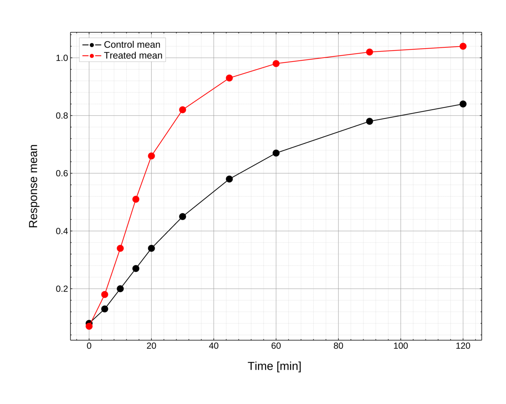
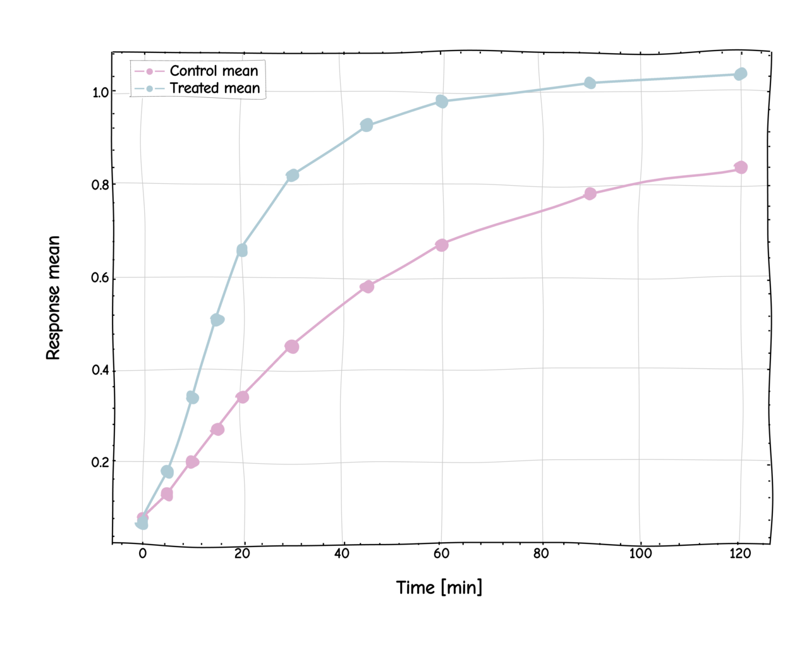
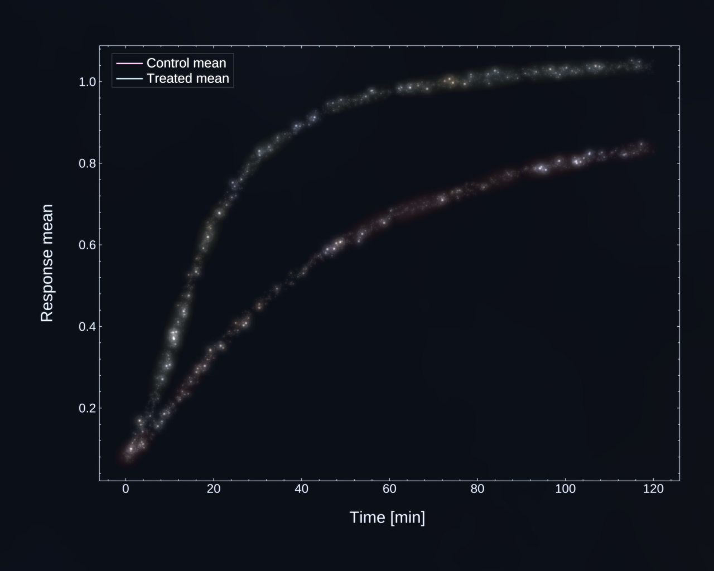
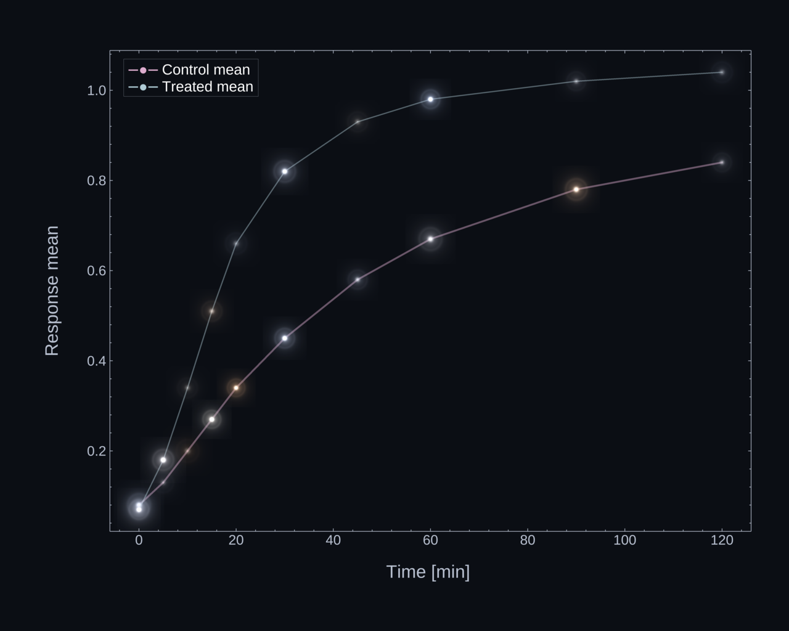
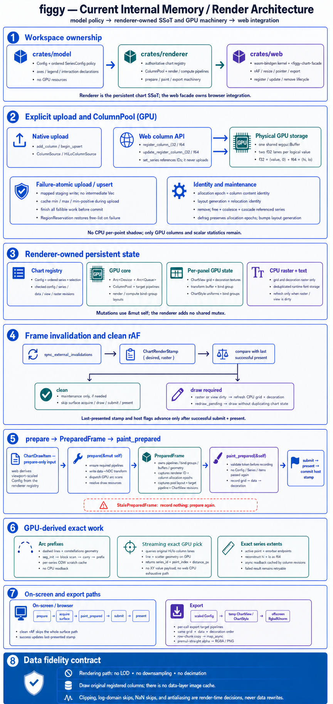
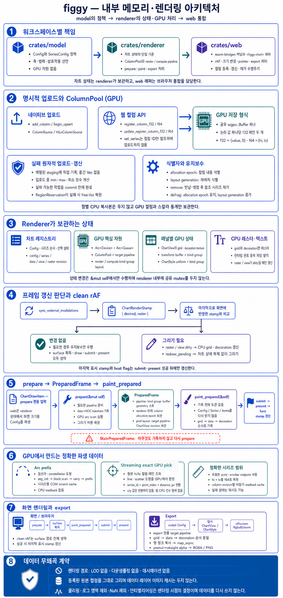

# figgy

Rust scientific chart library. **CPU raster (axes / labels / grid — tiny-skia + swash) + GPU wgpu (large data) hybrid** rendering.
Embed in egui / iced / winit / any other wgpu host.

> [한국어 문서](#한국어-문서) is available below.

> This is the workspace root README. The workspace has three crates:
> **`crates/model`** — the pure chart model and schema authority: option/data SSoT (`Config`, `SeriesConfig`), the rich-text/legend document model, interaction policies (`Selectable`/`Draggable`/`Resizable`, `HitMap`, the single `Config::nudge` movement path), presets (`AxisPreset`, `ColorCycle`). Dependency-free; optional `serde` feature.
> **`crates/renderer`** — the wgpu + CPU-raster machinery documented below. It also provides a renderer-owned chart registry (`ChartId` → `Config`, ordered `SeriesConfig`, selection, checked revisions) for persistent hosts such as the web wrapper. Depends on `model` and re-exports every module, so all `renderer::…` paths keep working unchanged.
> **`crates/web`** — the browser package (`figgy`): public `<figgy-chart>` Custom Element facade plus a raw `FiggyChart` wasm kernel as an advanced escape hatch. The facade owns the shadow canvas, ready promise/event lifecycle, rAF loop, ResizeObserver/DPR handling, pointer mapping, export busy gate, and id-keyed register/unregister lifecycle. Browser I/O: [WASM.md](crates/renderer/WASM.md) · full Config JSON schema: [SCHEMA.md](crates/web/SCHEMA.md). Build artifacts (`crates/web/pkg/`) are gitignored — build with `npx wasm-pack build crates/web --release --target web`.
> **Online studio** — [figgyplot.com](https://figgyplot.com/) hosts the public web editor. It runs in-browser with local chart data, imports CSV/TSV/Excel, opens `.figgy` project files, and exports PNGs from the same wasm/WebGPU surface.

- **GPU columnar pool**: all data columns share a single GPU buffer with first-fit alloc + ping-pong defrag on fragmentation. Logical values are stored as f32 hi/lo pairs when uploaded through `HiLoColumnSource`, preserving timestamp-sized offsets on the GPU. Upload caches scalar stats (min / max / smallest-positive) for auto-fit; per-point geometry such as the dashed-line arc-length prefix is computed in place by a compute scan (`line_arc.wgsl`).
- **Layered compositing**: grid → data → axis/label/legend, so grid never covers the data. Axis raster can be produced as `Grid` and `Decoration` layers; `AxisLayerKind::All` remains a legacy single-pass helper.
- **Data fidelity contract**: renderer/web consume the model contract without silently changing original coordinates, provenance, or axis↔data correspondence. Explicit clipping, log-domain skips, NaN skips, and antialiasing limits are rendering contracts rather than data rewrites.
- **Headless PNG export**: GPU offscreen raster at arbitrary DPI → RGBA / PNG bytes in memory (async-first; blocking wrappers on native).
- **Interaction layer (opt-in)**: hit-testing, selection boxes, drag (axes constrained to their perpendicular, detached-axis `line_offset`), PPT-style 8-handle resize of the data area — all policy in `model`, fed by host pointer events; never runs if you don't wire it.
- **Data picking (opt-in)**: picking is defined against the original series primitives, not the final styled/rasterized pixels. Scatter tests source data-point positions with the configured marker hit radius; line tests each straight segment between adjacent source-data points and snaps to the nearer endpoint. Dash off-gaps, cap rasterization, and decorative draw-style displacement do not alter the pick path. The async web result is `{ source_id: string | null, series_id, point_index, distance_px }`; hosts use `point_index` to read coordinates from their registered source data. Errorbar stems/caps are not pick targets. Picked-point decoration is driven back through `Config.picked_points` so UI state stays outside the renderer.
- **Per-point style mapping (opt-in)**: precise scatter can bind `point_style_table` / `point_style_index_column` / `point_style_overrides`; precise errorbars can independently bind `error_bar_style_table` / `error_bar_style_index_column` / `error_bar_style_overrides`. Styled modes keep their own visual shaders and ignore these mappings.
- **Rich-text everywhere**: titles, tick labels, and the legend share one engine — per-segment bold/italic/underline/sub/superscript/greek, per-segment color & size overrides, `'\n'` line breaks, `'\t'` table columns, fixed-width legend symbol fields.
- **Hand-drawn sketch mode (opt-in)**: `draw_style: { mode: "sketch", amplitude_px, wavelength_px, seed }` renders the whole chart xkcd-style — axes/ticks/grid/legend wobble on the CPU raster, line wobble/dash phase uses arc-length-scan-driven GPU variants, markers/errorbars use dedicated GPU variants, and chart text automatically switches to the bundled handwritten face (Comic Neue, OFL) with per-character fallback for glyphs it lacks (CJK keeps your registered font). Deterministic (seeded), composes with dashes, and the field's absence means the precise path runs completely untouched.
- **Milkyway mode (opt-in)**: `draw_style: { mode: "milkyway", ... }` renders the chart as an astrophotograph — lines become star chains over a series-colored nebula ribbon; scatter markers become ringed planets; errorbars become bipolar jets over a deep-space backdrop.
- **Constellation mode (opt-in)**: `draw_style: { mode: "constellation", ... }` supports `ScatterLine` series only: PSF-rendered stars sit at scatter data positions and a translucent line connects them. Parameter ranges ship as machine-readable metadata (`draw_style_param_specs`).
- **Single wgpu major (27)**: aligned with iced 0.14 + eframe 0.33 ecosystem.
- **WebAssembly-ready**: pure-Rust raster stack (tiny-skia + fontdb + swash), async init/export, runtime font registration (`register_font`) for CJK and custom families.

### Draw style preview

Same growth-response data, rendered through the four chart styles:

<table>
  <tr>
    <td width="50%"><strong>Precise</strong><br></td>
    <td width="50%"><strong>Sketch</strong><br></td>
  </tr>
  <tr>
    <td width="50%"><strong>Milkyway</strong><br></td>
    <td width="50%"><strong>Constellation</strong><br></td>
  </tr>
</table>

---

## 1. Usage

### Adding the dependency

```toml
[dependencies]
renderer = { path = "crates/renderer" }   # or git URL — currently 0.7.0, not on crates.io.
wgpu     = "27"
```

The library itself depends on neither winit, egui, nor iced. Pull in only the host you actually use:

```toml
# winit standalone
winit = "0.30"

# egui embedded
eframe    = { version = "0.33", default-features = false, features = ["wgpu"] }
egui      = "0.33"
egui-wgpu = "0.33"

# iced embedded
iced      = { version = "0.14", features = ["wgpu"] }
iced_wgpu = "0.14"
```

### Shortest standalone example (winit + figgy alone with wgpu)

```rust
use std::sync::Arc;
use renderer::{
    Chart, ChartDrawItem, DataLineStyleConfig, DataRenderType, Renderer, Series, SeriesConfig,
    color::Color, default, layout::{ChartArea, Rect}, line::LineStylePreset,
};

let window = Arc::new(event_loop.create_window(attrs).unwrap());
let size = window.inner_size();

// One-line setup — figgy owns instance/adapter/device/queue/surface/swap chain.
let mut renderer = Renderer::for_window(
    Arc::clone(&window),
    (size.width, size.height),
    16 * 1024 * 1024,   // 16 MiB GPU column pool
).unwrap();

// renderer.add_column takes `&dyn ColumnSource`.
// Implement the trait on your own type (see `ColumnSource` section below) — Vec, ndarray,
// polars Series, mmap, anything — and you get zero-copy upload. Built-in `Column<f64>` works too.
let xs: Vec<f64> = (0..1024).map(|i| i as f64 * 0.01).collect();
let ys: Vec<f64> = xs.iter().map(|x| x.sin()).collect();
renderer.add_column("x", &my_source_for(0, xs)).unwrap();   // your type : ColumnSource
renderer.add_column("y", &my_source_for(1, ys)).unwrap();

// Chart — builder pattern.
let mut config = default::default_config();
config.chart_area = ChartArea(Rect { x:8, y:8, width: size.width - 16, height: size.height - 16 });
let mut chart = Chart::new(config)
    .with_title("Sine")
    .with_x_title("x")
    .with_y_title("sin(x)");
chart.auto_fit_x(renderer.pool(), "x", 0.05).unwrap();
chart.auto_fit_y(renderer.pool(), "y", 0.10).unwrap();

// Series = SeriesConfig (declaration) + ChartStyle (GPU style auto-built from that declaration).
let cfg = SeriesConfig {
    series_id: "sin".into(), label: None,
    source_id: None,
    x_column: "x".into(), y_column: "y".into(),
    render_type: DataRenderType::Line {
        line: DataLineStyleConfig {
            line_style: LineStylePreset::Solid,
            line_color: Color::from_rgb8(20, 110, 230),
            line_width: 2.0,
        },
    },
};
let style = renderer.create_style_for_series(&cfg);            // SeriesConfig → ChartStyle
let view  = renderer.create_chart_view(&chart, chart.config().chart_area.0).unwrap();

// frame loop:
let series = [Series { config: &cfg, style: &style }];
let items  = [ChartDrawItem {
    view: &view,
    chart_config: chart.config(),
    series: &series,
}];
renderer.draw(Color::WHITE, &items).unwrap();   // acquire surface frame → prepare → encoder → pass → paint_prepared → submit → present
```

### `ColumnSource` — the data adapter trait

`Renderer::add_column` takes `&dyn ColumnSource` — implement the trait on any container of yours and the data lands in the GPU pool with zero copy (no intermediate `Vec` allocation). The upload pass reads the freshly written bytes once to cache scalar stats (min / max / smallest-positive) for auto-fit. Use `Renderer::add_hilo_column` with `&dyn HiLoColumnSource` for large absolute timestamps or coordinates that must preserve sub-f32 deltas; it uploads each logical value as `(hi: f32, lo: f32)`.

`add_column` / `add_hilo_column` register a new id. To atomically replace an
existing id, use `upsert_column` / `upsert_hilo_column`; the previous allocation
and renderer revisions are published only after the replacement upload and
checked revision preflight succeed. Integrations that must prepare dependent
picker/extent state first use `begin_upsert_*`, inspect its provisional pool,
then call the guard's allocation-free `commit`.

```rust
pub trait ColumnSource {
    fn len(&self) -> usize;
    fn is_empty(&self) -> bool { self.len() == 0 }  // default
    fn min(&self) -> f64;
    fn max(&self) -> f64;

    /// **Key**: write little-endian f32 values directly into the GPU mapped staging buffer (`&mut [u8]`).
    /// Caller guarantees `dst.len() == self.len() * 4`. null → `f32::NAN`.
    fn write_f32_le_into(&self, dst: &mut [u8]);
}
```

**Built-in implementors**: `Column<f64>`, `Column<f32>`, `Column<Option<f64>>` (null → NaN).

```rust
pub trait HiLoColumnSource {
    fn len(&self) -> usize;
    fn is_empty(&self) -> bool { self.len() == 0 }
    fn min(&self) -> f64;
    fn max(&self) -> f64;

    /// Write little-endian `(hi: f32, lo: f32)` pairs into `dst`.
    /// Caller guarantees `dst.len() == self.len() * 8`.
    fn write_f32_pair_le_into(&self, dst: &mut [u8]);
}
```

`Column<f64>` implements `HiLoColumnSource`; browser hosts should pass a
`Float64Array` through `register_column_f64` for the first upload and
`update_register_column_f64` for an explicit replacement when using timestamp
axes with large Unix epoch values.

**Custom — time series / DataFrame / mmap / FFI data, anything**:

```rust
struct MyTimeSeries {
    samples: Vec<f64>,    // or Arc<[f64]>, ndarray::ArrayView, polars::Series, ...
    cached_min: f64,
    cached_max: f64,
}

impl renderer::ColumnSource for MyTimeSeries {
    fn len(&self) -> usize { self.samples.len() }
    fn min(&self) -> f64 { self.cached_min }
    fn max(&self) -> f64 { self.cached_max }
    fn write_f32_le_into(&self, dst: &mut [u8]) {
        debug_assert_eq!(dst.len(), self.samples.len() * 4);
        for (i, &v) in self.samples.iter().enumerate() {
            dst[i*4..i*4+4].copy_from_slice(&(v as f32).to_le_bytes());
        }
    }
}

renderer.add_column("temperature", &my_series)?;   // ↘ writes directly into mapped staging memory, zero Vec
```

If your container is already native `f32`, a single `bytemuck::cast_slice` lets you do `dst.copy_from_slice(...)` — even the conversion cost is zero.

### Three examples — sine / RC / cross-section

```bash
cargo run -p renderer --example winit_simple
cargo run -p renderer --example egui_embed --features egui_demo
cargo run -p renderer --example iced_embed --features iced_demo
```

Each example shows:
- A 3-panel grid with different grid options (off / major / major + dotted minor)
- The RC panel renders 2 series (charging + discharging)
- Line widths of 1 / 2 / 3.5 px across panels
- Legends
- DPI input + Save PNG button (egui / iced) or `S` key (winit) → per-panel PNG bytes in memory → written by the example to `/tmp/figgy_*_panel_{i}.png`

### Browser timestamp-axis demo

`crates/web/timestamp-demo.html` exercises the browser timestamp path with
absolute Unix time values uploaded through `register_column_f64(Float64Array)`
and explicitly replaced through `update_register_column_f64`.
It lets you change the visible time window, data unit, timezone, fractional
second policy, label pattern, chart width, and export scale while the x axis
uses `LabelFormat::Timestamp` + `AutoCalendar` to choose non-overlapping labels.

```bash
npx wasm-pack build crates/web --release --target web
cd crates/web
python -m http.server 8142 --bind 127.0.0.1
# open http://127.0.0.1:8142/timestamp-demo.html
```

### Live SSoT lab — the split API at pool scale

```bash
cargo run --release -p renderer --example ssot_lab --features egui_demo
```

A 2×2 grid, one draw style per panel (Precise dashed / Sketch / Milkyway /
Constellation), all four series reading a single shared `x` pool column. The
sidebar edits the SSoT live — pan direction per x-linked column pair, window
width, and point density up to 3M/series (12M total, 5 columns). Every edit
flows through `Renderer::prepare` → `Renderer::paint_prepared` with no
`Mutex` and no per-frame `update_transform`; the status box's `frames
skipped` stays at 0, proving the token never goes stale under live edits.

### egui integration pattern (summary)

The frame is split to match host callback shapes: every mutation lives in
`Renderer::prepare` (`&mut self`), pure command recording lives in
`Renderer::paint_prepared` (`&self`) — so the paint callback needs no
`Mutex` around the renderer:

```rust
// stored in CallbackResources as plain FiggyState — no Mutex
struct FiggyState { renderer: renderer::Renderer, panels: Vec<PanelEntry> }
struct PanelEntry { /* chart, view, … */ prepared: Option<renderer::PreparedFrame> }
struct FiggyCallback { panel_idx: usize /* one callback per panel */ }

impl egui_wgpu::CallbackTrait for FiggyCallback {
    fn prepare(&self, _device, _queue, _screen, _enc, resources) -> Vec<...> {
        let state = resources.get_mut::<FiggyState>().unwrap();
        // dirty handling: refresh_axis (raster). No per-frame update_transform —
        // prepare writes the transform uniform itself.
        let prepared = state.renderer.prepare(&items).unwrap();
        // store the token per panel — egui runs every callback's prepare before
        // any paint, so one shared token would be overwritten by later panels
        state.panels[self.panel_idx].prepared = Some(prepared);
        Vec::new()
    }
    fn paint(&self, info, render_pass, resources) {
        let state = resources.get::<FiggyState>().unwrap();
        let prepared = state.panels[self.panel_idx].prepared.as_ref().unwrap();
        let target = (info.screen_size_px[0], info.screen_size_px[1]);
        state.renderer.paint_prepared(render_pass, target, prepared).unwrap();
    }
}
```

`paint_prepared` is repeatable (the same token may be recorded into more than
one pass). `PreparedFrame` owns the resolved draw inputs, so paint neither
reconstructs nor receives `items`. If a captured renderer resource changes
between the two phases, paint records nothing and returns
`FiggyError::StalePreparedFrame` — recover with a fresh `prepare` next frame.
The one-shot `Renderer::paint(&mut self, …)` facade remains for hosts that own
the renderer exclusively during their frame (winit loop, wasm wrapper): it
runs both phases back to back.

Full version: [examples/egui_embed.rs](crates/renderer/examples/egui_embed.rs).

### iced integration pattern

`iced_wgpu::primitive::Pipeline` (one-time init) + `shader::Primitive` (per frame) — keep figgy's `Renderer` inside the Pipeline directly, no `Mutex`: `prepare` (`&mut Storage`) runs dirty handling plus `renderer.prepare(&items)` and stores the returned `PreparedFrame` token alongside the Pipeline, `draw` (`&Storage`) calls `renderer.paint_prepared(pass, target, &prepared)` through shared access only. See [examples/iced_embed.rs](crates/renderer/examples/iced_embed.rs).

### PNG export (memory only — saving is the caller's job)

```rust
let bytes = renderer
    .export_panel_png_bytes_async(&chart, &series_configs, scale)
    .await?;
std::fs::write("/tmp/out.png", &bytes)?;          // or clipboard / network / wherever.

// If you only need RGBA:
let img = renderer
    .export_panel_rgba_async(&chart, &series_configs, scale)
    .await?;
// img.width, img.height, img.rgba (straight alpha, length = w * h * 4)
```

Native-only blocking convenience wrappers use the same names without `_async`.
`scale` bounds: `renderer::MIN_EXPORT_SCALE` (0.25) ~ `renderer::MAX_EXPORT_SCALE` (8.0), automatically clamped.
Convert from standard 96 DPI via `renderer::dpi_to_scale(dpi)`.

When scaling, every pixel-based dimension (font / line / margin / grid / legend) scales proportionally → the visual is identical, just denser pixels.

---

## 2. Config struct field reference

```rust
pub struct Config {
    pub chart_area: ChartArea,           // panel pixel rect (inside the host viewport)
    pub top_x: AxisOptions,              // 4-side axes — top/right labels & titles disabled by default
    pub bottom_x: AxisOptions,
    pub left_y: AxisOptions,
    pub right_y: AxisOptions,
    pub chart_title: ChartTitleOptions,
    pub grid: GridOptions,
    pub legend: Legend,
    pub picked_points: Option<PickedPointsConfig>,
    pub draw_style: DrawStyle,
}
```

### `ChartArea` / `Rect`
| Field | Type | Meaning |
|---|---|---|
| `x, y` | u32 | Top-left pixel position relative to the host surface |
| `width, height` | u32 | Panel pixel size. 0 → live raster fails (`InvalidChartArea`); callers should keep export chart areas non-zero too. Export's current 1 px clamp is a compatibility guard and may become an explicit error |

### `AxisOptions` (top_x / bottom_x / left_y / right_y)
| Field | Type | Meaning |
|---|---|---|
| `scale` | `AxisScale` | `Linear` or `Logarithmic` (log10) |
| `min, max` | f64 | Data-space range. For log scale, positive bounds are used as-is; manual non-positive/non-finite bounds are guarded to `1e-12` on renderer/axis paths. Non-positive data samples are skipped/NaN-handled rather than making the whole range invalid |
| `major_spacing` | f64 | linear: data units; log: decade step (1, 2, …) |
| `minor_count` | usize | minors per major (linear) or sub-decade 2..9 (8 recommended for log) |
| `inverted` | bool | Reverses the visual direction of this axis. Tick/grid placement, data rendering, and picking all use the same reversed mapping; `min`/`max` remain the data-space bounds |
| `label_style` | `LabelStyle` | Tick-label styling |
| `tick` | `TickVisibility` | `None / Outside / Inside / Both` |
| `title_option` | `AxisTitleOptions` | Axis title text / visibility / offset |
| `out_margin` | f32 | Outer (label + title band) pixel margin |
| `line_visible / color / width / style` | mixed | Axis line appearance. CPU raster strokes floor to 1 px, so sub-pixel widths do not disappear |
| `line_offset` | f32 | Detached-axis offset: shifts the axis chrome (line/ticks/labels) perpendicular to itself while the data area stays put. Layout-neutral; the drag system's axis movement lands here |
| `major_tick_length / minor_tick_length` | f32 | Tick mark length (px) |

### `LabelStyle`
| Field | Type | Meaning |
|---|---|---|
| `visible` | bool | Overall label visibility |
| `color` | `Color` | Label color |
| `font_size` | f32 | px |
| `label_visible` | bool | Number labels themselves (separate from `visible`, e.g. show the axis but hide labels) |
| `label_font` | String | Font family. Empty string → bundled Liberation Sans |
| `label_offset_x / y` | f32 | Fine nudge offset (px) |
| `format` | `LabelFormat` | `Decimal / Power / Scientific / Timestamp`. `Timestamp` interprets numeric values as Unix epoch time on linear axes and can use calendar-aware ticks |
| `significant_digits` | u8 | |

`LabelFormat::Timestamp` keeps data coordinates numeric. Its default config is
UTC Unix seconds with `AutoCalendar` tick planning; use
`unit = Milliseconds` for JS timestamps and `FixedOffsetMinutes(540)` for KST.
`AutoCalendar` measures tick-label text and coarsens the calendar step so labels
do not overlap. Use `Renderer::add_hilo_column` (native) or
`register_column_f64` / `update_register_column_f64` (web `Float64Array`) for
high-resolution absolute Unix timestamps; those paths preserve sub-f32 deltas
on the GPU as f32 hi/lo pairs.
The browser demo at [crates/web/timestamp-demo.html](crates/web/timestamp-demo.html)
is the quickest visual check for range changes, chart-width changes, and export
scale against that contract.

### `AxisTitleOptions` / `ChartTitleOptions`
| Field | Type | Meaning |
|---|---|---|
| `text` | `RichText` | greek / sub/super / bold/italic styled segments |
| `visible` | bool | |
| `offset_x / y` | f32 | nudge |
| `top_margin` | f32 | (chart_title only) chart-title band height |

### `GridOptions`
| Field | Type | Meaning |
|---|---|---|
| `show_major_x/y` | bool | Major grid lines |
| `major_x/y_color, _width, _style` | mixed | Major line appearance (Solid / Dash / Dot, 11 presets) |
| `show_minor_x/y` | bool | Minor grid lines |
| `minor_x/y_color, _width, _style` | mixed | Minor line appearance |

### `DrawStyle`
| Variant / JSON mode | Meaning |
|---|---|
| `Precise` / omitted or `{ "mode": "precise" }` | Default scientific renderer; serialized default omits `draw_style` |
| `Sketch` / `{ "mode": "sketch", ... }` | Hand-drawn chart-wide style |
| `Milkyway` / `{ "mode": "milkyway", ... }` | Astrophotograph chart-wide style. Parameter metadata comes from `draw_style_param_specs("milkyway")` |
| `Constellation` / `{ "mode": "constellation", ... }` | ScatterLine-only star chart style. Parameter metadata comes from `draw_style_param_specs("constellation")` |

### `Legend`
| Field | Type | Meaning |
|---|---|---|
| `visible` | bool | |
| `content` | `RichText` | The whole legend as **one rich document**: `'\n'` segments break lines, symbols are inline segments (glyph char + per-segment `color` override) — breaks, symbol positions, and mid-text symbols are all explicit in the SSoT. `font` / `font_size` are live at draw time |
| `corner` | `LegendCorner` | `TopLeft / TopRight / BottomLeft / BottomRight` |
| `padding` | f32 | Legend box internal padding. Corner placement uses the fixed data-area inset plus `offset_x / offset_y` |
| `bg_color, border_color` | `Color` | Box background / border |

Symbols are **fixed-width field segments** (`field_em`): every form spans
exactly `SYMBOL_FIELD_EM` (2.0 em × font size) regardless of shape — a line
mark is a drawn rule (`rule: true`) filling the whole field, a scatter mark
is the shape glyph (`● ■ ▲ …`) centered in it, and line+scatter is
rule–glyph–rule summing to the same width. Dashed/dotted line styles are
carried by `rule_dash` on rule segments, so legend marks reflect
`LineStylePreset` as well as color and shape. Auto-built entries are
`symbol + ' ' + '\t' + label`, so labels also align via the tab column.
Composition helpers: `symbol_segments(kind, color)`,
`series_symbol_segments(cfg)`, `append_legend_entry(content, symbol, label)`.

### `PickedPointsConfig`
| Field | Type | Meaning |
|---|---|---|
| `visible` | bool | Enables/disables the overlay when `picked_points` is present |
| `refs` | `Vec<PickedPointRef>` | Picked data references: `series_id`, optional `source_id`, and `point_index`. The overlay stores provenance, not copied coordinates |
| `ring_color` | `Color` | Highlight ring color |
| `ring_width_px` | f32 | Ring stroke width in pixels |
| `radius_extra_px` | f32 | Extra radius added around the source marker |

Missing `picked_points` / JSON `null` means no picked-point overlay. JSON `{}` is accepted as the default overlay config (`visible: true`, empty refs, gold ring, 2 px stroke, +3 px radius), so hosts can turn the overlay on and then fill `refs`.
The overlay ring follows the picked scatter marker radius, including per-point style mapping; for line-only picks it uses `radius_extra_px` around the snapped endpoint.

### `data_config` — declarative series schema (the active API)

Series are declared via `data_config::SeriesConfig`. `Renderer::paint` branches on the `render_type` enum to spawn line / scatter / errorbar layers automatically; colors, widths, and shapes are also extracted from the matching sub-style.

| Type | Fields | Role |
|---|---|---|
| `SeriesConfig` | `series_id, source_id?, label, x_column: ColumnId, y_column: ColumnId, render_type` | Full series declaration. `source_id` is optional host provenance for picking; `x_column / y_column` are pool-registered ids. In the web editing flow, `legend.content` is the live label authority; ordinary series edits update recognized legend symbols only and preserve user text. `SeriesConfig.label` becomes authoritative only for an explicit `reset_legend_from_series_labels()` rebuild |
| `DataRenderType` | enum, 9 variants | One independent draw path per variant. Optional struct merging avoided |
| `ErrorRef` | `Symmetric { column }` or `Asymmetric { lower, upper }` | Errorbar column reference. Symmetric = ±σ, Asymmetric = lower/upper split |
| `DataLineStyleConfig` | `line_style, line_color, line_width` | Line appearance |
| `DataScatterStyleConfig` | `point_color, point_shape, point_size, point_style_table?, point_style_index_column?, point_style_overrides?` | Point appearance. The optional style map applies only to precise scatter; each table/override slot can replace color, shape, size, or any subset |
| `DataErrorBarStyleConfig` | `error_bar_color, _width, _cap_size, cap_width, error_bar_style_table?, error_bar_style_index_column?, error_bar_style_overrides?` | Errorbar appearance. The optional style map applies only to precise errorbars; each table/override slot can replace color, stem width, cap half-size, cap width, or any subset |
| `ScatterShape` | enum, 26 variants | Circle / Square / Triangle directions / Diamond / Cross / Plus / Pentagon / Hexagon / Octagon / Star + filled variants |

**The 9 `DataRenderType` variants**:

| Variant | Sub-styles used | Meaning |
|---|---|---|
| `Line { line }` | line | Line only |
| `Scatter { scatter }` | scatter | Points only |
| `ScatterLine { scatter, line }` | both | Points + connecting line |
| `ScatterErrorbarX { scatter, err_x, err_style }` | scatter + errorbar | Points + X errorbars |
| `ScatterErrorbarY { scatter, err_y, err_style }` | scatter + errorbar | Points + Y errorbars |
| `ScatterErrorbarXY { scatter, err_x, err_y, err_style }` | scatter + errorbar | Points + X/Y errorbars |
| `LineScatterErrorbarX / Y / XY` | line + scatter + errorbar | The above + connecting line |

**`Renderer::create_style_for_series(cfg)`** extracts color/width/shape from `cfg.render_type`'s sub-styles and builds a GPU `ChartStyle` for screen paint. For export, `create_style_for_series_scaled(cfg, scale)` scales pixel widths only.

**Single-direction errorbar** (`ScatterErrorbarY` etc.): the unused dimension binds the renderer-owned reserved column `__zero`. Native hosts call `renderer.ensure_internal_zero_column(required_len)?` before preparing the series; public add/upsert calls reject this reserved id. The web wrapper creates or grows it only during render/export preparation, never as a side effect of `set_series`. (Symmetric variants reuse the same column for lo/hi — no special handling.)

### `Config::scaled(scale)` / `Config::scale_in_place(s)`
Multiplies every pixel-based dim by `scale`. `min/max/major_spacing`, scale enum, and colors are untouched. Used for resolution-invariant high-DPI export.

### Default builder — `renderer::default::default_config()`
- bottom_x / left_y: axis line + ticks + labels + title enabled, text starts as empty segments.
- top_x / right_y: axis line + ticks enabled, labels + title disabled, `out_margin = 8` (narrow gap).
- chart_title: visible, `top_margin = 32`, text empty.
- grid: major only, light gray.
- legend: disabled.

Empty text is filled in via the `Chart::with_title / with_x_title / with_y_title / with_legend_entry` builders.

---

## 3. Internal memory data flow



The renderer-owned registry is the persistent SSoT used by the browser wrapper.
Low-level native hosts may still supply `ChartDrawItem` directly. In both paths,
`ChartDrawItem` is prepare-only input; paint consumes only the owned token.

### Ownership and lifetime boundaries

`Renderer` owns the chart registry and GPU-side state: the `ColumnPool`,
render/compute pipelines, bind groups, per-panel GPU resources such as
`ChartView` / `ChartStyle`, and the shared `Arc<wgpu::Device>` /
`Arc<wgpu::Queue>`. A `ChartId` is opaque and bound to its issuing renderer.
`set_chart_state` atomically validates and replaces a chart's `Config` and
ordered series when one logical edit affects both.
`remove_column` cascade-removes every renderer-owned series that references the
id, but the core renderer deliberately does not rewrite the `Config::legend`
document. The web facade applies its auto-managed-versus-free-edited legend
policy around that core operation.

Every mutation — `Renderer::prepare` and the export prepare path — runs behind
an `&mut self` boundary and does not introduce a shared lock inside the
renderer. `Renderer::paint_prepared` records through `&self` against an owned
`PreparedFrame` token, so host paint callbacks that only hand out shared access
need no wrapper lock either (`Renderer` is `Send + Sync`).

The token captures resolved pipelines, bind groups, buffers, panel geometry,
column allocation epochs, pool layout generation, target-pipeline generation,
and each captured `ChartView` content revision. A mismatch fails before
recording with `FiggyError::StalePreparedFrame`; the host prepares again on the
next frame. Arc/star scratch buffers use copy-on-write slots when a live token
still owns the old slot. This COW guarantee does not apply indiscriminately to
every GPU buffer: rewriting the same `ChartView`, replacing a captured column,
defragmenting the pool, or rebuilding target pipelines deliberately makes the
old token stale.

`ColumnSource` data is borrowed only during upload. The long-lived records are
the GPU-pool column and the scalar stats cached for auto-fit (min / max /
smallest-positive); source references and CPU-side per-point geometry are not
kept. Per-point geometry such as dashed-line and constellation arc prefixes is
derived from the GPU pool by compute scans.

The browser public surface follows the same boundary. The `<figgy-chart>`
facade owns the shadow canvas, ready promise, rAF loop, ResizeObserver/DPR
handling, pointer mapping, export busy gate, and id register/unregister
lifecycle. The raw `FiggyChart` wasm kernel remains available as an advanced
escape hatch.

These ownership rules support the data fidelity contract: renderer/web keep
source columns intact, and clipping, log-domain skips, NaN skips, and
antialiasing limits stay rendering decisions rather than data rewrites.

### Dashed-line arc scan (GPU)

The dash phase needs the cumulative pixel arc length at every point, which
depends on the live data→pixel transform. It is produced entirely on the GPU,
per dashed series, on every draw that uses it:

```
pool columns (x, y) ──┐                       Transform uniform (96 B write)
                      ▼                                   │
   seg_init           dst[i] = |px(pᵢ) − px(pᵢ₋₁)|   ◄────┘
   scan_block         256-block inclusive scans (Hillis–Steele, shared mem)
   scan_block/add     block-sum levels (dst → sums0 → sums1)
   carry chain        chunks of min(dispatch limit × 256, 256³) points run
                      sequentially; a 1-element carry buffer folds each
                      chunk's total into the next — n is bounded only by
                      pool memory, with no readback at any size
                      ▼
   arc prefix buffer ──► line pipeline vertex slots 4/5 (dash phase)
```

The compute encoder is submitted before the host's render pass, so queue
order sequences it under every embedding (winit / egui / iced / web) without
API changes. Arc scratch buffers and bind groups are cached per series and
reused only when the pool layout generation, column offsets, length, and star-pass
shape match. The current arc-prefix scan is u32-addressable (`u32::MAX =
4,294,967,295`); if a series length or pool element offset cannot fit in
`u32`, the dashed arc prefix is skipped. As a runaway-churn backstop, a new
series id clears the per-series arc cache before insertion when it already
holds 256 entries. Stale rebuilds for an existing id replace that entry in
place, so the cache does not retain more than 256 entries.

### Renderer-owned state and frame invalidation

Persistent hosts register a chart in `Renderer` and keep the last
`ChartRenderStamp` that was actually submitted and presented. The renderer is
the sole issuer of its checked revisions:

| State | Current trigger/handling |
|---|---|
| renderer `desired` revision | Any accepted visible chart edit, a referenced column replacement, or synchronized font registration requires a draw |
| renderer `raster` revision | Config, series, selection, or font changes conservatively require `refresh_axis` before drawing |
| host `view_dirty` | Surface/DPR preview geometry changed; refresh raster and draw |
| host `redraw_pending` | Host-only surface state such as clear color changed; draw without duplicating chart state |

Browser frame flow:

```rust
renderer.sync_external_invalidations()?;
let stamp = renderer.chart_render_stamp(chart_id)?;
let draw = stamp.needs_draw_since(last_presented_stamp.as_ref());
let raster = stamp.needs_raster_since(last_presented_stamp.as_ref());

if !draw && !view_dirty && !redraw_pending {
    process_maintenance_without_surface_if_needed()?;
    return Ok(());
}
if raster || view_dirty {
    renderer.refresh_axis_with_selection(&mut view, &display_chart, rect, &boxes)?;
}
renderer.draw(clear, &items)?;
last_presented_stamp = Some(renderer.chart_render_stamp(chart_id)?);
view_dirty = false;
redraw_pending = false;
```

The last-presented stamp and host flags advance only after a successful draw, so
a failed visual frame is retried. A clean web rAF skips the entire GPU surface
path. Once a draw is required, data primitives are recorded again from the
registered columns; there is no data-layer image cache, LOD, sampling, or
decimation.

The standalone `Chart::{data_dirty,raster_dirty}` booleans remain a compatibility
mechanism for low-level callers that own an external `Chart`. `prepare` does not
read or consume those booleans; it writes the transform whenever the caller has
decided to draw. External-`Chart` hosts remain responsible for consuming
`raster_dirty` and calling `refresh_axis`.

### Log scale on the GPU

When `AxisOptions.scale = Logarithmic`:
- Auto-fit uses the cached smallest-positive value when data contains zero or negative samples.
- Manual non-positive/non-finite range bounds are guarded in renderer/axis paths with `1e-12`; valid positive bounds, even below `1e-12`, are preserved.
- CPU: `scatter_transform_from_config` pre-converts the guarded range to log10 and sets the relevant `scale_log` axis flag.
- GPU shader: `mix(v, log10(v), is_log)` — branch-free ALU. Non-positive data samples become NaN/ignored by the data path, not a config validation failure.

### Export pipeline

```
export_panel_rgba_async(chart, &[SeriesConfig], scale).await:
    scale ← clamp_export_scale(scale)         // [MIN_EXPORT_SCALE, MAX_EXPORT_SCALE]
    chart.config().scaled(scale)               // every pixel dim scaled proportionally
        ↓
    temp ChartView (scaled axis textures)
    temp ChartStyles ← create_style_for_series_scaled(cfg, scale) per cfg
        ↓
    offscreen wgpu::Texture (fixed Rgba8Unorm, COPY_SRC, transparent clear)
    paint(items) — same compositing order (grid → data → decoration)
        ↓
    copy_texture_to_buffer in ROW CHUNKS (256-byte aligned padding; chunk
    height adapts to the device's max buffer size, so huge exports survive)
        ↓
    map_async (+ inline Wait poll on native, browser-yielding await on wasm)
        ↓
    premul→straight α conversion, padding rows removed (no channel swap —
    the target is RGBA already)
        ↓
    RasterImage { width, height, rgba: Vec<u8> }   ← API return
        ↓
    encode_png(&img) → Vec<u8>                      ← PNG bytes
        ↓
    Caller decides: std::fs::write / clipboard / network / ...
```

---

## License / fonts

Bundled font: Liberation Sans (SIL OFL 1.1) — `crates/renderer/fonts/LICENSE-LiberationSans.txt`. Hosts can register additional fonts at runtime (`register_font` on wasm, `text_render::register_font_bytes` on native). Byte-for-byte duplicate registration is idempotent: the registry stores the file once, reuses resolved face backing by face id, and does not advance the global font generation.

---

<a id="한국어-문서"></a>

# figgy (한국어 문서)

Rust 과학 차트 라이브러리. **CPU 라스터 (축 / 라벨 / 그리드 — tiny-skia + swash) + GPU wgpu (대량 데이터) 하이브리드** 렌더링.
egui / iced / winit / 기타 wgpu 호스트 어디든 임베드 가능.

> 워크스페이스 루트 README. crate 3개로 구성:
> **`crates/model`** — 순수 차트 모델이자 스키마 권위: 옵션/데이터 SSoT(`Config`, `SeriesConfig`), 리치텍스트/범례 문서 모델, 상호작용 정책(`Selectable`/`Draggable`/`Resizable`, `HitMap`, 단일 이동 경로 `Config::nudge`), 프리셋(`AxisPreset`, `ColorCycle`). 의존성 0, `serde` 는 선택 피쳐.
> **`crates/renderer`** — 아래에서 문서화하는 wgpu + CPU 라스터 장치. 지속 상태를 쓰는 host를 위해 renderer-owned chart registry(`ChartId` → `Config`, 순서 있는 `SeriesConfig`, selection, checked revision)도 제공한다. `model` 을 의존하며 전 모듈 re-export — `renderer::…` 경로 전부 유효.
> **`crates/web`** — 브라우저 패키지(`figgy`): public `<figgy-chart>` Custom Element facade와 advanced escape hatch로 남는 raw `FiggyChart` wasm kernel. facade가 shadow canvas, ready promise/event 수명주기, rAF loop, ResizeObserver/DPR 처리, pointer mapping, export busy gate, id 기반 등록/해제 수명주기를 소유한다. 브라우저 I/O: [WASM.md](crates/renderer/WASM.md) · Config JSON 스키마: [SCHEMA.md](crates/web/SCHEMA.md). 빌드 산출물(`crates/web/pkg/`)은 gitignore — `npx wasm-pack build crates/web --release --target web` 로 빌드.
> **웹 스튜디오** — [figgyplot.com](https://figgyplot.com/) 에 공개 웹 편집기가 있다. 브라우저 안에서 로컬 차트 데이터를 처리하고, CSV/TSV/Excel import, `.figgy` 프로젝트 열기, 같은 wasm/WebGPU 표면 기반 PNG export를 제공한다.

- **GPU columnar pool**: 모든 데이터 컬럼을 하나의 GPU buffer 에 first-fit + 단편화 시 핑퐁 defrag. 업로드 시 auto-fit 용 스칼라 통계(min / max / 최소 양수)를 캐싱하고, 점선 호장 prefix 같은 per-point 지오메트리는 컴퓨트 스캔(`line_arc.wgsl`)이 제자리에서 계산.
- **분리 합성**: grid → data → axis/label/legend 순으로 합성 → 그리드가 데이터를 가리지 않음. axis raster는 `Grid` / `Decoration` 분리 레이어가 기본이고, `AxisLayerKind::All`은 legacy 단일 패스 helper로 남아 있음.
- **데이터 무왜곡 계약**: renderer/web은 model 계약을 소비하며 원본 좌표, provenance, 축↔데이터 대응을 호스트 동의 없이 조용히 바꾸지 않는다. 명시적 clipping, log-domain skip, NaN skip, antialiasing 한계는 데이터 재작성 아닌 렌더링 계약이다.
- **헤드리스 PNG export**: 임의 DPI 로 GPU offscreen 라스터 → 메모리 RGBA / PNG 바이트 반환 (async 우선, native 는 blocking 래퍼 제공).
- **상호작용 레이어 (opt-in)**: 히트테스트, 선택 박스, 드래그(축은 수직 방향 제약 + 분리 축 `line_offset`), 데이터 영역 PPT 식 8핸들 리사이즈 — 정책은 전부 `model`, 호스트가 포인터 이벤트를 넣을 때만 동작.
- **데이터 피킹 (opt-in)**: 최종 스타일/래스터 픽셀이 아니라 원본 시리즈 primitive가 판정 기준이다. scatter는 원본 데이터 점 위치와 설정된 marker hit 반경을 사용하고, line은 인접한 원본 데이터 점 사이의 직선 segment를 검사해 가까운 endpoint로 스냅한다. dash 공백, cap 래스터 형상, 장식용 draw-style 변형은 pick 경로를 바꾸지 않는다. web의 async 반환은 `{ source_id: string | null, series_id, point_index, distance_px }`이고, 좌표가 필요하면 host가 `point_index`로 등록한 원본 데이터를 조회한다. errorbar stem/cap은 pick target이 아니다.
- **리치텍스트 일원화**: 제목·틱 라벨·범례가 한 엔진 공유 — 세그먼트별 bold/italic/밑줄/첨자/그리스, 세그먼트별 색·크기 오버라이드, `'\n'` 줄바꿈, `'\t'` 표 열, 고정폭 범례 심볼 필드.
- **손그림 스케치 모드 (opt-in)**: `draw_style: { mode: "sketch", amplitude_px, wavelength_px, seed }` 한 필드로 차트 전체를 xkcd 풍으로 — 축/틱/그리드/범례는 CPU 라스터에서, 라인의 흔들림/점선 위상은 호장 스캔 기반 GPU 변형으로, 마커/에러바는 전용 GPU 변형으로 처리되고, 차트 텍스트는 번들 손글씨 폰트(Comic Neue, OFL)로 자동 전환된다(글리프 없는 문자는 문자 단위 폴백 — CJK는 등록 폰트 유지). 시드 기반 결정적, 점선과 합성 가능, 필드가 없으면 정밀 경로가 한 바이트도 달라지지 않는다.
- **은하수(milkyway) 모드 (opt-in)**: `draw_style: { mode: "milkyway", ... }` — 차트를 천체사진처럼 렌더링한다. 라인은 시리즈색 성운 리본 위 별 사슬(흑체색·흰 포화 코어·멱법칙 등급·클럼핑·쌍성), scatter는 기존 point shape가 고리 각도로 매핑되는 고리 행성, 에러바는 경계에 충격파 매듭이 맺히는 양극 제트, 축 크롬은 선광원 블룸, 배경은 가독성 우선 비네팅이 걸린 심우주(데이터가 항상 가장 밝다). 무거운 생성물(PSF·흑체 LUT·절차적 행성 아틀라스·고리 스트립)은 스타일 첫 사용 시 1회 베이크 후 캐싱, 전 파라미터 라이브 튜닝 가능(`examples/constellation_demo.rs`, `examples/constellation_lab.rs`), 슬라이더 범위는 기계가 읽는 메타데이터(`draw_style_param_specs`)로 제공.
- **성좌(constellation) 모드 (opt-in)**: `draw_style: { mode: "constellation", ... }` — 5~10개 안팎의 드문 `ScatterLine` 데이터를 위한 혼합 스타일. scatter 위치에는 PSF 별 스프라이트를 놓고, line은 별자리를 잇는 선처럼 낮은 투명도로 연결한다. 별 크기는 scatter `point_size`를 따르며 별/선 투명도는 `ConstellationOptions.star_opacity` / `line_opacity`로 분리 제어한다.
- **단일 wgpu 메이저 (27)**: iced 0.14 + eframe 0.33 ecosystem 정렬.
- **WebAssembly 지원**: 순수 Rust 라스터 스택(tiny-skia + fontdb + swash), async 초기화/export, 런타임 폰트 등록(`register_font`) 으로 CJK·커스텀 패밀리 지원.

### 렌더링 스타일 미리보기

같은 growth-response 데이터를 네 가지 차트 스타일로 렌더링한 비교:

<table>
  <tr>
    <td width="50%"><strong>정밀(Precise)</strong><br></td>
    <td width="50%"><strong>스케치(Sketch)</strong><br></td>
  </tr>
  <tr>
    <td width="50%"><strong>은하수(Milkyway)</strong><br></td>
    <td width="50%"><strong>성좌(Constellation)</strong><br></td>
  </tr>
</table>

---

## 1. 사용법

### 의존성 추가

```toml
[dependencies]
renderer = { path = "crates/renderer" }   # 또는 git URL — 현재 0.7.0, crates.io 미배포.
wgpu     = "27"
```

라이브러리 자체는 winit / egui / iced 어느 것에도 의존하지 않습니다. 사용하는 호스트만 추가:

```toml
# winit standalone
winit = "0.30"

# egui 임베드
eframe    = { version = "0.33", default-features = false, features = ["wgpu"] }
egui      = "0.33"
egui-wgpu = "0.33"

# iced 임베드
iced      = { version = "0.14", features = ["wgpu"] }
iced_wgpu = "0.14"
```

### 가장 짧은 standalone 예 (winit + figgy 단독 wgpu)

```rust
use std::sync::Arc;
use renderer::{
    Chart, ChartDrawItem, DataLineStyleConfig, DataRenderType, Renderer, Series, SeriesConfig,
    color::Color, default, layout::{ChartArea, Rect}, line::LineStylePreset,
};

let window = Arc::new(event_loop.create_window(attrs).unwrap());
let size = window.inner_size();

// 한 줄 셋업 — instance/adapter/device/queue/surface/swap chain 모두 figgy 가 소유.
let mut renderer = Renderer::for_window(
    Arc::clone(&window),
    (size.width, size.height),
    16 * 1024 * 1024,   // GPU column pool 16 MiB
).unwrap();

// renderer.add_column 은 `&dyn ColumnSource` 받음.
// 본인 데이터 타입에 trait 구현 (아래 `ColumnSource` 섹션 참조) — Vec, ndarray,
// polars Series, mmap 등 어떤 출처든 zero-copy 업로드. 빌트인 `Column<f64>` 도 사용 가능.
let xs: Vec<f64> = (0..1024).map(|i| i as f64 * 0.01).collect();
let ys: Vec<f64> = xs.iter().map(|x| x.sin()).collect();
renderer.add_column("x", &my_source_for(0, xs)).unwrap();   // your type : ColumnSource
renderer.add_column("y", &my_source_for(1, ys)).unwrap();

// Chart — 빌더 패턴.
let mut config = default::default_config();
config.chart_area = ChartArea(Rect { x:8, y:8, width: size.width - 16, height: size.height - 16 });
let mut chart = Chart::new(config)
    .with_title("Sine")
    .with_x_title("x")
    .with_y_title("sin(x)");
chart.auto_fit_x(renderer.pool(), "x", 0.05).unwrap();
chart.auto_fit_y(renderer.pool(), "y", 0.10).unwrap();

// 시리즈 = SeriesConfig (선언) + ChartStyle (그 선언에서 자동 빌드된 GPU 스타일).
let cfg = SeriesConfig {
    series_id: "sin".into(), label: None,
    source_id: None,
    x_column: "x".into(), y_column: "y".into(),
    render_type: DataRenderType::Line {
        line: DataLineStyleConfig {
            line_style: LineStylePreset::Solid,
            line_color: Color::from_rgb8(20, 110, 230),
            line_width: 2.0,
        },
    },
};
let style = renderer.create_style_for_series(&cfg);            // SeriesConfig → ChartStyle
let view  = renderer.create_chart_view(&chart, chart.config().chart_area.0).unwrap();

// frame loop:
let series = [Series { config: &cfg, style: &style }];
let items  = [ChartDrawItem {
    view: &view,
    chart_config: chart.config(),
    series: &series,
}];
renderer.draw(Color::WHITE, &items).unwrap();   // surface frame 획득 → prepare → encoder → pass → paint_prepared → submit → present
```

### `ColumnSource` — 데이터 어댑터 trait

`Renderer::add_column` 의 시그니처는 `&dyn ColumnSource` 입니다 — 어떤 데이터 컨테이너든 본인 타입에 trait 구현하면 GPU pool 에 zero-copy 로 들어갑니다 (`Vec` 중간 alloc 0). 업로드 패스가 갓 쓴 바이트를 한 번 읽어 auto-fit 용 스칼라 통계(min / max / 최소 양수)를 캐싱합니다.

`add_column` / `add_hilo_column` 은 새 id 등록용이다. 기존 id를 원자적으로
교체할 때는 `upsert_column` / `upsert_hilo_column` 을 사용한다. 교체 업로드와
checked revision preflight가 성공한 뒤에만 이전 allocation과 renderer
revision이 교체·공개된다. picker/extent 같은 의존 상태를 먼저 준비해야 하는
통합은 `begin_upsert_*` guard의 provisional pool을 사용하고 마지막에
allocation-free `commit`을 호출한다.

```rust
pub trait ColumnSource {
    fn len(&self) -> usize;
    fn is_empty(&self) -> bool { self.len() == 0 }  // 디폴트 제공
    fn min(&self) -> f64;
    fn max(&self) -> f64;

    /// **핵심**: GPU mapped staging buffer 의 `&mut [u8]` 에 little-endian f32 로 직접 채움.
    /// 호출자는 `dst.len() == self.len() * 4` 보장. null → `f32::NAN`.
    fn write_f32_le_into(&self, dst: &mut [u8]);
}
```

**빌트인 구현체**: `Column<f64>`, `Column<f32>`, `Column<Option<f64>>` (null → NaN).

**사용자 정의 — 시계열 / DataFrame / mmap / FFI 데이터 등 어떤 출처든**:

```rust
struct MyTimeSeries {
    samples: Vec<f64>,    // 또는 Arc<[f64]>, ndarray::ArrayView, polars::Series, ...
    cached_min: f64,
    cached_max: f64,
}

impl renderer::ColumnSource for MyTimeSeries {
    fn len(&self) -> usize { self.samples.len() }
    fn min(&self) -> f64 { self.cached_min }
    fn max(&self) -> f64 { self.cached_max }
    fn write_f32_le_into(&self, dst: &mut [u8]) {
        debug_assert_eq!(dst.len(), self.samples.len() * 4);
        for (i, &v) in self.samples.iter().enumerate() {
            dst[i*4..i*4+4].copy_from_slice(&(v as f32).to_le_bytes());
        }
    }
}

renderer.add_column("temperature", &my_series)?;   // ↘ mapped staging memory 에 직접 write, Vec 0
```

`f32` 네이티브 컨테이너면 `bytemuck::cast_slice` 한 줄로 `dst.copy_from_slice(...)` 가능 — 변환 비용도 0.

### example 3 종 — 사인 / RC / cross-section

```bash
cargo run -p renderer --example winit_simple
cargo run -p renderer --example egui_embed --features egui_demo
cargo run -p renderer --example iced_embed --features iced_demo
```

각 example 은:
- 3 panel grid (그리드 옵션 다름: 끔 / major / major+minor 점선)
- RC panel 은 충전 + 방전 2 시리즈
- 라인 두께 1 / 2 / 3.5 px 차등
- 범례 표시
- DPI 입력 + Save PNG 버튼 (egui / iced) 또는 `S` 키 (winit) 으로 panel 별 PNG 메모리 export → `/tmp/figgy_*_panel_{i}.png`

### 브라우저 timestamp 축 데모

`crates/web/timestamp-demo.html` 은 absolute Unix time 값을
`register_column_f64(Float64Array)` 로 처음 올리고
`update_register_column_f64` 로 명시 교체하는 브라우저 timestamp 경로를
확인하는 데모다. 시간 범위, 데이터 단위, 시간대, 소수 초 정책, 라벨 패턴,
차트 폭, export scale 을 바꾸면서 x 축이 `LabelFormat::Timestamp` +
`AutoCalendar` 로 겹치지 않는 라벨을 고르는지 볼 수 있다.

```bash
npx wasm-pack build crates/web --release --target web
cd crates/web
python -m http.server 8142 --bind 127.0.0.1
# http://127.0.0.1:8142/timestamp-demo.html 열기
```

### 라이브 SSoT lab — 풀 스케일에서 본 분리 API

```bash
cargo run --release -p renderer --example ssot_lab --features egui_demo
```

2×2 grid, panel 마다 draw style 하나씩 (Precise dashed / Sketch / Milkyway /
Constellation), 네 시리즈가 공유 `x` 풀 컬럼 하나를 함께 읽는다. 사이드바가
SSoT 를 라이브로 편집한다 — x 연동된 열 쌍별 pan 방향, window 폭, 시리즈당
포인트 밀도 최대 3M (합계 12M, 5 컬럼). 모든 편집이 `Renderer::prepare` →
`Renderer::paint_prepared` 로 흐르며 `Mutex` 도 frame 별 `update_transform`
도 없다. 상태창의 `frames skipped` 가 0 으로 유지되어, 라이브 편집 중에도
토큰이 stale 되지 않음을 증명한다.

### egui 통합 패턴 (요약)

프레임이 호스트 콜백 형태에 맞게 둘로 나뉜다: 모든 변경은
`Renderer::prepare` (`&mut self`), 순수 커맨드 기록은
`Renderer::paint_prepared` (`&self`) — paint 콜백에서 렌더러를 `Mutex` 로
감쌀 필요가 없다:

```rust
// CallbackResources 에 FiggyState 그대로 저장 — Mutex 없음
struct FiggyState { renderer: renderer::Renderer, panels: Vec<PanelEntry> }
struct PanelEntry { /* chart, view, … */ prepared: Option<renderer::PreparedFrame> }
struct FiggyCallback { panel_idx: usize /* panel 당 콜백 하나 */ }

impl egui_wgpu::CallbackTrait for FiggyCallback {
    fn prepare(&self, _device, _queue, _screen, _enc, resources) -> Vec<...> {
        let state = resources.get_mut::<FiggyState>().unwrap();
        // dirty 처리: refresh_axis (raster). frame 별 update_transform 은 불필요 —
        // prepare 가 transform uniform 을 직접 쓴다.
        let prepared = state.renderer.prepare(&items).unwrap();
        // 토큰은 panel 별로 저장 — egui 는 모든 콜백의 prepare 를 먼저 돌린 뒤
        // paint 를 돌리므로, 공유 토큰 하나면 뒤 panel 의 prepare 가 덮어쓴다
        state.panels[self.panel_idx].prepared = Some(prepared);
        Vec::new()
    }
    fn paint(&self, info, render_pass, resources) {
        let state = resources.get::<FiggyState>().unwrap();
        let prepared = state.panels[self.panel_idx].prepared.as_ref().unwrap();
        let target = (info.screen_size_px[0], info.screen_size_px[1]);
        state.renderer.paint_prepared(render_pass, target, prepared).unwrap();
    }
}
```

`paint_prepared` 는 반복 가능하다(같은 토큰을 여러 pass 에 기록 가능).
`PreparedFrame` 이 resolve된 draw input을 소유하므로 paint에서 `items`를
재구성하거나 다시 전달하지 않는다. 두 단계 사이에 캡처된 renderer 자원이
바뀌면 아무것도 기록하지 않고 `FiggyError::StalePreparedFrame` 을 반환한다
— 다음 frame 에 새로 `prepare` 하면 복구된다. 렌더러를 frame 동안 단독
소유하는 호스트(winit 루프, wasm
래퍼)는 두 단계를 연달아 실행하는 원샷 `Renderer::paint(&mut self, …)`
facade 를 그대로 쓰면 된다.

자세한 건 [examples/egui_embed.rs](crates/renderer/examples/egui_embed.rs).

### iced 통합 패턴

`iced_wgpu::primitive::Pipeline` (1회 init) + `shader::Primitive` (frame 별) — figgy 의 `Renderer` 를 Pipeline 에 그대로 보관, `Mutex` 없음: `prepare` (`&mut Storage`) 가 dirty 처리와 `renderer.prepare(&items)` 를 실행해 반환된 `PreparedFrame` 토큰을 Pipeline 옆에 저장하고, `draw` (`&Storage`) 는 공유 참조만으로 `renderer.paint_prepared(pass, target, &prepared)` 를 호출한다. [examples/iced_embed.rs](crates/renderer/examples/iced_embed.rs).

### PNG export (메모리 only — 저장은 caller)

```rust
let bytes = renderer
    .export_panel_png_bytes_async(&chart, &series_configs, scale)
    .await?;
std::fs::write("/tmp/out.png", &bytes)?;          // 또는 clipboard / network 등 자유.

// RGBA 만 필요하면:
let img = renderer
    .export_panel_rgba_async(&chart, &series_configs, scale)
    .await?;
// img.width, img.height, img.rgba (straight alpha, 길이 = w * h * 4)
```

native 전용 blocking convenience wrapper는 `_async` 없는 같은 이름을 쓴다.
`scale` 한계: `renderer::MIN_EXPORT_SCALE` (0.25) ~ `renderer::MAX_EXPORT_SCALE` (8.0) 자동 clamp.
`renderer::dpi_to_scale(dpi)` 로 표준 DPI(96) 기준 변환.

스케일 시 모든 픽셀 dim (폰트 / 선 / 마진 / 그리드 / 범례) 비례 확대 → 시각적 동치, 픽셀만 더 촘촘.

---

## 2. Config 구조체 필드 레퍼런스

```rust
pub struct Config {
    pub chart_area: ChartArea,           // 패널 픽셀 영역 (호스트 viewport 안)
    pub top_x: AxisOptions,              // 4 변 축 — 디폴트는 top/right 라벨/타이틀 비활성
    pub bottom_x: AxisOptions,
    pub left_y: AxisOptions,
    pub right_y: AxisOptions,
    pub chart_title: ChartTitleOptions,
    pub grid: GridOptions,
    pub legend: Legend,
    pub picked_points: Option<PickedPointsConfig>,
    pub draw_style: DrawStyle,
}
```

### `ChartArea` / `Rect`
| 필드 | 타입 | 의미 |
|---|---|---|
| `x, y` | u32 | 호스트 surface 좌상단 기준 패널 픽셀 위치 |
| `width, height` | u32 | 패널 픽셀 크기. 0 이면 live raster 실패 (`InvalidChartArea`). export chart area도 0이 되지 않게 호출자가 보장해야 하며, 현재 1px clamp는 호환 guard이고 추후 명시 오류로 바뀔 수 있음 |

### `AxisOptions` (top_x / bottom_x / left_y / right_y)
| 필드 | 타입 | 의미 |
|---|---|---|
| `scale` | `AxisScale` | `Linear` 또는 `Logarithmic` (log10) |
| `min, max` | f64 | 데이터 공간 범위. log scale에서는 양수 bound를 그대로 쓰고, 수동으로 들어온 0 이하/비정상 bound는 렌더러/축 경로에서 `1e-12`로 guard한다. 0 이하 데이터 샘플은 전체 range 오류가 아니라 skip/NaN 처리된다 |
| `major_spacing` | f64 | linear: 데이터 단위, log: decade 단위 (1, 2, …) |
| `minor_count` | usize | major 사이 minor 개수 (linear) 또는 decade 내 2..9 (log 시 8 추천) |
| `inverted` | bool | 축의 시각 방향을 반전한다. tick/grid 위치, 데이터 렌더링, picking 이 모두 같은 반전 mapping을 사용하며 `min`/`max`는 데이터 공간 bound로 유지된다 |
| `label_style` | `LabelStyle` | 눈금 라벨 스타일 |
| `tick` | `TickVisibility` | `None / Outside / Inside / Both` |
| `title_option` | `AxisTitleOptions` | 축 타이틀 텍스트 / 가시성 / 오프셋 |
| `out_margin` | f32 | 축 바깥쪽 (라벨+타이틀 band) 픽셀 마진 |
| `line_visible / color / width / style` | mixed | 축 선 외형. CPU raster stroke는 최소 1px로 floor되어 sub-pixel 폭이 사라지지 않음 |
| `line_offset` | f32 | 분리 축 오프셋: 데이터 영역은 그대로 두고 축 chrome(선/틱/라벨)만 수직 방향으로 평행이동. 레이아웃 비기여 — 드래그 시스템의 축 이동이 여기에 기록됨 |
| `major_tick_length / minor_tick_length` | f32 | tick 길이 (px) |

### `LabelStyle`
| 필드 | 타입 | 의미 |
|---|---|---|
| `visible` | bool | 라벨 표시 여부 (overall) |
| `color` | `Color` | 라벨 색 |
| `font_size` | f32 | px |
| `label_visible` | bool | 숫자 라벨 자체 표시 여부 (visible 과 별개로 axis 자체는 켜고 라벨만 끄기) |
| `label_font` | String | 폰트 패밀리. 빈 문자열 → 번들 Liberation Sans |
| `label_offset_x / y` | f32 | nudge용 미세 오프셋 (px) |
| `format` | `LabelFormat` | `Decimal / Power / Scientific / Timestamp`. `Timestamp`는 linear axis에서 숫자 좌표를 Unix epoch 시간으로 해석하고 calendar-aware tick을 사용할 수 있음 |
| `significant_digits` | u8 | 유효 숫자 |

`LabelFormat::Timestamp`는 데이터 좌표를 계속 숫자로 유지한다. 기본값은 UTC
Unix seconds + `AutoCalendar` tick 계획이며, JS timestamp에는 `unit =
Milliseconds`, 한국 시간 같은 고정 오프셋에는 `FixedOffsetMinutes(540)`을 쓴다.
`AutoCalendar`는 tick label 폭을 측정해서 label이 겹치지 않도록 calendar step을
자동으로 성글게 만든다. 고해상도 absolute Unix timestamp는 native에서
`Renderer::add_hilo_column`, web에서 `register_column_f64` /
`update_register_column_f64`(`Float64Array`)를 사용하면 GPU에서
`(hi: f32, lo: f32)` pair로 보존된다.
[crates/web/timestamp-demo.html](crates/web/timestamp-demo.html) 데모는 이 계약을
시간 범위 변경, 차트 폭 변경, export scale 변경과 함께 가장 빨리 눈으로
확인하는 경로다.

### `AxisTitleOptions` / `ChartTitleOptions`
| 필드 | 타입 | 의미 |
|---|---|---|
| `text` | `RichText` | greek / sub/super / bold/italic 등 styled segments |
| `visible` | bool | |
| `offset_x / y` | f32 | nudge |
| `top_margin` | f32 | (chart_title only) 차트 타이틀 band 높이 |

### `GridOptions`
| 필드 | 타입 | 의미 |
|---|---|---|
| `show_major_x/y` | bool | major 그리드 라인 |
| `major_x/y_color, _width, _style` | mixed | major 라인 외형 (Solid / Dash / Dot 등 11 종 preset) |
| `show_minor_x/y` | bool | minor 그리드 라인 |
| `minor_x/y_color, _width, _style` | mixed | minor 라인 외형 |

### `DrawStyle`
| 변종 / JSON mode | 의미 |
|---|---|
| `Precise` / 생략 또는 `{ "mode": "precise" }` | 기본 정밀 렌더러. 기본 직렬화에서는 `draw_style` 키가 생략됨 |
| `Sketch` / `{ "mode": "sketch", ... }` | 차트 전체 손그림 스타일 |
| `Milkyway` / `{ "mode": "milkyway", ... }` | 차트 전체 천체사진 스타일. 파라미터 메타데이터는 `draw_style_param_specs("milkyway")` 에서 제공 |
| `Constellation` / `{ "mode": "constellation", ... }` | `ScatterLine` 전용 별자리 스타일. scatter 위치의 별과 이를 잇는 투명한 선만 렌더링하며, 별 크기는 scatter `point_size`를 따른다. 파라미터 메타데이터는 `draw_style_param_specs("constellation")` 에서 제공 |

### `Legend`
| 필드 | 타입 | 의미 |
|---|---|---|
| `visible` | bool | |
| `content` | `RichText` | 범례 전체가 **하나의 리치 문서**: `'\n'` 세그먼트가 줄바꿈, 심볼은 세그먼트별 `color` 오버라이드를 가진 인라인 세그먼트 — 줄바꿈·심볼 위치·글자 중간 심볼이 전부 SSoT에 명시적. `font` / `font_size` 는 그리기 시점에 적용 |
| `corner` | `LegendCorner` | `TopLeft / TopRight / BottomLeft / BottomRight` |
| `padding` | f32 | legend box 내부 padding. corner 배치는 고정 data-area inset과 `offset_x / offset_y`를 사용 |
| `bg_color, border_color` | `Color` | 박스 배경 / 테두리 |

심볼은 **고정폭 필드 세그먼트**(`field_em`)다: 형태와 무관하게 모든 심볼이
정확히 `SYMBOL_FIELD_EM`(2.0 em × 폰트 크기)을 차지한다 — 선 마크는 필드를
가득 채우는 그려진 선(`rule: true`), scatter 마크는 필드 중앙의 shape
글리프(`● ■ ▲ …`), 선+점은 rule–글리프–rule 합계가 같은 폭. 점선/도트
선 스타일은 rule 세그먼트의 `rule_dash` 로 보존되어 범례 기호도
`LineStylePreset` 을 반영한다. 자동 구성
엔트리는 `심볼 + ' ' + '\t' + 라벨` 형태라 라벨도 탭 열로 정렬된다.
구성 헬퍼: `symbol_segments(kind, color)`, `series_symbol_segments(cfg)`,
`append_legend_entry(content, symbol, label)`.

### `PickedPointsConfig`
| 필드 | 타입 | 의미 |
|---|---|---|
| `visible` | bool | `picked_points`가 있을 때 overlay 표시 여부 |
| `refs` | `Vec<PickedPointRef>` | 선택된 데이터 참조: `series_id`, 선택적 `source_id`, `point_index`. overlay는 좌표 복사본이 아니라 provenance만 저장한다 |
| `ring_color` | `Color` | 강조 링 색 |
| `ring_width_px` | f32 | 링 stroke 픽셀 두께 |
| `radius_extra_px` | f32 | 원본 마커 바깥에 더하는 추가 반지름 |

`picked_points` 누락 / JSON `null` 은 picked-point overlay 없음이다. JSON `{}` 는 기본 overlay 설정(`visible: true`, 빈 refs, 금색 링, 2 px stroke, +3 px radius)으로 파싱되므로, 호스트가 overlay를 켠 뒤 `refs`만 채울 수 있다.
overlay ring은 선택된 scatter marker 반지름을 따른다(포인트별 스타일 매핑 포함). line-only pick은 스냅된 endpoint 주변에 `radius_extra_px`만 사용한다.

### `data_config` — series 선언형 스키마 (활성 API)

차트별 시리즈는 모두 `data_config::SeriesConfig` 로 선언. `Renderer::paint` 가 `render_type` enum 변종으로 분기해 line / scatter / errorbar layer 를 자동 생성, 색·두께·shape 등 모든 시각 속성도 sub-style 에서 추출.

| 타입 | 필드 | 역할 |
|---|---|---|
| `SeriesConfig` | `series_id, source_id?, label, x_column: ColumnId, y_column: ColumnId, render_type` | 한 시리즈의 모든 선언. `source_id`는 picking용 선택적 host provenance이고, `x_column / y_column` 은 pool 에 등록된 id. web 편집 플로우에서는 `legend.content`가 live 라벨 권위이며, 일반 시리즈 편집은 인식 가능한 범례 심볼만 갱신하고 사용자 텍스트를 보존한다. `SeriesConfig.label`은 명시적 `reset_legend_from_series_labels()` 재작성에서만 권위가 된다 |
| `DataRenderType` | 9 변종 enum | 변종별 독립 draw path. 옵셔널 struct 안 합침 |
| `ErrorRef` | `Symmetric { column }` 또는 `Asymmetric { lower, upper }` | 에러바 컬럼 참조. Symmetric 은 ±σ, Asymmetric 은 lower/upper 분리 |
| `DataLineStyleConfig` | `line_style, line_color, line_width` | 라인 외형 |
| `DataScatterStyleConfig` | `point_color, point_shape, point_size, point_style_table?, point_style_index_column?, point_style_overrides?` | 점 외형. optional style map은 precise scatter에만 적용되며 table/override slot이 색, shape, 크기 또는 일부만 대체할 수 있다 |
| `DataErrorBarStyleConfig` | `error_bar_color, _width, _cap_size, cap_width, error_bar_style_table?, error_bar_style_index_column?, error_bar_style_overrides?` | 에러바 외형. optional style map은 precise errorbar에만 적용되며 table/override slot이 색, stem width, cap half-size, cap width 또는 일부만 대체할 수 있다 |
| `ScatterShape` | enum 26 변종 | Circle / Square / Triangle directions / Diamond / Cross / Plus / Pentagon / Hexagon / Octagon / Star + filled variants |

**`DataRenderType` 변종 9 개**:

| 변종 | 사용 sub-style | 의미 |
|---|---|---|
| `Line { line }` | line | 라인만 |
| `Scatter { scatter }` | scatter | 점만 |
| `ScatterLine { scatter, line }` | 둘 다 | 점 + 연결선 |
| `ScatterErrorbarX { scatter, err_x, err_style }` | scatter + errorbar | 점 + X 에러바 |
| `ScatterErrorbarY { scatter, err_y, err_style }` | scatter + errorbar | 점 + Y 에러바 |
| `ScatterErrorbarXY { scatter, err_x, err_y, err_style }` | scatter + errorbar | 점 + X/Y 에러바 |
| `LineScatterErrorbarX / Y / XY` | line + scatter + errorbar | 위 3 + 연결선 |

**`Renderer::create_style_for_series(cfg)`** 가 `cfg.render_type` 의 sub-style 에서 색/두께/shape 자동 추출 → GPU `ChartStyle` 빌드. 화면 paint 시 사용. export 는 `create_style_for_series_scaled(cfg, scale)` 로 두께만 픽셀 스케일.

**한쪽 차원만 errorbar 시** (`ScatterErrorbarY` 등): 미사용 차원은 renderer-owned reserved column `__zero` 를 바인딩한다. native host는 시리즈 prepare 전에 `renderer.ensure_internal_zero_column(required_len)?` 을 호출하고, public add/upsert는 이 reserved id를 거부한다. web wrapper는 `set_series` 부수효과로 업로드하지 않고 실제 render/export 준비 시에만 생성·확장한다. (Symmetric 변종은 같은 컬럼을 lo/hi 양쪽에 자동 사용 — 별도 처리 X.)

### `Config::scaled(scale)` / `Config::scale_in_place(s)`
모든 픽셀 dim 을 `scale` 배. `min/max/major_spacing`, scale enum, 색은 무변경. 고해상도 export 시 시각적 동치 보장.

### 기본값 빌더 — `renderer::default::default_config()`
- bottom_x / left_y: 축선 + 눈금 + 라벨 + 타이틀 활성, 텍스트는 빈 segments.
- top_x / right_y: 축선 + tick 활성, 라벨 + 타이틀 비활성, `out_margin = 8` (좁은 gap).
- chart_title: visible, top_margin 32, 텍스트 빈 segments.
- grid: major 만 활성, 옅은 회색.
- legend: 비활성.

빈 텍스트는 `Chart::with_title / with_x_title / with_y_title / with_legend_entry` 빌더로 채움.

---

## 3. 내부 메모리 데이터 흐름



renderer-owned registry가 browser wrapper의 지속 SSoT다. 저수준 native host는
`ChartDrawItem`을 직접 전달할 수도 있다. 어느 경로든 `ChartDrawItem`은
prepare 전용 입력이고 paint는 owned token만 소비한다.

### 소유권과 수명 경계

`Renderer` 는 chart registry와 GPU 측 상태의 수명 소유자다. `ColumnPool`,
render/compute pipeline, bind group, panel 별 `ChartView` / `ChartStyle`
GPU 자원, 공유 `Arc<wgpu::Device>` / `Arc<wgpu::Queue>` 를 보관한다.
`ChartId`는 발급한 renderer에 결박된 opaque id다. 하나의 논리 편집이
Config와 ordered series를 함께 바꾸면 `set_chart_state`가 두 값을 검증하고
원자적으로 교체한다.
`remove_column`은 그 id를 참조하는 모든 renderer-owned series를 cascade
제거하지만 core renderer는 `Config::legend` 문서를 고치지 않는다. web
facade가 core 호출 주위에서 auto-managed/free-edited legend 정책을 적용한다.

모든 변경 — `Renderer::prepare` 와 export prepare 경로 — 은 `&mut self`
경계에서 실행되고, renderer 내부에 새 공유 락을 만들지 않는다.
`Renderer::paint_prepared` 는 owned `PreparedFrame` 토큰을 상대로 `&self`
로 기록하므로, 공유 참조만 제공하는 host paint 콜백에도 wrapper 락이
필요 없다 (`Renderer` 는 `Send + Sync`).

토큰은 resolve된 pipeline, bind group, buffer, panel geometry, column
allocation epoch, pool layout generation, target-pipeline generation,
캡처한 각 `ChartView`의 content revision을 보유한다. 하나라도 어긋나면
기록 전에 `FiggyError::StalePreparedFrame`으로 실패하고 다음 frame에 다시
prepare한다. arc/star scratch buffer는 살아 있는 토큰이 기존 slot을 잡고
있을 때만 copy-on-write slot을 쓴다. 이 COW 보장은 모든 GPU buffer에
무차별 적용되지 않는다. 같은 `ChartView` 재작성, 캡처 column 교체, pool
defrag, target pipeline 재생성은 기존 토큰을 의도적으로 stale 처리한다.

`ColumnSource` 데이터는 upload 순간에만 빌려 읽힌다. 장기 보관되는 것은
GPU pool column과 auto-fit 용 scalar stats(min / max / 최소 양수)뿐이며,
원본 source 참조나 CPU 측 per-point geometry는 유지하지 않는다. dashed line
또는 constellation arc prefix 같은 per-point geometry는 GPU pool을 compute
scan해서 만든다.

web public surface도 같은 경계를 따른다. `<figgy-chart>` facade가 shadow
canvas, ready promise, rAF loop, ResizeObserver/DPR 처리, pointer mapping,
export busy gate, id 등록/해제 수명주기를 소유한다. raw `FiggyChart` wasm
kernel은 advanced escape hatch로 남는다.

이 소유권 규칙은 데이터 무왜곡 계약과 연결된다. renderer/web은 source
column을 변형 저장하지 않고, clipping, log-domain skip, NaN skip,
antialiasing 한계는 데이터 재작성이 아닌 렌더링 결정으로만 적용된다.

### 점선 호장 스캔 (GPU)

dash 위상은 매 점의 누적 픽셀 호장이 필요하고, 이는 라이브 데이터→픽셀
변환에 의존한다. dashed 시리즈마다, 사용하는 draw 마다 GPU 에서 전부 생산:

```
pool 컬럼 (x, y) ──┐                        Transform uniform (96 B write)
                   ▼                                   │
   seg_init        dst[i] = |px(pᵢ) − px(pᵢ₋₁)|   ◄────┘
   scan_block      256-블록 inclusive 스캔 (Hillis–Steele, 공유 메모리)
   scan_block/add  블록 합 레벨 (dst → sums0 → sums1)
   carry 체인      min(디스패치 한계 × 256, 256³) 점 단위 청크를 순차 실행;
                   1-원소 carry 버퍼가 각 청크의 누계를 다음 청크에 전파 —
                   n 의 상한은 풀 메모리뿐, 어떤 크기에서도 readback 없음
                   ▼
   호장 prefix buffer ──► 라인 파이프라인 정점 슬롯 4/5 (dash 위상)
```

컴퓨트 인코더는 호스트의 렌더 패스보다 먼저 submit 되므로 큐 순서가 모든
임베딩(winit / egui / iced / web)에서 API 변경 없이 순서를 보장한다.
arc scratch buffer/바인드 그룹은 시리즈별 캐싱되며 pool layout generation, column
offset, length, star-pass shape가 모두 맞을 때만 재사용된다. 현재 arc-prefix
scan은 u32-addressable 범위(`u32::MAX = 4,294,967,295`) 안에서 동작한다.
시리즈 길이나 pool element offset이 `u32`에 들어가지 않으면 dashed arc
prefix는 생략된다. 새 series id를 삽입할 때 시리즈별 arc cache가 이미
256개이면 삽입 전에 clear한다. 기존 id의 stale rebuild는 같은 key를 제자리에서
교체하므로 불필요하게 clear하지 않으며, cache는 256개를 넘겨 보관하지 않는다.

### Renderer-owned 상태와 frame invalidation

지속 host는 chart를 `Renderer`에 등록하고 실제 submit/present에 성공한 마지막
`ChartRenderStamp`를 보관한다. checked revision은 renderer만 발급한다:

| 상태 | 현재 trigger / 처리 |
|---|---|
| renderer `desired` revision | 승인된 시각 상태 변경, 참조 column 교체, 동기화된 font 등록은 draw 요구 |
| renderer `raster` revision | Config, series, selection, font 변경은 보수적으로 draw 전 `refresh_axis` 요구 |
| host `view_dirty` | surface/DPR preview geometry 변경 — raster refresh + draw |
| host `redraw_pending` | clear color 같은 host-only surface 상태 변경 — chart 상태 복제 없이 draw |

browser frame 흐름:

```rust
renderer.sync_external_invalidations()?;
let stamp = renderer.chart_render_stamp(chart_id)?;
let draw = stamp.needs_draw_since(last_presented_stamp.as_ref());
let raster = stamp.needs_raster_since(last_presented_stamp.as_ref());

if !draw && !view_dirty && !redraw_pending {
    process_maintenance_without_surface_if_needed()?;
    return Ok(());
}
if raster || view_dirty {
    renderer.refresh_axis_with_selection(&mut view, &display_chart, rect, &boxes)?;
}
renderer.draw(clear, &items)?;
last_presented_stamp = Some(renderer.chart_render_stamp(chart_id)?);
view_dirty = false;
redraw_pending = false;
```

last-presented stamp와 host flag는 draw 성공 뒤에만 전진하므로 visual frame
실패는 재시도된다. clean web rAF는 GPU surface 경로 전체를 생략한다. draw가
필요해지면 등록 column의 원본 primitive를 다시 기록한다. data-layer image
cache, LOD, sampling, decimation은 없다.

독립 `Chart::{data_dirty,raster_dirty}` bool은 외부 `Chart`를 소유하는 저수준
호출자용 호환 장치로 남는다. `prepare`는 이 bool을 읽거나 consume하지 않고,
호출자가 draw를 결정했을 때 transform을 쓴다. 외부-`Chart` host는
`raster_dirty`를 consume하고 `refresh_axis`를 호출할 책임이 있다.

### Log scale GPU 처리

`AxisOptions.scale = Logarithmic` 시:
- auto-fit은 데이터에 0/음수가 섞여도 캐시된 최소 양수를 log 하한으로 사용.
- 수동 range의 0 이하/비정상 bound는 렌더러/축 경로에서 `1e-12`로 guard한다. 단, `1e-12`보다 작은 유효 양수 bound는 그대로 보존.
- CPU: `scatter_transform_from_config` 가 guard된 range를 log10 으로 미리 변환하고 해당 축의 `scale_log` 플래그를 설정.
- GPU shader: `mix(v, log10(v), is_log)` — 분기 없이 ALU로 처리. 0 이하 데이터 샘플은 data path에서 NaN/skip 처리되며 config validation 실패가 아니다.

### Export 파이프라인

```
export_panel_rgba_async(chart, &[SeriesConfig], scale).await:
    scale ← clamp_export_scale(scale)         // [MIN_EXPORT_SCALE, MAX_EXPORT_SCALE]
    chart.config().scaled(scale)               // 픽셀 dim 모두 비례 확대
        ↓
    임시 ChartView (스케일된 axis 텍스처)
    임시 ChartStyle 들 ← create_style_for_series_scaled(cfg, scale) per cfg
        ↓
    offscreen wgpu::Texture (고정 Rgba8Unorm, COPY_SRC, transparent clear)
    paint(items) — 동일 합성 순서 (grid → data → decoration)
        ↓
    copy_texture_to_buffer 를 **행 청크** 로 (256 byte 정렬 padding; 청크
    높이가 디바이스 max buffer size 에 맞춰 적응 — 초대형 export 도 동작)
        ↓
    map_async (native 는 inline Wait poll, wasm 은 브라우저 yield await)
        ↓
    premul→straight α 변환, 패딩 행 제거 (채널 스왑 없음 — 타겟이 이미 RGBA)
        ↓
    RasterImage { width, height, rgba: Vec<u8> }   ← API 반환
        ↓
    encode_png(&img) → Vec<u8>                      ← PNG 바이트
        ↓
    호출자가 std::fs::write / clipboard / 네트워크 등 자유 처리
```

---

## 라이선스 / 폰트

번들 폰트: Liberation Sans (SIL OFL 1.1) — `crates/renderer/fonts/LICENSE-LiberationSans.txt`. 추가 폰트는 런타임 등록 (wasm `register_font`, native `text_render::register_font_bytes`). byte-for-byte 동일 파일 재등록은 멱등이며, registry는 파일을 한 번만 저장하고 face id별 resolved backing을 재사용하며 global font generation을 올리지 않는다.
