# figgy

Rust scientific chart library. **CPU raster (axes / labels / grid — tiny-skia + swash) + GPU wgpu (large data) hybrid** rendering.
Embed in egui / winit / any other wgpu 30 host.

> [한국어 문서](#한국어-문서) is available below.

Code is dual-licensed under [MIT](LICENSE-MIT) or [Apache-2.0](LICENSE-APACHE). Bundled Liberation Sans and Comic Neue fonts retain their [OFL notices](crates/renderer/fonts/LICENSE-LiberationSans.txt) ([Comic Neue](crates/renderer/fonts/LICENSE-ComicNeue.txt)).

> This is the workspace root README. The workspace has three crates:
> **`crates/model`** — the pure chart model and schema authority: option/data SSoT (`Config`, `SeriesConfig`), the rich-text/legend document model, interaction policies (`Selectable`/`Draggable`/`Resizable`, `HitMap`, the single `Config::nudge` movement path), presets (`AxisPreset`, `ColorCycle`). Dependency-free; optional `serde` feature.
> **`crates/renderer`** — the wgpu + CPU-raster machinery documented below. It owns the persistent chart registry (`ChartId` → `Config`, ordered `SeriesConfig`, selection, checked revisions), resident `ColumnPool`, nonresident logical-source metadata in 0.12.0, picker pipeline bundle and derived single active-chart registry cache, and pending GPU-pool maintenance. Depends on `model` and re-exports its public modules.
> **`crates/web`** — the browser package (`figgy`): public `<figgy-chart>` Custom Element facade plus a raw `FiggyChart` wasm kernel as an advanced escape hatch. The facade owns the shadow canvas, ready promise/event lifecycle, rAF loop, ResizeObserver/DPR handling, pointer mapping, async-operation busy gate, id-keyed registration metadata, UI-derived labels/styles/extents, and Promise adaptation. Picker, pool, chart, and maintenance authority remain in `Renderer`. Browser I/O: [WASM.md](crates/renderer/WASM.md) · full Config JSON schema: [SCHEMA.md](crates/web/SCHEMA.md). Build artifacts (`crates/web/pkg/`) are gitignored — build with `npx wasm-pack@0.15.0 build crates/web --release --target web --locked`.
> **Online studio** — [figgyplot.com](https://figgyplot.com/) hosts the public web editor. It runs in-browser with local chart data, imports CSV/TSV/Excel, opens `.figgy` project files, and exports PNGs from the same wasm/WebGPU surface.

<a id="public-release-candidate--renderer-0120--figgy-0100"></a>

## Source release — renderer 0.12.0 / figgy 0.10.0

This release adds renderer-owned exact nonresident streaming and the browser
`render_chart()` job API. The web facade requests bounded original ranges,
schedules work, and reports progress. For supported precise point, solid-line,
and errorbar charts, the renderer can retain only the original rows needed by
the current view in a chart-local GPU cache; it never promotes the connected
whole-column closure automatically. Wider views and scaled export replay the
source, while a narrower view can redraw from that cache.
There is no LOD or downsampling. Supported styles and exclusions are listed in
[WASM.md](crates/renderer/WASM.md). This source release does **not** mean the
online Studio has adopted the new API. Build the browser package from this
revision; the crates are distributed through this repository, not crates.io.
The model is version **0.7.2**, including the fix for subnormal logarithmic
contour levels. Renderer 0.12.0 and figgy 0.10.0 use wgpu 30 and Rust 1.99.0.

The previous renderer 0.11.0 / figgy 0.9.1 release introduced:

Subpixel histogram bins now fill each pixel column from zero to its maximum
bin value on the GPU. An enabled, nontransparent stroke supplies the entire
fill colour; otherwise the bin's fill colour is used. Original columns and
web API signatures are unchanged. The Rust `ColumnBarLayer` has a new
`envelope` field, so downstream struct literals require an update (`None`
for manually built layers without an envelope).
The browser demo includes bin-count and stroke controls. Run
`npx serve crates/web -l 8142`, then open `http://localhost:8142/`.

Renderer 0.10.0 / figgy 0.9.0 introduced:

- **Histogram and matrix fields are first-class GPU series.** `Histogram` uses explicit bin edges/counts; `Heatmap`, `Contour`, and `HeatmapContour` share the declared matrix lattice and colour-map SSoT. Heatmaps support flat or interpolated shading, contours support up to 1024 levels, and contour labels open a real gap in the underlying isoline. Automatic field fitting uses the rendered cell boundaries rather than only the sample centres.
- **Field interaction and styling use stable identities.** `pick_data` returns tagged point, histogram-bin, matrix-cell, or contour-level references that can be written back through `Config.picked_data`. Histograms expose width, outline colour/thickness, and per-bin overrides. Contour label text/background/number formatting is independent of per-level line colour. The colourbar exposes its full `AxisOptions`, including ticks, labels, title, reversal, and pointer-following resize handles.
- **GPU range and startup contracts are exact and observable.** Hi/lo field-coordinate arithmetic and range reduction stay on the GPU; the reduced bounds committed to the axis SSoT are the same values used for drawing. Browser startup validates every render entry, including the contour-label width attribute, and `prewarm_all_with_progress` / `prewarm_all` can publish the renderer-owned lazy caches explicitly.
- **GPU memory accounting spans renderer resources.** Pool storage, staging, export, picking, and contour placement participate in allocation checks. Baked Milkyway/Constellation style textures remain an accounting exception; the reported total is not all GPU memory or driver VRAM usage. See [memory accounting](#memory-accounting-and-release).

This repository is the supported source distribution; the crates are not published on crates.io. Consumers pinned to a public Git revision must update their lockfile and rebuild the wasm package. See [WASM.md](crates/renderer/WASM.md) for browser lifecycle/API details and [SCHEMA.md](crates/web/SCHEMA.md) for the complete JSON contract.

- **Resident GPU columnar pool**: columns admitted to the resident path share a single GPU buffer with first-fit alloc + ping-pong defrag on fragmentation. Logical values are stored as f32 hi/lo pairs when uploaded through `HiLoColumnSource`, preserving timestamp-sized offsets on the GPU. Upload caches scalar stats (min / max / smallest-positive) for auto-fit; per-point geometry such as the dashed-line arc-length prefix is computed on the GPU by a compute scan (`line_arc.wgsl`).
- **Nonresident rendering (0.10.0)**: replayable columns are registered by logical ID, length, encoding, and revision without keeping their complete data in the GPU pool. The renderer requests bounded original ranges and accumulates the exact drawing; the host retains the source for replay after a view or output change. This does not decimate or downsample data. Admission, supported styles, cancellation, and completed-revision queries are described in [WASM.md](crates/renderer/WASM.md).
- **Layered compositing**: grid → data → axis/label/legend, so grid never covers the data. Axis raster can be produced as `Grid` and `Decoration` layers; `AxisLayerKind::All` remains a legacy single-pass helper.
- **Data fidelity contract**: renderer/web consume the model contract without silently changing original coordinates, provenance, or axis↔data correspondence. Explicit clipping, log-domain skips, NaN skips, and antialiasing limits are rendering contracts rather than data rewrites.
- **Headless PNG export**: GPU offscreen raster at arbitrary DPI → RGBA / PNG bytes in memory (async-first; blocking wrappers on native).
- **Interaction layer (opt-in)**: hit-testing, selection boxes, drag (axes constrained to their perpendicular, detached-axis `line_offset`), PPT-style 8-handle resize of the data area — all policy in `model`, fed by host pointer events; never runs if you don't wire it.
- **Data picking (opt-in)**: `pick_point` retains the point/line compatibility contract, while `pick_data` additionally returns tagged histogram-bin, canonical matrix-cell, and contour-level identities. Resident picking evaluates bar rectangles and field/contour geometry on the GPU from the same transform, pool, style, lattice, and level tables used to draw them. A completed chart-local packed view supports GPU point/line picking with original row indices and no source replay; other nonresident streams return `null`. Low-level WASM stream-pick replay entry points reject immediately. Hosts may still feed known stable refs through `Config.picked_data` or `Config.picked_points` for bounded selection highlighting.
- **Per-point style mapping (opt-in)**: precise scatter can bind `point_style_table` / `point_style_index_column` / `point_style_overrides`; precise errorbars can independently bind `error_bar_style_table` / `error_bar_style_index_column` / `error_bar_style_overrides`. Styled modes keep their own visual shaders and ignore these mappings.
- **Rich-text everywhere**: titles, tick labels, and the legend share one engine — per-segment bold/italic/underline/sub/superscript/greek, per-segment color & size overrides, `'\n'` line breaks, `'\t'` table columns, fixed-width legend symbol fields.
- **Hand-drawn sketch mode (opt-in)**: `draw_style: { mode: "sketch", amplitude_px, wavelength_px, seed }` renders the whole chart xkcd-style — axes/ticks/grid/legend wobble on the CPU raster, line wobble/dash phase uses arc-length-scan-driven GPU variants, markers/errorbars use dedicated GPU variants, and chart text automatically switches to the bundled handwritten face (Comic Neue, OFL) with per-character fallback for glyphs it lacks (CJK keeps your registered font). Deterministic (seeded), composes with dashes, and the field's absence means the precise path runs completely untouched.
- **Milkyway mode (opt-in)**: `draw_style: { mode: "milkyway", ... }` renders the chart as an astrophotograph — lines become star chains over a series-colored nebula ribbon; scatter markers become ringed planets; errorbars become bipolar jets over a deep-space backdrop.
- **Constellation mode (opt-in)**: `draw_style: { mode: "constellation", ... }` supports `ScatterLine` series only: PSF-rendered stars sit at scatter data positions and a translucent line connects them. Parameter ranges ship as machine-readable metadata (`draw_style_param_specs`).
- **Single wgpu major (30)**: the renderer and active egui integration use wgpu 30. The retained iced integration source is not a build target because iced 0.14 still exposes wgpu 27 types.
- **WebAssembly-ready**: pure-Rust raster stack (tiny-skia + fontdb + swash), async init/export, runtime font registration (`register_font`) for CJK and custom families.
- **Observable web startup**: in a wasm browser, `create` / `create_with_progress` warm every render WGSL entry on the same `GPUDevice` through Promise-based `createRenderPipelineAsync`, discard those temporary JS pipelines, and then await the first empty-chart frame. Renderer-owned optional render/style and arc/fit/picker/contour compute caches remain lazy until first use or explicit `prewarm_all_with_progress` / `prewarm_all`. `<figgy-chart>` publishes its first successful frame and `figgy-ready` before renderer-owned GPU picking is prewarmed in the background.

### Native chart gallery

Synthetic datasets rendered by figgy’s native headless renderer. Each GIF contains 48 separately exported frames, looping at 12 fps.

**Response curves with error bars · Histogram with explicit bin edges**

<p>
  <a href="crates/renderer/assets/gallery-errorbars.png">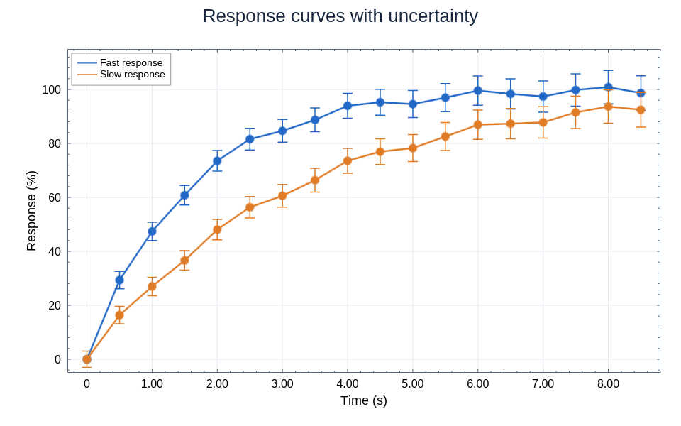</a>
  <a href="crates/renderer/assets/gallery-histogram.png">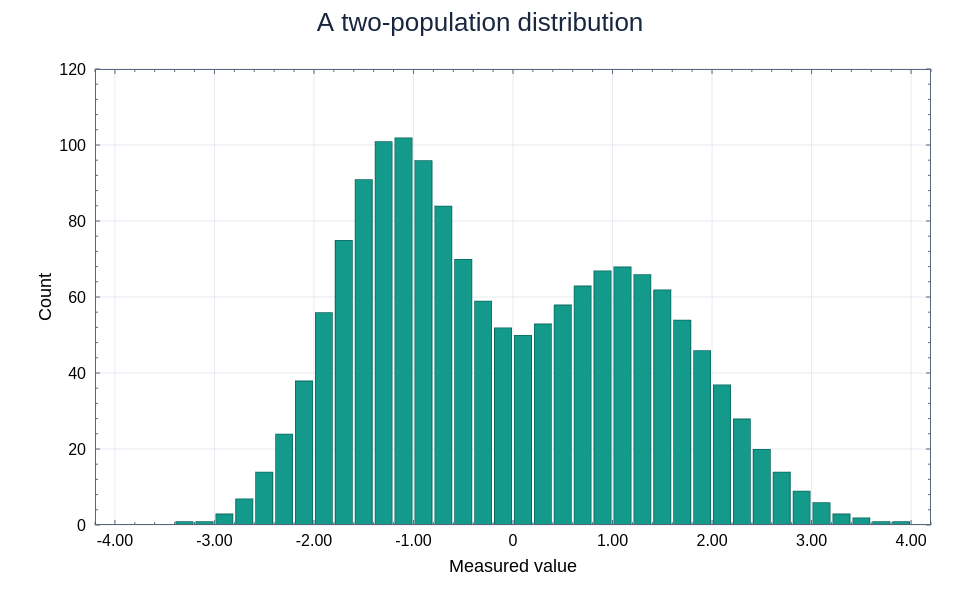</a>
</p>

**Travelling waves · A moving point on a 2:3 phase portrait**

<p>
  <a href="crates/renderer/assets/gallery-wave.gif">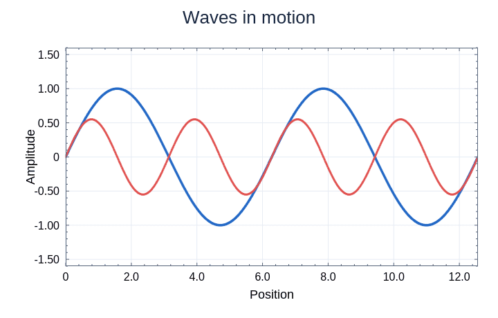</a>
  <a href="crates/renderer/assets/gallery-orbit.gif">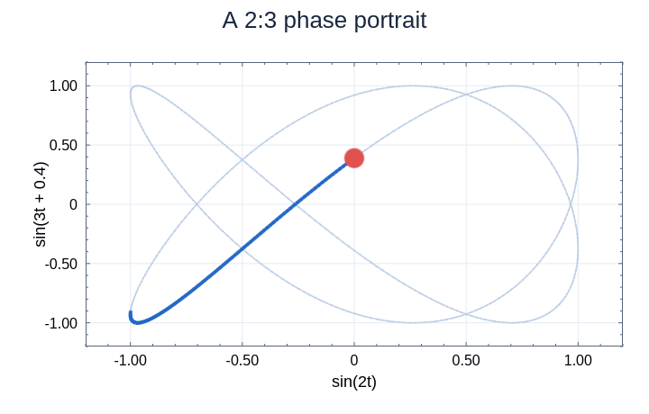</a>
</p>

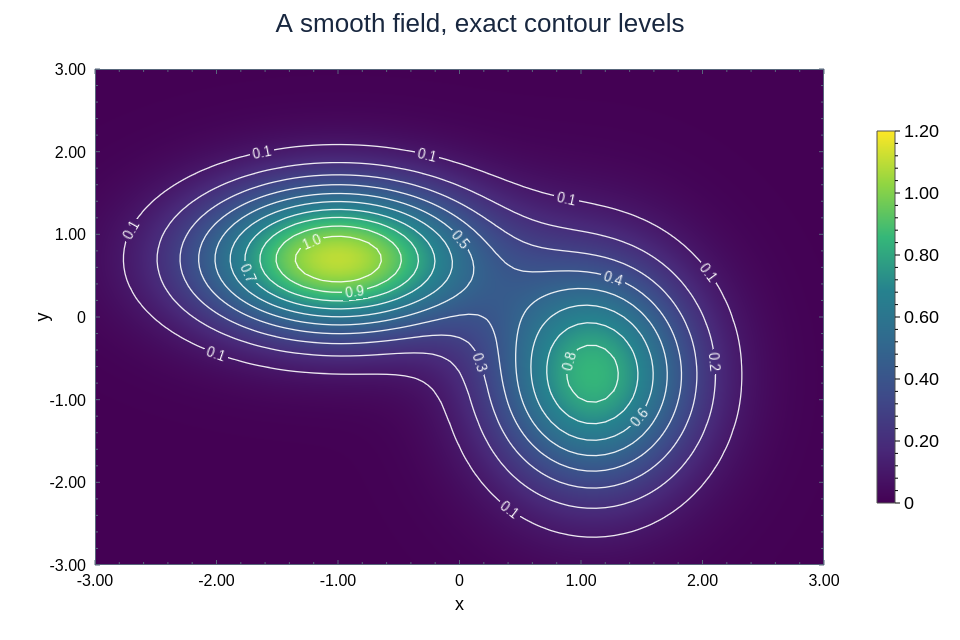

See [the gallery guide](crates/renderer/GALLERY.md) for runnable commands, data definitions, export sizes, and validation details. GIF timing is presentation timing, not a rendering benchmark.

### Draw style preview

Growth-response charts in four styles. The Milkyway preview uses line-only series: stars and faint nebula along the curves, with no scatter planets or errorbar jets. [Reproduce this preview](crates/renderer/GALLERY.md#milkyway-line-only-preview).

**Precise · Sketch**

<p>
  <a href="crates/renderer/assets/style-growth-response-precise.png">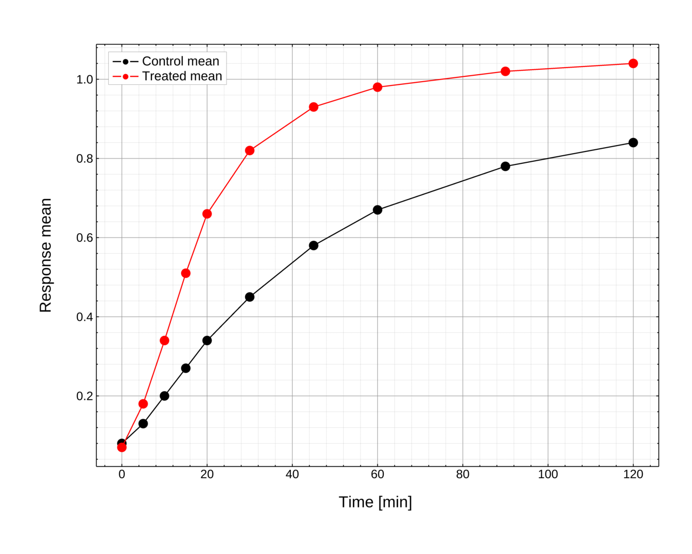</a>
  <a href="crates/renderer/assets/style-growth-response-sketch.png">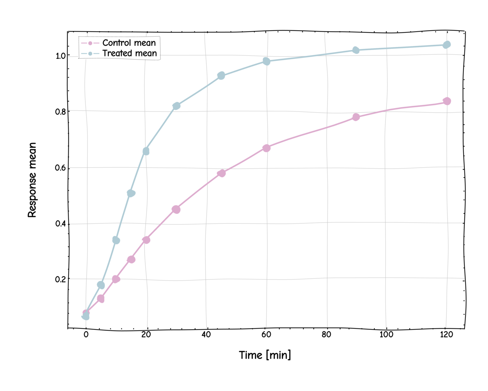</a>
</p>

**Milkyway · line only · Constellation**

<p>
  <a href="crates/renderer/assets/style-growth-response-milkyway.png">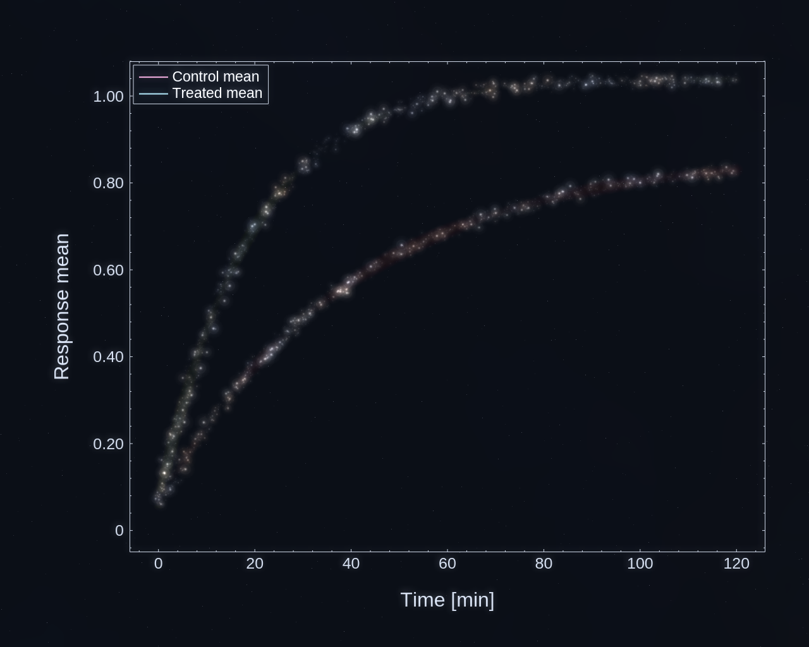</a>
  <a href="crates/renderer/assets/style-growth-response-constellation.png">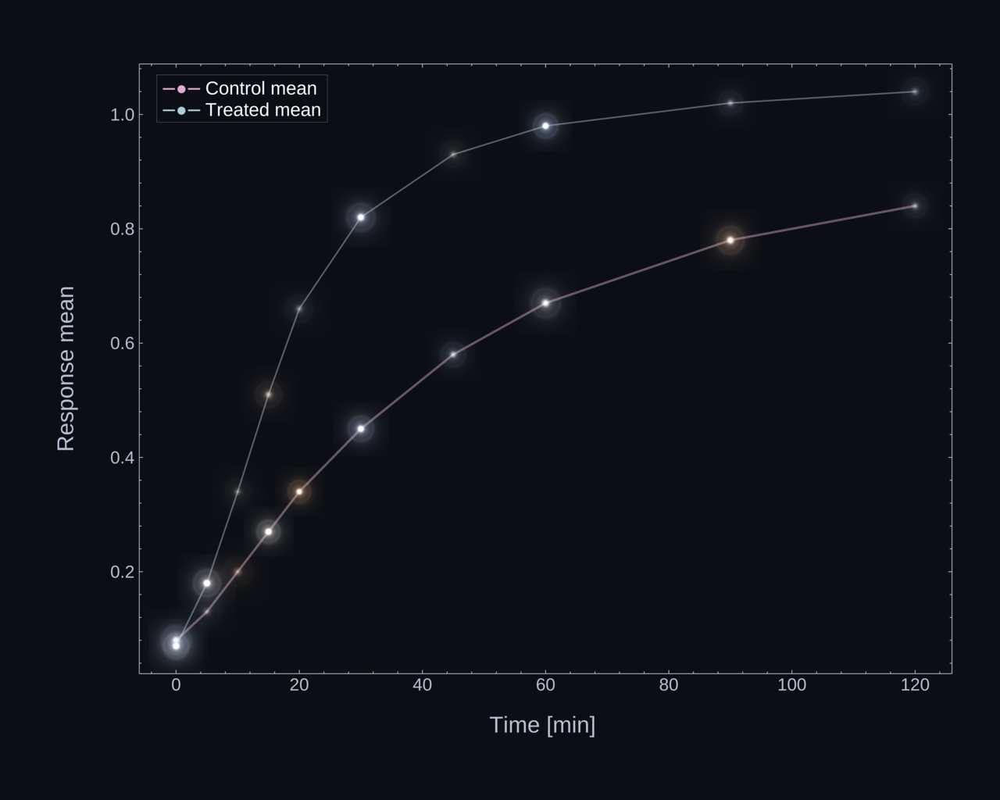</a>
</p>

---

## 1. Usage

### Toolchain and builds

This release pins **Rust 1.99.0** in
[`rust-toolchain.toml`](rust-toolchain.toml), including the wasm32 target,
rustfmt and clippy. With rustup installed, commands in this checkout select
that toolchain automatically. This is the tested development toolchain, not
a separately verified minimum supported Rust version. Use the committed
`Cargo.lock` with `--locked` when building this checkout; downstream Git
consumers resolve dependencies with their own lockfile.

```bash
cargo check --locked --workspace --all-targets --all-features
npx wasm-pack@0.15.0 build crates/web --release --target web --locked
```

### Adding the dependency

```toml
[dependencies]
renderer = { path = "crates/renderer" }   # or public Git source — version 0.12.0, not on crates.io.
wgpu     = "30"
```

The library itself depends on neither winit, egui, nor iced. Pull in only the host you actually use:

```toml
# winit standalone
winit = "0.30"

# egui embedded
eframe    = { version = "0.36", default-features = false, features = ["wgpu"] }
egui      = "0.36"
egui-wgpu = "0.36"
```

iced 0.14 still uses wgpu 27, so direct device/queue/render-pass sharing is
disabled until iced publishes a wgpu 30-compatible release.

### Standalone setup and drawing (winit + figgy)

The following initialization/draw fragment belongs in a winit
`ApplicationHandler::resumed` handler, with `event_loop: &ActiveEventLoop`.
See [winit_simple.rs](crates/renderer/examples/winit_simple.rs) for the complete
event loop and persistent window/renderer state.

```rust
use std::sync::Arc;
use renderer::{
    Chart, ChartDrawItem, DataLineStyleConfig, DataRenderType, Renderer, Series, SeriesConfig,
    color::Color, default, layout::{ChartArea, Rect}, line::LineStylePreset,
};

let window = Arc::new(event_loop.create_window(winit::window::Window::default_attributes()).unwrap());
let size = window.inner_size();

// One-line setup — figgy owns instance/adapter/device/queue/surface/swap chain.
let mut renderer = Renderer::for_window(
    Arc::clone(&window),
    (size.width, size.height),
    16 * 1024 * 1024,   // 16 MiB GPU column pool
).unwrap();

// renderer.add_column takes `&dyn ColumnSource`.
// Implement the trait on your own type (see `ColumnSource` section below) — Vec, ndarray,
// polars Series, mmap, anything — native upload writes directly into mapped staging
// without a conversion Vec. Built-in `Column<f64>` works too.
let xs: Vec<f64> = (0..1024).map(|i| i as f64 * 0.01).collect();
let ys: Vec<f64> = xs.iter().map(|x| x.sin()).collect();
fn column(data: Vec<f64>) -> renderer::Column<f64> {
    let min = data.iter().copied().fold(f64::INFINITY, f64::min);
    let max = data.iter().copied().fold(f64::NEG_INFINITY, f64::max);
    renderer::Column { data, min, max }
}
renderer.add_column("x", &column(xs)).unwrap();
renderer.add_column("y", &column(ys)).unwrap();

// Chart — builder pattern.
let mut config = default::default_config();
config.chart_area = ChartArea(Rect { x:8, y:8, width: size.width.saturating_sub(16).max(1), height: size.height.saturating_sub(16).max(1) });
let mut chart = Chart::new(config)
    .with_title("Sine")
    .with_x_title("x")
    .with_y_title("sin(x)");
chart.auto_fit_x(renderer.pool(), "x", 0.05).unwrap();
chart.auto_fit_y(renderer.pool(), "y", 0.10).unwrap();

// Series = SeriesConfig (declaration) + ChartStyle (GPU style auto-built from that declaration).
let cfg = SeriesConfig {
    series_id: "sin".into(), label: None,
    source_id: None,
    x_column: "x".into(), y_column: "y".into(),
    render_type: DataRenderType::Line {
        line: DataLineStyleConfig {
            line_style: LineStylePreset::Solid,
            line_color: Color::from_rgb8(20, 110, 230),
            line_width: 2.0,
        },
    },
};
let style = renderer.create_style_for_series(&cfg).unwrap();   // budget-checked ChartStyle
let view  = renderer.create_chart_view(&chart, chart.config().chart_area.0).unwrap();

// frame loop:
let series = [Series { config: &cfg, style: &style }];
let items  = [ChartDrawItem {
    view: &view,
    chart_config: chart.config(),
    series: &series,
}];
renderer.draw(Color::WHITE, &items).unwrap();   // acquire surface frame → prepare → encoder → pass → paint_prepared → submit → present
```

### `ColumnSource` — the data adapter trait

`Renderer::add_column` takes `&dyn ColumnSource` — implement the trait on any container of yours and native upload writes into mapped staging without an intermediate conversion `Vec`. The GPU then copies staging into the column pool; “zero-copy” here means no extra CPU conversion buffer or retained CPU point mirror. The source writes GPU pairs and returns smallest-positive statistics in the same pass; the renderer never reads wgpu 30's write-only mapped bytes. `min` / `max` retain their source-level meaning. Scalar smallest-positive uses the actual uploaded `(value as f32, 0)` value, while hi-lo uses the recorded `hi as f64 + lo as f64`; both include only finite positive values. Use `Renderer::add_hilo_column` with `&dyn HiLoColumnSource` for large absolute timestamps or coordinates that must preserve sub-f32 deltas.

`add_column` / `add_hilo_column` register a new id. To atomically replace an
existing id, use `upsert_column` / `upsert_hilo_column`. `Renderer` prepares the
provisional pool, affected chart revisions, active picker transition, and
maintenance state before publishing any of them. A returned preparation error
therefore preserves the previous authority state. Integrations with additional
host-owned derived state may use `begin_upsert_*`, inspect its provisional pool,
prepare that derived state, and then call the guard's infallible,
allocation-free `commit`; hosts do not rebuild the picker themselves.

```rust
pub trait ColumnSource {
    fn len(&self) -> usize;
    fn is_empty(&self) -> bool { self.len() == 0 }  // default
    fn min(&self) -> f64;
    fn max(&self) -> f64;

    /// Legacy scalar encoder retained for source compatibility.
    /// Caller guarantees `dst.len() == self.len() * 4`. null → `f32::NAN`.
    fn write_f32_le_into(&self, dst: &mut [u8]);

    /// Write `(value as f32, 0)` pairs and return stats in the same pass.
    fn write_f32_pair_le_into_with_stats(
        &self,
        writer: ColumnPairWriter<'_>,
    ) -> ColumnUploadStats;
}
```

**Built-in implementors**: `Column<f64>`, `Column<f32>`, `Column<Option<f64>>` (null → NaN).

```rust
pub trait HiLoColumnSource {
    fn len(&self) -> usize;
    fn is_empty(&self) -> bool { self.len() == 0 }
    fn min(&self) -> f64;
    fn max(&self) -> f64;

    /// Legacy slice encoder retained for source compatibility.
    /// Caller guarantees `dst.len() == self.len() * 8`.
    fn write_f32_pair_le_into(&self, dst: &mut [u8]);

    /// Write pairs and return stats from recorded `hi as f64 + lo as f64`.
    fn write_f32_pair_le_into_with_stats(
        &self,
        writer: ColumnPairWriter<'_>,
    ) -> ColumnUploadStats;
}
```

`Column<f64>` implements `HiLoColumnSource`; browser hosts should pass a
`Float64Array` through `register_column_f64` for the first upload and
`update_register_column_f64` for an explicit replacement when using timestamp
axes with large Unix epoch values.

Custom trait implementations must implement the fused method. This makes an
incomplete migration a compile-time error instead of allowing a source to
compile and then fail during upload. There is no byte-readback or silently
incorrect fallback.

**Custom — time series / DataFrame / mmap / FFI data, anything**:

```rust
struct MyTimeSeries {
    samples: Vec<f64>,    // or Arc<[f64]>, ndarray::ArrayView, polars::Series, ...
    cached_min: f64,
    cached_max: f64,
}

impl renderer::ColumnSource for MyTimeSeries {
    fn len(&self) -> usize { self.samples.len() }
    fn min(&self) -> f64 { self.cached_min }
    fn max(&self) -> f64 { self.cached_max }
    fn write_f32_le_into(&self, dst: &mut [u8]) {
        debug_assert_eq!(dst.len(), self.samples.len() * 4);
        for (i, &v) in self.samples.iter().enumerate() {
            dst[i*4..i*4+4].copy_from_slice(&(v as f32).to_le_bytes());
        }
    }
    fn write_f32_pair_le_into_with_stats(
        &self,
        mut writer: renderer::ColumnPairWriter<'_>,
    ) -> renderer::ColumnUploadStats {
        debug_assert_eq!(writer.len(), self.samples.len());
        let mut min_positive: Option<f64> = None;
        for (index, &sample) in self.samples.iter().enumerate() {
            let value = sample as f32;
            writer.write_pair(index, value, 0.0);
            let value = value as f64;
            if value.is_finite() && value > 0.0
                && min_positive.map_or(true, |current| value < current)
            {
                min_positive = Some(value);
            }
        }
        renderer::ColumnUploadStats { min_positive }
    }
}

renderer.add_column("temperature", &my_series)?;   // ↘ writes directly into mapped staging memory, zero Vec
```

Native `f32` containers use the same fused path: iterate the values and call
`writer.write_pair(index, value, 0.0)`. `ColumnPairWriter` exposes logical pair
writes rather than mapped bytes, so active pool upload remains allocation-free
without exposing wgpu or permitting a `dst.copy_from_slice(...)` shortcut.

### Native examples — sine / RC / cross-section

```bash
cargo run -p renderer --example winit_simple
cargo run -p renderer --example egui_embed --features egui_demo
```

Each example shows:
- A 3-panel grid with different grid options (off / major / major + dotted minor)
- The RC panel renders 2 series (charging + discharging)
- Line widths of 1 / 2 / 3.5 px across panels
- Legends
- DPI input + Save PNG button (egui) or `S` key (winit) → per-panel PNG bytes in memory → written by the example to `/tmp/figgy_*_panel_{i}.png`

### Browser timestamp-axis demo

`crates/web/timestamp-demo.html` exercises the browser timestamp path with
absolute Unix time values uploaded through `register_column_f64(Float64Array)`
and explicitly replaced through `update_register_column_f64`.
It lets you change the visible time window, data unit, timezone, fractional
second policy, label pattern, chart width, and export scale while the x axis
uses `LabelFormat::Timestamp` + `AutoCalendar` to choose non-overlapping labels.

```bash
npx wasm-pack@0.15.0 build crates/web --release --target web --locked
cd crates/web
python -m http.server 8142 --bind 127.0.0.1
# open http://127.0.0.1:8142/timestamp-demo.html
```

### Live SSoT lab — the split API at pool scale

```bash
cargo run --release -p renderer --example ssot_lab --features egui_demo
```

A 2×2 grid, one draw style per panel (Precise dashed / Sketch / Milkyway /
Constellation), all four series reading a single shared `x` pool column. The
sidebar edits the SSoT live — pan direction per x-linked column pair, window
width, and point density up to 3M/series (12M total, 5 columns). Every edit
flows through `Renderer::prepare` → `Renderer::paint_prepared` with no
`Mutex` and no per-frame `update_transform`; the status box's `frames
skipped` stays at 0, proving the token never goes stale under live edits.

### egui integration pattern (summary)

The frame is split to match host callback shapes: every mutation lives in
`Renderer::prepare` (`&mut self`), pure command recording lives in
`Renderer::paint_prepared` (`&self`) — so the paint callback needs no
`Mutex` around the renderer:

```rust
// stored in CallbackResources as plain FiggyState — no Mutex
struct FiggyState { renderer: renderer::Renderer, panels: Vec<PanelEntry> }
struct PanelEntry { /* chart, view, … */ prepared: Option<renderer::PreparedFrame> }
struct FiggyCallback { panel_idx: usize /* one callback per panel */ }

impl egui_wgpu::CallbackTrait for FiggyCallback {
    fn prepare(&self, _device, _queue, _screen, _enc, resources) -> Vec<...> {
        let state = resources.get_mut::<FiggyState>().unwrap();
        // dirty handling: refresh_axis (raster). No per-frame update_transform —
        // prepare writes the transform uniform itself.
        let prepared = state.renderer.prepare(&items).unwrap();
        // store the token per panel — egui runs every callback's prepare before
        // any paint, so one shared token would be overwritten by later panels
        state.panels[self.panel_idx].prepared = Some(prepared);
        Vec::new()
    }
    fn paint(&self, info, render_pass, resources) {
        let state = resources.get::<FiggyState>().unwrap();
        let prepared = state.panels[self.panel_idx].prepared.as_ref().unwrap();
        let target = (info.screen_size_px[0], info.screen_size_px[1]);
        state.renderer.paint_prepared(render_pass, target, prepared).unwrap();
    }
}
```

After the host submits every command buffer for the frame, call
`renderer.end_gpu_frame()` exactly once. With callback schedulers such as egui,
the frame coordinator may make that call before the first prepare of the next
frame, after the previous frame is known to have been submitted. It must not be
called once per panel prepare: other panels may still hold recorded but
unsubmitted resources.

Renderer-owned submit paths (`WindowedRenderer::draw*` and panel export) report
that boundary themselves. A host that also records external passes must submit
those pending command buffers before invoking one of these paths; wgpu command
buffers are opaque, so the renderer cannot identify or retire only one host's
pending references.

`paint_prepared` is repeatable (the same token may be recorded into more than
one pass). `PreparedFrame` owns the resolved draw inputs, so paint neither
reconstructs nor receives `items`. If a captured renderer resource changes
between the two phases, paint records nothing and returns
`FiggyError::StalePreparedFrame` — recover with a fresh `prepare` next frame.
Automatic contour labels follow the same ownership rule per panel/item + series
occurrence: the baked atlas and cell table are immutable cache resources, while
each distinct dispatch input produces one immutable placement result owning its
params, transform, candidates, anchors, indirect args, compute bind groups, and
GPU charge. An exact key reuses that result; a different key never rewrites it,
even after the token drops, because a host command buffer may still hold the old
GPU handles before submission. Explicit anchors are one immutable placement
snapshot. Arc/star compute results follow the same exact-key rule. Paint uses
the token's exact resources and never re-reads the series cache.

The host must submit a command buffer recorded from a token before the next
mutation of that token's `ChartView` (`refresh_axis`, `update_transform`, or a
later `prepare` using the same view). The content revision rejects stale input
before recording; it cannot inspect or order a command buffer after ownership
has moved to the host.
The one-shot `Renderer::paint(&mut self, …)` facade remains for hosts that own
the renderer exclusively during their frame (winit loop, wasm wrapper): it
runs both phases back to back.

Full version: [examples/egui_embed.rs](crates/renderer/examples/egui_embed.rs).

### iced integration status

The retained [iced integration source](crates/renderer/unsupported/iced_embed_wgpu27.rs)
documents the intended `prepare` / `paint_prepared` ownership pattern, but its
build target is disabled while iced 0.14 remains on wgpu 27. wgpu device,
queue, and render-pass types cannot be shared across major versions.

### PNG export (memory only — saving is the caller's job)

```rust
let bytes = renderer
    .export_panel_png_bytes_async(&chart, &series_configs, scale)
    .await?;
std::fs::write("/tmp/out.png", &bytes)?;          // or clipboard / network / wherever.

// If you only need RGBA:
let img = renderer
    .export_panel_rgba_async(&chart, &series_configs, scale)
    .await?;
// img.width, img.height, img.rgba (straight alpha, length = w * h * 4)
```

Native-only blocking convenience wrappers use the same names without `_async`.
`scale` bounds: `renderer::MIN_EXPORT_SCALE` (0.25) ~ `renderer::MAX_EXPORT_SCALE` (8.0), automatically clamped.
Convert from standard 96 DPI via `renderer::dpi_to_scale(dpi)`.

When scaling, every pixel-based dimension (font / line / margin / grid / legend) scales proportionally → the visual is identical, just denser pixels.

---

## 2. Config struct field reference

```rust
pub struct Config {
    pub chart_area: ChartArea,           // panel pixel rect (inside the host viewport)
    pub top_x: AxisOptions,              // 4-side axes — top/right labels & titles disabled by default
    pub bottom_x: AxisOptions,
    pub left_y: AxisOptions,
    pub right_y: AxisOptions,
    pub chart_title: ChartTitleOptions,
    pub grid: GridOptions,
    pub legend: Legend,
    pub picked_points: Option<PickedPointsConfig>,
    pub picked_data: Option<DataSelectionsConfig>,
    pub colorbar: Option<ColorBarOptions>,   // the colourbar AND the chart's z scale
    pub draw_style: DrawStyle,
}
```

### `ChartArea` / `Rect`
| Field | Type | Meaning |
|---|---|---|
| `x, y` | u32 | Top-left pixel position relative to the host surface |
| `width, height` | u32 | Panel pixel size. 0 → live raster fails (`InvalidChartArea`); callers should keep export chart areas non-zero too. Export's current 1 px clamp is a compatibility guard and may become an explicit error |

### `AxisOptions` (top_x / bottom_x / left_y / right_y)
| Field | Type | Meaning |
|---|---|---|
| `scale` | `AxisScale` | `Linear` or `Logarithmic` (log10) |
| `min, max` | f64 | Data-space range. For log scale, positive bounds are used as-is; manual non-positive/non-finite bounds are guarded to `1e-12` on renderer/axis paths. Non-positive data samples are skipped/NaN-handled rather than making the whole range invalid |
| `major_spacing` | f64 | linear: data units; log: decade step (1, 2, …) |
| `minor_count` | usize | minors per major (linear) or sub-decade 2..9 (8 recommended for log) |
| `inverted` | bool | Reverses the visual direction of this axis. Tick/grid placement, data rendering, and picking all use the same reversed mapping; `min`/`max` remain the data-space bounds |
| `label_style` | `LabelStyle` | Tick-label styling |
| `tick` | `TickVisibility` | `None / Outside / Inside / Both` |
| `title_option` | `AxisTitleOptions` | Axis title text / visibility / offset |
| `out_margin` | f32 | Outer (label + title band) pixel margin |
| `line_visible / color / width / style` | mixed | Axis line appearance. CPU raster strokes floor to 1 px, so sub-pixel widths do not disappear |
| `line_offset` | f32 | Detached-axis offset: shifts the axis chrome (line/ticks/labels) perpendicular to itself while the data area stays put. Layout-neutral; the drag system's axis movement lands here |
| `major_tick_length / minor_tick_length` | f32 | Tick mark length (px) |

### `LabelStyle`
| Field | Type | Meaning |
|---|---|---|
| `visible` | bool | Overall label visibility |
| `color` | `Color` | Label color |
| `font_size` | f32 | px |
| `label_visible` | bool | Number labels themselves (separate from `visible`, e.g. show the axis but hide labels) |
| `label_font` | String | Font family. Empty string → bundled Liberation Sans |
| `label_offset_x / y` | f32 | Fine nudge offset (px) |
| `format` | `LabelFormat` | `Decimal / Power / Scientific / Timestamp`. `Timestamp` interprets numeric values as Unix epoch time on linear axes and can use calendar-aware ticks |
| `significant_digits` | u8 | |

`LabelFormat::Timestamp` keeps data coordinates numeric. Its default config is
UTC Unix seconds with `AutoCalendar` tick planning; use
`unit = Milliseconds` for JS timestamps and `FixedOffsetMinutes(540)` for KST.
`AutoCalendar` measures tick-label text and coarsens the calendar step so labels
do not overlap. Use `Renderer::add_hilo_column` (native) or
`register_column_f64` / `update_register_column_f64` (web `Float64Array`) for
high-resolution absolute Unix timestamps; those paths preserve sub-f32 deltas
on the GPU as f32 hi/lo pairs.
The browser demo at [crates/web/timestamp-demo.html](crates/web/timestamp-demo.html)
is the quickest visual check for range changes, chart-width changes, and export
scale against that contract.

### `AxisTitleOptions` / `ChartTitleOptions`
| Field | Type | Meaning |
|---|---|---|
| `text` | `RichText` | greek / sub/super / bold/italic styled segments |
| `visible` | bool | |
| `offset_x / y` | f32 | nudge |
| `top_margin` | f32 | (chart_title only) chart-title band height |

### `GridOptions`
| Field | Type | Meaning |
|---|---|---|
| `show_major_x/y` | bool | Major grid lines |
| `major_x/y_color, _width, _style` | mixed | Major line appearance (Solid / Dash / Dot, 11 presets) |
| `show_minor_x/y` | bool | Minor grid lines |
| `minor_x/y_color, _width, _style` | mixed | Minor line appearance |

### `DrawStyle`
| Variant / JSON mode | Meaning |
|---|---|
| `Precise` / omitted or `{ "mode": "precise" }` | Default scientific renderer; serialized default omits `draw_style` |
| `Sketch` / `{ "mode": "sketch", ... }` | Hand-drawn chart-wide style |
| `Milkyway` / `{ "mode": "milkyway", ... }` | Astrophotograph chart-wide style. Parameter metadata comes from `draw_style_param_specs("milkyway")` |
| `Constellation` / `{ "mode": "constellation", ... }` | ScatterLine-only star chart style. Parameter metadata comes from `draw_style_param_specs("constellation")` |

### `Legend`
| Field | Type | Meaning |
|---|---|---|
| `visible` | bool | |
| `content` | `RichText` | The whole legend as **one rich document**: `'\n'` segments break lines, symbols are inline segments (glyph char + per-segment `color` override) — breaks, symbol positions, and mid-text symbols are all explicit in the SSoT. `font` / `font_size` are live at draw time |
| `corner` | `LegendCorner` | `TopLeft / TopRight / BottomLeft / BottomRight` |
| `padding` | f32 | Legend box internal padding. Corner placement uses the fixed data-area inset plus `offset_x / offset_y` |
| `bg_color, border_color` | `Color` | Box background / border |

Symbols are **fixed-width field segments** (`field_em`): every form spans
exactly `SYMBOL_FIELD_EM` (2.0 em × font size) regardless of shape — a line
mark is a drawn rule (`rule: true`) filling the whole field, a scatter mark
is the shape glyph (`● ■ ▲ …`) centered in it, and line+scatter is
rule–glyph–rule summing to the same width. Dashed/dotted line styles are
carried by `rule_dash` on rule segments, so legend marks reflect
`LineStylePreset` as well as color and shape. Auto-built entries are
`symbol + ' ' + '\t' + label`, so labels also align via the tab column.
Composition helpers: `symbol_segments(kind, color)`,
`series_symbol_segments(cfg)`, `append_legend_entry(content, symbol, label)`.

### `PickedPointsConfig`
| Field | Type | Meaning |
|---|---|---|
| `visible` | bool | Enables/disables the overlay when `picked_points` is present |
| `refs` | `Vec<PickedPointRef>` | Picked data references: `series_id`, optional `source_id`, and `point_index`. The overlay stores provenance, not copied coordinates |
| `ring_color` | `Color` | Highlight ring color |
| `ring_width_px` | f32 | Ring stroke width in pixels |
| `radius_extra_px` | f32 | Extra radius added around the source marker |

Missing `picked_points` / JSON `null` means no picked-point overlay. JSON `{}` is accepted as the default overlay config (`visible: true`, empty refs, gold ring, 2 px stroke, +3 px radius), so hosts can turn the overlay on and then fill `refs`.
The overlay ring follows the picked scatter marker radius, including per-point style mapping; for line-only picks it uses `radius_extra_px` around the snapped endpoint.

### `DataSelectionsConfig`

`Config.picked_data` stores tagged `PickedDataRef` identities: `Point`,
`HistogramBin`, `MatrixCell`, or `ContourLevel`. Every ref has `series_id` and
optional `source_id`; its kind then carries `point_index`, `bin_index`, canonical
`x_index/y_index`, or `level_index + x_index/y_index`. Visual policy is
`highlight_color`, `outline_width_px`, `point_radius_extra_px`, and
`contour_width_extra_px`. No ref stores coordinates, bar bounds, or contour
segments. The overlay resolves current geometry from the same GPU resources as
the normal draw, and stale/out-of-range indices draw nothing. JSON `null`
clears it and `{}` selects the default empty gold overlay.

### `ColorBarOptions`
| Field | Type | Meaning |
|---|---|---|
| `visible` | bool | `false` draws nothing **and reserves no band** — the space returns to the data area. Field series still render |
| `side` | `Side` | `Left`/`Right` = vertical bar, `Top`/`Bottom` = horizontal. This alone decides the orientation |
| `thickness_px` | f32 | The strip's short dimension |
| `gap_px` | f32 | Space between the data area and the strip |
| `length_frac` | f32 | Strip length as a fraction of the data area's length along that side; must be in `(0, 1]` |
| `align` | `BarAlign` | `Start` / `Center` / `End` along that side — the discrete half of the anchor |
| `offset_x`, `offset_y` | f32 | Free offset from that anchor, in screen pixels. **Margin-noncontributing**, the same contract as `Legend::offset_{x,y}` and the title / label offsets, so nudging the bar moves it without reflowing the data area. This is where a drag accumulates |
| `colormap` | `ColorMap` | `Viridis` / `Magma` / `Turbo` / `GrayScale` / `RdBu` / `Custom { stops }` |
| `nan_color` | `Color` | Colour for z the ramp cannot place: NaN, and non-positive z on a log colourbar. Fully transparent by default |
| `border_color`, `border_width` | `Color`, f32 | Strip border |
| `axis` | `AxisOptions` | **The z axis — the single source of the z range** |

`axis` being a full `AxisOptions` is the design, not incidental reuse: `scale`
(including `Logarithmic`), `min`/`max`, `major_spacing`, `minor_count`,
`label_style` (including `LabelFormat::Power`), `tick`, and `title_option` mean
exactly what they mean on a chart axis, and tick generation, label formatting,
and log handling are the same code rather than a parallel implementation.

Consequences, all of them decisions:

- A `Heatmap` / `Contour` / `HeatmapContour` series **requires** this to be
  `Some`. Without it there is no z range and no colormap anywhere, so there is
  no value to draw — the renderer rejects the series rather than inventing one.
- There is therefore **one z scale per chart**; several heatmaps share it.
- The band is `gap_px + thickness_px + axis.out_margin + axis.major_tick_length`
  on its own side. `fit_to_data_area` / `resize_chart_area_scaled` may reclaim
  `axis.out_margin` (label space, like an axis') but never the strip itself, so
  a colourbar does not get thinner with the window.
- Two defaults differ from a chart axis: `line_visible: false` (the strip's
  border is that edge) and `tick: Outside` (ticks sit in the label margin
  instead of over the colours).
- The band is the **outermost** part of its side's margin: from the chart edge
  inward it is the bar's label margin, its ticks, the strip, `gap_px`, and only
  then that side's axis band. Axis tick labels are drawn from the data area
  outward and cannot move, so a strip placed next to the data area would be
  drawn on top of them.
- The bar is drawn on the CPU in the decoration layer, with no GPU pipeline. Its
  ticks, labels, and title go through the same helpers the four chart axes use,
  so a logarithmic colourbar gets decade ticks and 10ⁿ labels from the code that
  already does that for a logarithmic axis. `axis.tick` controls
  inside/outside/both, `axis.inverted` controls the min→max screen direction,
  and tick paint now honors the same `line_color` / `line_width` /
  `line_style` as its axis line.
- It is a **selectable, draggable, resizable** element like the rest of the
  chrome: hit-test id `"colorbar"`, a blue selection box, and — with the data
  area, the only two that have them — the eight resize handles. A drag lands in
  `offset_{x,y}`; a handle drives `thickness_px` or `length_frac` depending on
  the *bar's* orientation, which nudge resolves because a handle only knows
  screen directions. Its details are independent foreground targets:
  `"colorbar_axis"`, `"colorbar_tick_labels"`, and `"colorbar_title"`.
  Dragging them updates `axis.line_offset`, label offsets, and title offsets
  respectively. All three derive from the painted strip rect; a shortened,
  aligned, moved, or resized strip therefore keeps its title and hit geometry
  attached.
- `ColorBarOptions::normalized_z(z) -> Option<f32>` is the one z→colour
  normalization (`color_for_z` applies it): clamped to `[0, 1]`, `None` for NaN,
  for non-positive z on a logarithmic bar, and for a degenerate range — those
  draw as `nan_color` rather than clamping to an endpoint, because "missing" and
  "smallest" are different facts. `axis.inverted` is not applied: it moves where
  a value is drawn, not which colour it has.

### `data_config` — declarative series schema (the active API)

Series are declared via `data_config::SeriesConfig`. `Renderer::paint` branches on the `render_type` enum to spawn line / scatter / errorbar layers automatically; colors, widths, and shapes are also extracted from the matching sub-style.

| Type | Fields | Role |
|---|---|---|
| `SeriesConfig` | `series_id, source_id?, label, x_column: ColumnId, y_column: ColumnId, render_type` | Full series declaration. `source_id` is optional host provenance for picking; `x_column / y_column` are renderer-registered ids, resident in the pool or backed by a replayable nonresident source. In the web editing flow, `legend.content` is the live label authority; ordinary series edits update recognized legend symbols only and preserve user text. `SeriesConfig.label` becomes authoritative only for an explicit `reset_legend_from_series_labels()` rebuild |
| `DataRenderType` | enum, 13 variants | One independent draw path per variant. Optional struct merging avoided |
| `ErrorRef` | `Symmetric { column }` or `Asymmetric { lower, upper }` | Errorbar column reference. Symmetric = ±σ, Asymmetric = lower/upper split |
| `DataLineStyleConfig` | `line_style, line_color, line_width` | Line appearance |
| `DataScatterStyleConfig` | `point_color, point_shape, point_size, point_style_table?, point_style_index_column?, point_style_overrides?` | Point appearance. The optional style map applies only to precise scatter; each table/override slot can replace color, shape, size, or any subset |
| `DataErrorBarStyleConfig` | `error_bar_color, _width, _cap_size, cap_width, error_bar_style_table?, error_bar_style_index_column?, error_bar_style_overrides?` | Errorbar appearance. The optional style map applies only to precise errorbars; each table/override slot can replace color, stem width, cap half-size, cap width, or any subset |
| `DataBarStyleConfig` | `fill_color, border_color, border_width, baseline, gap_px, width_ratio, orientation, bar_style_overrides?` | Histogram appearance. `width_ratio` controls the centred fraction of each bin; sparse overrides replace fill, outline, gap, or width for selected bin indices |
| `ScatterShape` | enum, 26 variants | Circle / Square / Triangle directions / Diamond / Cross / Plus / Pentagon / Hexagon / Octagon / Star + filled variants |

**The 13 `DataRenderType` variants**:

| Variant | Sub-styles used | Meaning |
|---|---|---|
| `Line { line }` | line | Line only |
| `Scatter { scatter }` | scatter | Points only |
| `ScatterLine { scatter, line }` | both | Points + connecting line |
| `ScatterErrorbarX { scatter, err_x, err_style }` | scatter + errorbar | Points + X errorbars |
| `ScatterErrorbarY { scatter, err_y, err_style }` | scatter + errorbar | Points + Y errorbars |
| `ScatterErrorbarXY { scatter, err_x, err_y, err_style }` | scatter + errorbar | Points + X/Y errorbars |
| `LineScatterErrorbarX / Y / XY` | line + scatter + errorbar | The above + connecting line |
| `Histogram { bar }` | bar | Bars from host-binned `(edges, counts)`. `bar.orientation` alone decides which column is which: `Vertical` = `x_column` edges / `y_column` counts, `Horizontal` the reverse. The `edges = counts + 1` length relation is never used to guess |
| `Heatmap { matrix, fill }` | fill | Filled field only |
| `Contour { matrix, contour }` | contour | Contour lines only |
| `HeatmapContour { matrix, fill, contour }` | fill + contour | Filled field with lines over it |

Histogram width is resolved in two stages: `width_ratio` keeps a centred
`0..=1` fraction of the bin, then `gap_px` removes a fixed screen-space amount.
The gap is capped to leave at least one pixel for wider positive-width bars.
Bins whose original projected width is below one pixel use a GPU envelope:
each overlapping pixel column takes the maximum bin value and is filled to
zero (clipped to the visible axis range). Horizontal histograms use pixel rows.
The winning bin supplies the stroke colour for the entire area when its stroke
has positive width and alpha; otherwise it supplies the fill colour. Equal maxima use the first
bin. Gap and positive width ratios do not cut holes in this envelope;
`width_ratio = 0` still hides the bin. Original columns are unchanged.
`border_width = 0` disables the outline; otherwise `border_color` and
`border_width` control it. `bar_style_overrides` is a sparse declaration-order
list keyed by `index`; each record may independently replace `fill_color`,
`border_color`, `border_width`, `gap_px`, or `width_ratio`. Baseline and
orientation stay series-wide. Rendering, typed picking, and selected-bin
outlines all resolve the same final bar rectangle.

The three matrix variants declare their grid as `MatrixRef { columns,
orientation, grid_layout }` — a bundle of registered column ids and nothing
else. There is no separate matrix container: resident drawing reads those columns
from the pool, while supported nonresident Heatmap drawing replays their registered
sources in bounded ranges. Neither path duplicates `Config` or `series`.
`grid_layout` says whether the coordinate
columns are cell `Edges` (n + 1) or `Centers` (n); it is never inferred from the
lengths. A declaration that does not line up with the data is **not an error** —
the smallest common extent is drawn and the truncation is reported.

<!-- contour-contract: scope=readme-en max-levels=1024 -->
`ContourConfig.levels` is always an explicit list in data units (there is no
"auto" variant — a level set inferred at draw time is a value the config does not
contain). Its accepted length is `0..=1024`; 1025 or more is an error, and no
level is silently truncated. On a cache miss the renderer keeps the original
list and declaration order, while building a lookup copy from consecutive
32-level blocks sorted by value. Each fragment searches at most 32 blocks and
runs coverage math only for reachable candidates; if all 1024 levels actually
cross one cell, all 1024 are composited in declaration order. `per_level_color:
None` means every level uses `line.line_color`;
colours are not derived from the colormap. The lines themselves are drawn as the
level set of the field's own bilinear interpolation, from its analytic gradient —
so a band boundary and the line over it come out of one computation. Stroke
distance is the quadratic crossing obtained by restricting the current cell's
bilinear field to the current gradient-normal line. It is not a global shortest
distance to the whole piecewise-bilinear contour.

Non-finite levels have explicit uploaded-f32 semantics. Contour lines exclude
NaN and both infinities. For `FillMode::Bands`, the numerator counts every
`-Infinity` plus each finite level less than or equal to z, while the denominator
keeps the full declared level count:
`t=(negative_infinity_count + finite_le_z + 0.5)/(declared_level_count + 1)`.
NaN and `+Infinity` therefore affect only the denominator.

`ContourLabelConfig.anchors` is an **override**. Empty is the normal case: the GPU
places the labels itself, seeding a lattice at `spacing_px` over the data area and
projecting each seed onto its level's isoline. Normal selection targets
`spacing_px` separation, but the per-level fallback may keep a closer candidate
rather than omit a level. `spacing_px` must always be finite and greater than zero,
including for hidden labels and explicit overrides. Automatic and explicit
placement share a 1024-label capacity. Explicit anchors whose `level_index` is
invalid are discarded, and only the first 1024 valid anchors are retained in
input order. If that resolved list is empty, automatic placement runs; otherwise
the resolved list overrides it. Only automatic placement multiplies spacing by
the frame/export scale; export validates that product after clamping the scale.
The atlas must also fit the adapter's texture-dimension limit. Invalid spacing,
scale-product overflow, or an oversized atlas fails before publishing renderer
state, so the previous chart and GPU resources remain active. An anchor is data
coordinates plus a data-space tangent, so a zoom or pan only re-projects it.
`ContourLabelConfig.color` owns the text colour independently of the line and
`per_level_color`; changing a ramp never recolours the typography. Decimal text
uses the contour-level interval (falling back to the colourbar interval), never
an x-axis interval, and `significant_digits` remains effective without allowing
adjacent levels to collapse to one string. The contour fragment reads the same
selected-anchor buffer as the label draw and omits stroke coverage inside each
label rectangle. `bg_padding_px` pads that real line gap whether `bg_color` is
opaque or absent.

`Renderer::series_draw_info(chart, series_id) -> SeriesDrawInfo` is the
series-common window onto what actually drew: `drawn_count`, a matrix' `cols` /
`rows`, and `truncated`. Column lengths are facts that arrive with the data, not
SSoT, so a mismatch never errors and never stops the draw — the smallest common
extent is drawn and reported here. That is how a host learns its 11-edge /
9-count histogram drew 9 bars, and it explains the existing `min(x, y)`
truncation of lines and scatters through the same call.

These four render types do not go through the point-only compatibility picker.
Histograms fit from their uploaded edge/value metadata. Matrix fields use the
GPU fit engine in a distinct field mode: the CPU supplies only the resolved cell
counts, and the GPU reads the same coordinate-pair pool as the field shader and
applies the same `Edges`/`Centers` plus cell/sample-lattice rule. Thus contour and
interpolated-field auto-fit stops at the actual sample endpoints (edge-coordinate
midpoints for `Edges`), while a flat field fits its actual cell boundaries. The
paired reducer works on index-aligned `(x[i], y[i])`
pairs, which a histogram (`edges` is one longer) and a grid (two independent
coordinate axes) are not. `pick_data` handles them through bar/field shader
entries; fitting follows the histogram/field rules above.

**`Renderer::create_style_for_series(cfg)`** extracts color/width/shape from `cfg.render_type`'s sub-styles and builds a GPU `ChartStyle` for screen paint. It returns `Result` and rejects a style before allocating when its four uniforms and optional style-map buffers exceed the remaining renderer GPU budget; those bytes remain accounted for while a prepared frame still holds the style bindings. For export, `create_style_for_series_scaled(cfg, scale)` scales pixel widths only and applies the same admission check.

**Single-direction errorbar** (`ScatterErrorbarY` etc.): direction presence is encoded in `PrimitiveStyle::primitive_flags` (Y=bit 0, X=bit 1). The inactive vertex slots reuse the already-bound anchor column and are collapsed before their error attributes are read, so prepare/export creates no hidden filler column and no host-maintained metadata. A real zero error remains a present, zero-length errorbar rather than being mistaken for an absent direction. (Symmetric variants reuse the same error column for lo/hi.)

### `Config::scaled(scale)` / `Config::scale_in_place(s)`
Multiplies every pixel-based dim by `scale`. `min/max/major_spacing`, scale enum, and colors are untouched. Used for resolution-invariant high-DPI export.

### Default builder — `renderer::default::default_config()`
- bottom_x / left_y: axis line + ticks + labels + title enabled, text starts as empty segments.
- top_x / right_y: axis line + ticks enabled, labels + title disabled, `out_margin = 8` (narrow gap).
- chart_title: visible, `top_margin = 32`, text empty.
- grid: major only, light gray.
- legend: disabled.

Empty text is filled in via the `Chart::with_title / with_x_title / with_y_title / with_legend_entry` builders.

---

## 3. Internal memory data flow

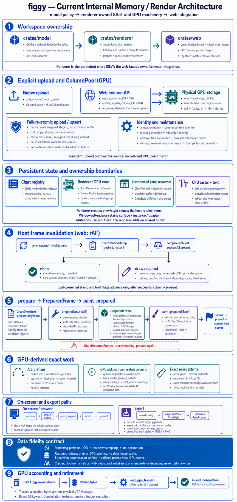

The renderer-owned registry is the persistent SSoT used by the browser wrapper.
Low-level native hosts may still supply `ChartDrawItem` directly. In both paths,
`ChartDrawItem` is prepare-only input; paint consumes only the owned token.


### Reading the architecture diagram

The numbered areas describe different boundaries, not a single chain in which
one component owns everything below it. Native hosts own their integration and
panel values; registered chart state and GPU machinery belong to `Renderer`.
The web integration is shown separately and does not define native upload costs.

| Area | Data flow and ownership contract |
|---|---|
| **1. Workspace responsibilities** | `model` defines chart declarations, layout and interaction policy without GPU resources. `renderer` implements the chart registry, GPU data processing and CPU raster integration. `web` adapts those APIs to canvas, input and browser scheduling. A low-level native host can also supply its own `ChartDrawItem` instead of using the registry. |
| **2. Column upload and maintenance** | Borrow `ColumnSource` only during native upload; write f32 pairs and smallest-positive statistics directly into mapped staging, then copy staging into the GPU pool. The pool keeps column slots and scalar metadata, not CPU point arrays. First-fit allocation and coalescing manage free regions. A reservation restores the free list on failure; upsert prepares fallible dependent state before publication. Allocation epochs identify content replacement, while layout generation identifies relocation such as defragmentation. |
| **3. Persistent and panel state** | `Renderer` holds registered Config/series, the pool, pipelines and shared device/queue. The host retains the returned `ChartView` and `ChartStyle`; views hold raster textures and transform resources, and styles retain GPU bindings. `WindowedRenderer` additionally retains surface/instance/adapter. CPU axis, text and grid rasterization can allocate image buffers; the column-upload contract does not prohibit those allocations. |
| **4. Frame invalidation** | A persistent host compares renderer-issued desired/raster revisions with its last successfully presented stamp. Raster or viewport changes require a raster refresh; host-only redraw state can require drawing without changing chart state. The browser's clean rAF skips surface acquisition and drawing, while required maintenance/completion processing can continue. Failed presentation must not advance the last-presented stamp. |
| **5. Prepare and record** | `prepare(&mut self)` resolves draw inputs and captures GPU handles, shared charges and validation stamps in `PreparedFrame`. `paint_prepared(&self)` validates that token before recording. It rejects changed views, captured columns, layouts, target pipelines or registered chart revisions. Once commands are recorded, the host must submit them before conflicting mutations; a token cannot inspect an external command buffer's later submission order. |
| **6. GPU-derived data** | Arc-prefix scans, picking and exact primitive extents use GPU columns. Arc scan uses bounded chunks plus a carry chain, rather than a fixed whole-series 16.7M-point ceiling. Picking and fitting return compact results instead of a CPU copy of all points. Immutable derived GPU results can be shared by cache entries and prepared tokens; cache eviction alone need not release the last owner. |
| **7. Screen and export** | Compose grid → data → decoration. Export prepares a scaled chart/view/style and offscreen target, then reads back padded row chunks and converts premultiplied RGBA to straight alpha. Row chunking bounds the readback buffer; the target, final RGBA image and PNG output still need their own memory. Resident export uses GPU columns, while streamed export replays original ranges. |
| **8. Fidelity and caches** | Resident redraw reads original GPU columns without a data image cache. Nonresident streaming retains an accumulation surface and may admit a chart-local cache of exact source rows for supported views. Neither path introduces LOD, sampling or decimation. Clipping, invalid/log-domain samples and antialiasing remain rendering rules; different backends need not produce byte-identical pixels. |
| **9. Accounting and retirement** | A GPU resource's shared charge survives as long as a Figgy owner retains it. After the last owner drops, retired bytes remain counted until an appropriate submission boundary and queue completion. `end_gpu_frame()` follows submission/discard of earlier commands; native hosts must service completions. The ledger describes tracked requested bytes, with the style-texture exceptions described below, rather than physical VRAM usage. |

### Exact streaming and residency

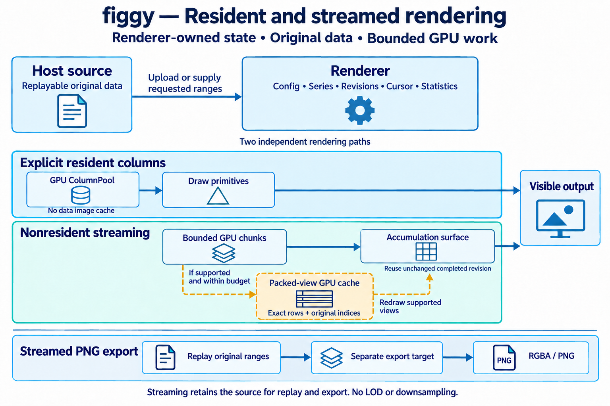

The image separates resident drawing from streaming accumulation, the optional
chart-local packed-view GPU cache, and export by source replay. The native host
owns replayable original data and supplies requested ranges. Browser hosts use
stable TypedArrays or a `readRange` provider; the web facade handles
browser scheduling and requests only the ranges needed for the current job; it
does not own the stream cursor, chart state, or accumulated statistics. The
renderer owns `Config`, ordered series, source revisions, the cursor, cached
range summaries, and view-local residency admission. Automatic streaming never
promotes a connected whole-column closure into the global `ColumnPool`. It
draws through bounded GPU uploads and an offscreen accumulation surface, then
may retain the exact original rows needed by the view within the configured
working-set and total-GPU budgets. Both paths draw original
primitives, without LOD, sampling, or decimation. A resident chart and a
streamed chart can coexist on one page.

Streaming presents completed portions while the next ranges are supplied. An
unchanged completed revision reuses its visible result; decoration-only edits
keep the data cursor and accumulation. A view or physical-resolution change
replays the same source revision at the new transform. `job.cancel()` stops new
work and releases job-owned resources after submitted GPU work settles. A
narrower view may redraw from the packed GPU cache without rereading the source;
other view changes replay it. GPU point/line picking uses the packed rows when
available and returns original row indices without source replay. Other streamed
charts do not support immediate picking. Scaled PNG export uses replayable
original ranges in a separate GPU path, so the source must remain available.
See [the web streaming contract](crates/renderer/WASM.md#exact-streaming)
for the current API, support limits, and lifecycle details. Exact original-data
processing does not imply byte-identical antialiasing across GPU backends or
render-pass boundaries.

### Ownership and lifetime boundaries

`Renderer` owns the chart registry and GPU-side state: each chart's authoritative
`Config` and ordered `SeriesConfig`, the resident `ColumnPool`, nonresident
logical-source metadata in 0.12.0, render/compute pipelines,
the shared picker pipeline bundle, at most one derived active-chart picker cache,
pending pool maintenance, renderer-level bind groups, and the shared
`Arc<wgpu::Device>` / `Arc<wgpu::Queue>`. It creates `ChartView` and `ChartStyle`
values and returns them to the host, which keeps them in its panel state (see
[the egui host](crates/renderer/examples/egui_embed.rs)). A `PreparedFrame` holds
its own GPU handles and shared charges, so dropping a host view/style does not
necessarily release those resources. `WindowedRenderer` additionally retains
the surface, instance, adapter, and optional MSAA target. A `ChartId` is opaque
and bound to its issuing renderer.
`set_chart_state` atomically validates and replaces a chart's `Config` and
ordered series when one logical edit affects both.

Column upsert, removal, and defragmentation prepare all fallible pool, chart,
revision, and active-picker work before publishing the new authority state.
For returned synchronous errors, the previous pool/chart/picker state remains
intact; the final publication is allocation-free. Plain `remove_column`
cascade-removes every renderer-owned series that references the id and does not
rewrite any `Config::legend` document. A host that derives a legend update from
that cascade uses `remove_column_with_chart_config`, which publishes the pool,
all affected series, and that chart's replacement `Config` in the same
transaction. The web facade uses this combined boundary for its
auto-managed-versus-free-edited legend policy.

Renderer 0.9 keeps exact GPU picking chart-aware. Call
`enable_gpu_picking()` once, optionally call
`prepare_gpu_picking_for_chart(chart_id)` to make a chart first-pick-ready, and
submit through `pick_chart(chart_id, GpuPickRequest)` or
`WindowedRenderer::pick_chart_at`. The renderer derives axis transforms and the
data-area clip from its authoritative `Config`; the public low-level
`GpuPickEngine` surface from 0.7 is no longer exposed. Picking reads the GPU
column pool directly: there is no CPU point mirror and no internal `Mutex`.
Use `pick_chart_data` / `WindowedRenderer::pick_chart_data_at` for the tagged
point, histogram-bin, matrix-cell, and contour-level result.

Every mutation — `Renderer::prepare` and the export prepare path — runs behind
an `&mut self` boundary and does not introduce a shared lock inside the
renderer. `Renderer::paint_prepared` records through `&self` against an owned
`PreparedFrame` token, so host paint callbacks that only hand out shared access
need no wrapper lock either (`Renderer` is `Send + Sync`).

The token captures resolved pipelines, bind groups, buffers, panel geometry,
column allocation epochs, pool layout generation, target-pipeline generation,
and each captured `ChartView` content revision. A mismatch fails before
recording with `FiggyError::StalePreparedFrame`; the host prepares again on the
next frame. Arc/star scratch and automatic contour placement are immutable
exact-key results: equal compute inputs share one result, while changed
geometry, data generation, or placement inputs allocate a new result and never
overwrite the old one. Their shared GPU charges live as long as the cache or a
prepared token owns the corresponding handles; after the last Figgy owner
drops, the charge becomes retired. After the host submits or discards all
previously recorded commands, `end_gpu_frame()` attaches a queue-completion
callback; the retired charge remains until that callback runs. Explicit contour placement is immutable too. This
guarantee does not replace host frame ordering: rewriting the same `ChartView`,
replacing a captured column, defragmenting the pool, or rebuilding target
pipelines deliberately makes the old token stale. Commands recorded from that
token must be submitted before one of those mutations.

For resident `add_column`, `ColumnSource` data is borrowed only during upload.
The long-lived records are the GPU-pool column and the scalar stats cached for
auto-fit (min / max / smallest-positive); source references and CPU-side
per-point geometry are not kept. Per-point geometry such as dashed-line and
constellation arc prefixes is derived from the GPU pool by compute scans.
Nonresident registration instead retains logical source metadata and bounded
GPU work; its host must keep the original range provider available for exact
replay. The renderer does not retain a full CPU copy of that source.

### Memory accounting and release

`gpu_memory_usage()` reports requested allocation bytes tracked by figgy, not
physical VRAM usage. Two lazy style-texture creation paths for Milkyway and
Constellation remain outside the regular ledger; each creates PSF, atlas, and
strip textures. Streaming export admission separately checks their known
payload size. These exceptions must not be read as fully accounted resources.

Live resources and retired resources both count toward the tracked total.
Dropping a Rust handle does not prove that queued GPU work has finished, and
`end_gpu_frame()` does not itself free device memory. Native hosts must service
completion callbacks even while idle. Native host allocations, final RGBA/PNG
output buffers, and driver internals are outside this GPU-byte report. The
native upload contract above does not claim control over browser JS/wasm copies.

An in-flight `GpuPickTicket` owns its readback resources and an `Arc`-backed
identity mapping captured at submission. Later chart or pool mutations, and
even dropping the renderer, cannot remap that ticket's eventual
`source_id` / `series_id` result.

The browser public surface follows the same boundary. The `<figgy-chart>`
facade owns the shadow canvas, ready promise, rAF loop, ResizeObserver/DPR
handling, pointer mapping, async-operation busy gate, and id register/unregister
lifecycle. The raw `FiggyChart` wasm kernel remains available as an advanced
escape hatch.

Web cold-start and lifecycle contract:

In browsers, first-frame readiness awaits the actual
`GPUQueue.onSubmittedWorkDone()` Promise. A queue rejection or device loss
rejects creation/readiness; it cannot publish a successful first-frame event.

| Surface | Contract |
|---|---|
| Raw `FiggyChart` | In a wasm browser, `create` / `create_with_progress` warm every render WGSL entry on the same `GPUDevice` through Promise-based `createRenderPipelineAsync`, discard the temporary JS pipelines, then submit and await the first empty-chart frame. Production renderer-owned optional render/style and arc/fit/picker/contour compute caches remain lazy. `prewarm_all_with_progress(callback)` publishes those actual wgpu caches with `{ scope, stage, phase }` progress; `prewarm_all()` performs the same work without a callback. `warm_up()` is a first-frame compatibility alias, not full prewarm. Creation does not enable the production picker: `prewarm_gpu_picking()` explicitly enables it and prepares the current chart, while retries and `pick_point` / `pick_data` reuse the same renderer-owned path and sticky activation error. |
| `<figgy-chart>` startup | The `web.create / first frame / finished` progress event and `figgy-ready` are published before background picker prewarm begins. A prewarm failure emits `figgy-error` with `operation: "prewarm_gpu_picking"` and `recoverable: true`; the fulfilled `ready` promise and rendering loop remain valid. |
| Async serialization | One generation+kernel operation token covers connect/create, `prewarm_all_with_progress` / `prewarm_all` and picker prewarm, export, `first_frame_ready` / `warm_up`, extent preparation, resident async fit, and pick. The facade's two full-prewarm methods pass through this generation-aware operation gate. While `busy`, rAF drawing and pointer/proxy kernel access do not enter wasm; only the latest resize and a pending pointer release are retained and applied after settlement. Streaming `auto_fit_all()` instead requests renderer-owned fitting and awaits its stream job without holding this token: the fit itself does not set `busy`, so the scheduler can keep calling the kernel and reconcile the latest chart state. An independent operation may still set `busy`. |
| Disconnect/reconnect | Disconnect invalidates the generation and cancels its rAF/observer. A kernel borrowed by an active operation is freed only after that operation settles. Its stale settlement cannot clear, resize, release, or free the new generation's kernel. |

Web mutation API contracts:

| API | Contract |
|---|---|
| `auto_fit_colorbar(padding)` | Fits the shared colorbar z axis to the upload-metadata union of every matrix value column. A chart without a colorbar is unchanged. |
| `set_colorbar_axis(json)` | Replaces the existing colorbar's complete `AxisOptions` SSoT, covering tick style/direction/length, inversion, tick-label style/offsets, and title options. |
| `set_colorbar_title(text)` | Sets the colorbar title and shows it; an empty string hides it. Fails when `Config.colorbar` is absent. |
| `set_contour_nice_levels(series_id, target_count, use_colormap_colors)` | Uses the colorbar axis tick rules to replace one contour series' explicit levels, optionally assigns color-map colors, records the result in series SSoT, and returns the resulting level count. |
| `series_draw_info(series_id)` | Reports `{ drawn_count, cols, rows, truncated }`. The raw wasm `FiggyChart` returns a JSON string; the `<figgy-chart>` facade parses it and returns the object. |
| `pick_data(x, y, max_distance_px)` | Asynchronously returns a tagged point/bin/cell/contour identity or `null`; raw wasm returns its JSON string or `undefined`, and the facade parses it. |
| `set_picked_points(json)` | Accepts a JSON string encoding `PickedPointsConfig` or `null`. It replaces only renderer-owned `Config.picked_points`; `null` clears the overlay. References retain `series_id`, optional `source_id`, and `point_index`, not copied point coordinates. |
| `set_picked_data(json)` | Accepts `DataSelectionsConfig` or `null` and replaces only `Config.picked_data`. Refs retain stable indices and provenance; current geometry stays in the GPU-backed chart SSoT. |
| `set_clear_color(r, g, b, a)` | Accepts linear RGBA components, clamps each to `0..1`, and schedules a surface redraw. Clear color is host/surface state and does not modify Config JSON or force an axis-raster refresh. |

These ownership rules support the data fidelity contract: renderer/web keep
source columns intact, and clipping, log-domain skips, NaN skips, and
antialiasing limits stay rendering decisions rather than data rewrites.

### Dashed-line arc scan (GPU)

The dash phase needs the cumulative pixel arc length at every point, which
depends on the live data→pixel transform. It is produced entirely on the GPU
for each distinct compute key; an exact key hit reuses the immutable result:

```
pool columns (x, y) ──┐                       Transform uniform (96 B write)
                      ▼                                   │
   seg_init           dst[i] = |px(pᵢ) − px(pᵢ₋₁)|   ◄────┘
   scan_block         256-block inclusive scans (Hillis–Steele, shared mem)
   scan_block/add     block-sum levels (dst → sums0 → sums1)
   carry chain        chunks of min(dispatch limit × 256, 256³) points run
                      sequentially; a 1-element carry buffer folds each
                      chunk's total into the next — n is bounded only by
                      pool memory, with no readback at any size
                      ▼
   arc prefix buffer ──► line pipeline vertex slots 4/5 (dash phase)
```

The compute encoder is submitted before the host's render pass, so queue
order sequences it under every embedding (winit / egui / iced / web) without
API changes. The exact key includes pool layout generation, x/y offsets and
allocation epochs, length, every geometry-transform bit read by the compute
shader, and optional star pitch. Each series retains its eight most recent
immutable results; a miss dispatches into new buffers and never rewrites an old
result. The current arc-prefix scan is u32-addressable (`u32::MAX =
4,294,967,295`); if a series length or pool element offset cannot fit in
`u32`, the dashed arc prefix is skipped. As a runaway-churn backstop, adding a
new series id clears the arc cache when it already holds 256 series ids.

### Renderer-owned state and frame invalidation

Persistent hosts register a chart in `Renderer` and keep the last
`ChartRenderStamp` that was actually submitted and presented. The renderer is
the sole issuer of its checked revisions:

| State | Current trigger/handling |
|---|---|
| renderer `desired` revision | Any accepted visible chart edit, a referenced column replacement, or synchronized font registration requires a draw |
| renderer `raster` revision | Config, series, selection, or font changes conservatively require `refresh_axis` before drawing |
| host `view_dirty` | Surface/DPR preview geometry changed; refresh raster and draw |
| host `redraw_pending` | Host-only surface state such as clear color changed; draw without duplicating chart state |

Browser frame flow:

```rust
renderer.sync_external_invalidations()?;
let stamp = renderer.chart_render_stamp(chart_id)?;
let draw = stamp.needs_draw_since(last_presented_stamp.as_ref());
let raster = stamp.needs_raster_since(last_presented_stamp.as_ref());

if !draw && !view_dirty && !redraw_pending {
    process_maintenance_without_surface_if_needed()?;
    return Ok(());
}
if raster || view_dirty {
    renderer.refresh_axis_with_selection(&mut view, &display_chart, rect, &boxes)?;
}
renderer.draw(clear, &items)?;
last_presented_stamp = Some(renderer.chart_render_stamp(chart_id)?);
view_dirty = false;
redraw_pending = false;
```

The last-presented stamp and host flags advance only after a successful draw, so
a failed visual frame is retried. A clean web rAF skips the entire GPU surface
path. A resident redraw records data primitives again from the pool; that path
has no data-layer image cache. Candidate nonresident rendering instead
keeps a bounded GPU accumulation surface for partial display and reuses an
unchanged completed revision. Neither path applies data LOD, sampling, or
decimation.

The public `FiggyChart::load_demo()` call is compound failure-atomic. Its four
columns, final `Config` and ordered series, active picker state, host metadata,
and retained extent cache become visible together; any synchronous preparation
failure leaves the complete prior state visible. The transaction submits no
extent reduction, so invalidated extents are recreated by the normal lazy retry
path after commit. An accepted call temporarily allocates one full
column-pool-capacity GPU buffer plus four staging buffers. If a defragmentation
backup already exists, peak pool storage is primary + backup + that temporary
full-pool buffer.

The standalone `Chart::{data_dirty,raster_dirty}` booleans remain a compatibility
mechanism for low-level callers that own an external `Chart`. `prepare` does not
read or consume those booleans; it writes the transform whenever the caller has
decided to draw. External-`Chart` hosts remain responsible for consuming
`raster_dirty` and calling `refresh_axis`.

### Log scale on the GPU

When `AxisOptions.scale = Logarithmic`:
- Auto-fit uses the cached smallest-positive value when data contains zero or negative samples.
- Manual non-positive/non-finite range bounds are guarded in renderer/axis paths with `1e-12`; valid positive bounds, even below `1e-12`, are preserved.
- CPU: `scatter_transform_from_config` pre-converts the guarded range to log10 and sets the relevant `scale_log` axis flag.
- GPU shader: `mix(v, log10(v), is_log)` — branch-free ALU. Non-positive data samples become NaN/ignored by the data path, not a config validation failure.

### Export pipeline

```
export_panel_rgba_async(chart, &[SeriesConfig], scale).await:
    scale ← clamp_export_scale(scale)         // [MIN_EXPORT_SCALE, MAX_EXPORT_SCALE]
    chart.config().scaled(scale)               // every pixel dim scaled proportionally
        ↓
    temp ChartView (scaled axis textures)
    temp ChartStyles ← create_style_for_series_scaled(cfg, scale) per cfg
        ↓
    offscreen wgpu::Texture (fixed Rgba8Unorm, COPY_SRC, transparent clear)
    paint(items) — same compositing order (grid → data → decoration)
        ↓
    copy_texture_to_buffer in ROW CHUNKS (256-byte aligned padding; chunk
    height adapts to the device's max buffer size, so huge exports survive)
        ↓
    map_async (+ inline Wait poll on native, browser-yielding await on wasm)
        ↓
    premul→straight α conversion, padding rows removed (no channel swap —
    the target is RGBA already)
        ↓
    RasterImage { width, height, rgba: Vec<u8> }   ← API return
        ↓
    encode_png(&img) → Vec<u8>                      ← PNG bytes
        ↓
    Caller decides: std::fs::write / clipboard / network / ...
```

---

## License / fonts

Bundled font: Liberation Sans (SIL OFL 1.1) — `crates/renderer/fonts/LICENSE-LiberationSans.txt`. Hosts can register additional fonts at runtime (`register_font` on wasm, `text_render::register_font_bytes` on native). Byte-for-byte duplicate registration is idempotent: the registry stores the file once, reuses resolved face backing by face id, and does not advance the global font generation.

---

<a id="한국어-문서"></a>

# figgy (한국어 문서)

figgy는 Rust로 작성한 과학·공학용 차트 라이브러리다. **축·눈금·격자·텍스트는 CPU에서, 대량의 데이터는 GPU에서 그린다.** CPU 렌더링에는 tiny-skia와 swash를, GPU 렌더링에는 wgpu를 사용한다. egui, winit을 비롯한 wgpu 30 기반 애플리케이션에 통합할 수 있다.

워크스페이스는 다음 세 크레이트로 구성된다.

- **`crates/model`**: 차트 설정과 데이터 구조를 정의한다. `Config`와 `SeriesConfig`가 설정의 기준이며, 리치 텍스트·범례, 선택·드래그·크기 조절 정책, `HitMap`, 이동 처리를 모은 `Config::nudge`, 축·색상 프리셋도 이 크레이트에 있다. 기본 의존성은 없으며 `serde` 기능은 선택 사항이다.
- **`crates/renderer`**: wgpu와 CPU 래스터 렌더링을 결합한다. 등록된 차트의 설정·시리즈 순서·선택 상태·리비전, 상주 `ColumnPool`, 피킹 파이프라인과 현재 차트의 피킹 캐시, 대기 중인 풀 정리 작업을 관리한다. 0.12.0에서는 비상주 데이터 소스의 메타데이터도 관리한다. `model`의 공개 모듈을 다시 내보내므로 렌더러 사용자는 같은 타입을 그대로 쓸 수 있다.
- **`crates/web`**: 브라우저용 `figgy` 패키지다. 일반적인 사용에는 `<figgy-chart>` 사용자 정의 요소를 제공하며, 브라우저 동작을 직접 제어해야 할 때는 저수준 WASM 클래스인 `FiggyChart`를 사용할 수 있다. `<figgy-chart>`는 캔버스, 준비 완료 알림, 애니메이션 루프, 화면 크기·DPR 변경, 포인터 좌표 변환, 비동기 호출의 중복 실행 방지, 등록 ID와 UI용 파생 정보, Promise 변환을 담당한다. 차트·풀·피킹·풀 정리 상태는 `Renderer`가 관리한다.

브라우저 사용법은 [WASM.md](crates/renderer/WASM.md), 전체 설정 형식은 [SCHEMA.md](crates/web/SCHEMA.md)를 참고한다. 빌드 결과물인 `crates/web/pkg/`는 Git에 포함하지 않는다. `npx wasm-pack@0.15.0 build crates/web --release --target web --locked`로 생성할 수 있다.

**웹 스튜디오** [figgyplot.com](https://figgyplot.com/)에서는 로컬 데이터를 브라우저에서 편집할 수 있다. CSV·TSV·Excel 가져오기, `.figgy` 프로젝트 열기, WASM/WebGPU 렌더링 결과의 PNG 내보내기를 지원한다.

<a id="공개-후보--renderer-0120--figgy-0100"></a>

## 소스 릴리스 — renderer 0.12.0 / figgy 0.10.0

이번 버전에는 원본 데이터를 나누어 그리는 스트리밍 기능과 웹 작업 API인 `render_chart()`가 추가됐다. 렌더러가 필요한 데이터 구간을 요청하면 웹 래퍼가 원본을 공급하고 작업 순서와 진행 상태를 관리한다.

지원되는 정밀 모드의 점·실선·오차 막대 차트에서는 현재 화면에 필요한 원본 행만 차트별 GPU 캐시에 보관할 수 있다. 서로 연결된 컬럼 전체를 자동으로 상주 풀에 옮기지는 않는다. 완료된 결과는 재사용하며, 표시 범위를 넓히거나 출력 배율을 바꾸면 같은 원본을 다시 읽어 그린다. LOD나 다운샘플링으로 데이터를 줄이지 않는다.

지원 범위와 제한 사항은 [WASM.md](crates/renderer/WASM.md)에 정리했다. 웹 스튜디오에 이 API가 적용된 것은 아니다. 이 저장소의 소스 버전은 renderer 0.12.0 / figgy 0.10.0이다. 브라우저 패키지는 해당 커밋에서 빌드하며, 크레이트는 crates.io에 배포하지 않는다.

모델은 로그 등고선의 매우 작은 값 처리 수정을 포함한 **0.7.2**다. 렌더러와 웹 패키지는 wgpu 30, 개발 툴체인은 Rust 1.99.0을 사용한다.

이전 renderer 0.11.0 / figgy 0.9.1 릴리스의 변경 내용:

화면에서 폭이 1픽셀보다 좁은 히스토그램 구간은 GPU가 픽셀 열별 최댓값을 골라 0까지 채운다. 외곽선 두께와 불투명도가 모두 양수이면 외곽선 색으로, 그렇지 않으면 채움색으로 영역 전체를 그린다.
원본 컬럼과 웹 API 형식은 그대로다. Rust의 `ColumnBarLayer`에는 `envelope` 필드가 추가됐으므로 구조체를 직접 생성하는 코드는 이 필드를 지정해야 한다. 수동으로 만든 레이어에 해당 자원이 없으면 `None`을 사용한다.
데모에는 구간 수 조절 슬라이더와 외곽선 표시 옵션이 있다. `npx serve crates/web -l 8142`를 실행한 뒤 `http://localhost:8142/`에서 확인할 수 있다.

renderer 0.10.0 / figgy 0.9.0 릴리스에 포함된 기능은 다음과 같다.

- **히스토그램과 행렬 데이터를 GPU에서 그린다.** `Histogram`은 구간 경계와 빈도 값을 명시적으로 받는다. `Heatmap`, `Contour`, `HeatmapContour`는 같은 행렬 격자와 색상표 설정을 사용한다. 히트맵은 셀 단위 채움과 보간을 지원하고, 등고선은 최대 1024개 레벨을 지원한다. 등고선 라벨이 놓인 곳에서는 선을 끊어 글자가 읽히도록 한다. 자동 범위 맞춤은 실제로 그려지는 셀 경계를 기준으로 한다.
- **선택한 데이터는 식별자로 추적한다.** `pick_data`는 점·히스토그램 구간·행렬 셀·등고선 레벨을 구분하는 참조를 반환한다. 이 참조를 `Config.picked_data`에 넣으면 해당 데이터를 강조할 수 있다. 히스토그램은 막대 폭, 외곽선 색·두께, 구간별 스타일을 지원한다. 등고선 라벨의 글자색·배경·숫자 형식은 선 색과 별도로 설정한다. 색상 막대는 눈금·라벨·제목·방향 반전과 크기 조절을 포함한 전체 `AxisOptions`를 제공한다.
- **범위 계산과 초기화 과정을 확인할 수 있다.** 행렬 좌표의 hi/lo 연산과 범위 계산은 GPU에서 수행한다. 축 설정에 기록하는 범위는 실제 그리기에 사용하는 값과 같다. 브라우저 초기화에서는 등고선 라벨의 너비 속성을 포함해 모든 렌더링 진입점을 검증한다. `prewarm_all_with_progress` 또는 `prewarm_all`을 호출하면 필요할 때 생성되는 렌더러 캐시를 미리 준비할 수 있다.
- **주요 GPU 자원의 할당량을 추적한다.** 풀 저장소, 업로드용 스테이징 버퍼, 이미지 출력, 피킹, 등고선 라벨 배치에 메모리 예산 검사를 적용한다. 은하수·별자리 스타일의 미리 생성한 텍스처는 일반 집계에서 제외된다. 따라서 보고값은 전체 GPU 메모리나 실제 VRAM 사용량과 다르다. 자세한 범위는 [메모리 계상과 회수](#메모리-계상과-회수)를 참고한다.

이 라이브러리는 공개 저장소의 소스로 제공하며 crates.io에는 배포하지 않는다. 특정 공개 Git 커밋을 사용하는 프로젝트는 버전을 바꿀 때 잠금 파일을 갱신하고 WASM 패키지를 다시 빌드해야 한다. 브라우저 API와 수명 관리는 [WASM.md](crates/renderer/WASM.md), JSON 형식은 [SCHEMA.md](crates/web/SCHEMA.md)에 설명돼 있다.

주요 기능은 다음과 같다. 선택 기능은 해당 API나 옵션을 사용할 때만 동작한다.

- **상주 GPU 컬럼 풀**: 여러 컬럼이 하나의 GPU 버퍼를 공유한다. 충분한 크기의 첫 빈 공간에 할당하고, 단편화가 생기면 두 버퍼를 번갈아 사용해 재배치한다. `HiLoColumnSource`로 올린 값은 두 f32의 hi/lo 쌍으로 저장하므로 큰 타임스탬프에서도 작은 값 차이를 보존한다. 업로드할 때 최소·최대·최소 양수 값을 저장해 자동 범위 맞춤에 사용한다. 점선의 누적 경로 길이처럼 점마다 필요한 값은 GPU 스캔 연산(`line_arc.wgsl`)으로 계산한다.
- **비상주 렌더링(0.10.0)**: 컬럼의 ID·길이·인코딩·리비전만 등록하고 전체 데이터를 GPU 풀에 보관하지 않는다. 렌더러가 제한된 크기로 원본 구간을 요청해 빠짐없이 그린다. 화면이나 출력 조건이 바뀌면 호스트가 같은 원본을 다시 공급한다. 실행 가능 조건, 지원 스타일, 취소와 완료 결과 조회는 [WASM.md](crates/renderer/WASM.md)를 참고한다.
- **레이어 합성**: 격자, 데이터, 축·라벨·범례 순서로 그려 격자가 데이터를 가리지 않게 한다. 축 이미지는 기본적으로 `Grid`와 `Decoration` 레이어로 나눈다. 기존 단일 패스 방식은 `AxisLayerKind::All`로 사용할 수 있다.
- **원본 데이터 보존**: 렌더러와 웹 래퍼는 모델의 설정을 따르며 원본 좌표, 데이터 출처, 축과 데이터의 대응 관계를 임의로 바꾸지 않는다. 화면 밖 자르기, 로그축에서 0 이하 값 제외, NaN 제외, 안티앨리어싱은 표시 과정에만 적용한다.
- **창 없이 PNG 출력**: 지정한 DPI로 GPU에서 그린 뒤 RGBA 또는 PNG 바이트를 반환한다. 비동기 API를 기본으로 제공하며 네이티브에서는 동기 래퍼도 쓸 수 있다.
- **선택·드래그·크기 조절**: 마우스 위치 판정, 선택 상자, 축에 수직인 방향으로 드래그, `line_offset`을 이용한 축 이동, 데이터 영역의 8개 조절점을 지원한다. 정책은 `model`에 정의돼 있으며 호스트가 포인터 이벤트를 전달할 때만 동작한다.
- **데이터 피킹**: `pick_point`는 점·선 선택을, `pick_data`는 여기에 히스토그램 구간·행렬 셀·등고선 레벨 선택을 더한다. 상주 데이터는 그리기와 같은 좌표 변환·풀·스타일·격자·레벨 표를 GPU에서 읽어 판정한다. 완료된 차트별 패킹 캐시는 원본을 다시 읽지 않고 점·선을 선택하며 원본 행 인덱스를 반환한다. 그 밖의 비상주 스트림은 `null`을 반환하고 저수준 WASM 스트림 피킹 호출은 즉시 거부한다. 이미 알고 있는 데이터 참조를 `Config.picked_data` 또는 `Config.picked_points`에 지정하면 필요한 행만 읽어 강조할 수 있다.
- **점별 스타일**: 정밀 모드의 산점도는 `point_style_table` / `point_style_index_column` / `point_style_overrides`로, 오차 막대는 별도의 `error_bar_style_table` / `error_bar_style_index_column` / `error_bar_style_overrides`로 스타일을 지정한다. 스케치·은하수·별자리 모드는 전용 셰이더를 사용하므로 이 매핑을 적용하지 않는다.
- **리치 텍스트**: 제목·눈금 라벨·범례가 같은 텍스트 엔진을 사용한다. 구간별 굵게·기울임·밑줄·위아래 첨자·그리스 문자, 색·크기 지정, `\n` 줄바꿈, `\t` 열 정렬, 고정 너비 범례 기호를 지원한다.
- **스케치 모드**: `draw_style: { mode: "sketch", amplitude_px, wavelength_px, seed }`로 차트 전체를 손그림처럼 표현한다. 축·눈금·격자·범례는 CPU에서, 선의 흔들림과 점선 간격은 경로 길이를 계산한 GPU에서 처리한다. 점과 오차 막대도 전용 GPU 셰이더를 쓴다. 텍스트에는 내장 손글씨 폰트 Comic Neue(OFL)를 사용하고, 없는 글자는 등록된 폰트 등으로 대체한다. 같은 시드와 입력은 같은 결과를 내며 점선과도 함께 사용할 수 있다. 이 옵션을 생략하면 기본 정밀 모드로 그린다.
- **은하수 모드**: `draw_style: { mode: "milkyway", ... }`로 천체사진 같은 효과를 낸다. 선은 시리즈 색의 성운 띠와 별 무리로, 산점도 기호는 고리가 있는 행성으로, 오차 막대는 양방향으로 뻗는 제트로 표현한다.
- **별자리 모드**: `draw_style: { mode: "constellation", ... }`는 `ScatterLine` 시리즈만 지원한다. 데이터 점 위치에 점광원 분포 함수(PSF)로 별을 그리고 반투명 선으로 잇는다. 프로그램에서 옵션 범위를 조회할 수 있도록 `draw_style_param_specs` 메타데이터를 제공한다.
- **wgpu 30 통합**: 렌더러와 egui 통합이 같은 wgpu 주 버전을 사용한다. iced 0.14는 wgpu 27을 사용하므로 보관 중인 iced 통합 예제는 빌드 대상에서 제외한다.
- **WebAssembly**: 순수 Rust로 구현된 tiny-skia·fontdb·swash와 비동기 초기화·출력 API를 사용한다. `register_font`로 실행 중에 폰트를 등록하면 한중일 문자와 사용자 지정 글꼴을 사용할 수 있다.
- **웹 초기화 진행 알림**: `create` / `create_with_progress`는 같은 `GPUDevice`에서 `createRenderPipelineAsync`로 모든 렌더링용 WGSL 진입점을 미리 컴파일한다. 임시 JS 파이프라인을 해제한 뒤 빈 차트의 첫 프레임 완료를 기다린다. 선택적인 렌더링·스타일 자원과 경로 길이·범위 계산·피킹·등고선용 컴퓨트 캐시는 처음 사용하거나 `prewarm_all_with_progress` / `prewarm_all`을 호출할 때 생성한다. `<figgy-chart>`는 첫 프레임과 `figgy-ready` 알림을 보낸 뒤 백그라운드에서 GPU 피킹을 준비한다.

### 네이티브 차트 갤러리

아래 차트는 예제용 데이터를 네이티브 렌더러로 그린 결과다. GIF는 개별 PNG로 출력한 48개 프레임을 초당 12프레임으로 반복 재생한다.

**오차 막대가 있는 응답 곡선 · 구간 경계를 지정한 히스토그램**

<p>
  <a href="crates/renderer/assets/gallery-errorbars.png"></a>
  <a href="crates/renderer/assets/gallery-histogram.png"></a>
</p>

**움직이는 파형 · 2:3 위상 궤적을 따라가는 점**

<p>
  <a href="crates/renderer/assets/gallery-wave.gif"></a>
  <a href="crates/renderer/assets/gallery-orbit.gif"></a>
</p>


실행 명령, 예제 데이터, 출력 크기와 검증 방법은 [갤러리 사용법](crates/renderer/GALLERY.md#한국어-사용법)을 참고한다. GIF 재생 속도는 보기 좋게 정한 값이며 렌더링 성능을 나타내지 않는다.

### 렌더링 스타일 미리보기

같은 성장 반응 곡선을 네 가지 스타일로 그렸다. 은하수 예제는 선만 사용해 곡선을 따라 별과 옅은 성운을 표현했다. [미리보기 생성 방법](crates/renderer/GALLERY.md#milkyway-line-only-preview)에서 설정과 실행 명령을 확인할 수 있다.

**정밀(Precise) · 스케치(Sketch)**

<p>
  <a href="crates/renderer/assets/style-growth-response-precise.png"></a>
  <a href="crates/renderer/assets/style-growth-response-sketch.png"></a>
</p>

**은하수(Milkyway) · 선만 표시 · 별자리(Constellation)**

<p>
  <a href="crates/renderer/assets/style-growth-response-milkyway.png"></a>
  <a href="crates/renderer/assets/style-growth-response-constellation.png"></a>
</p>

---

## 1. 사용법

### 툴체인과 빌드

[`rust-toolchain.toml`](rust-toolchain.toml)에 개발 환경을 **Rust 1.99.0**으로 고정하고 wasm32 빌드 대상, rustfmt, clippy를 지정했다. rustup이 설치돼 있으면 저장소 안에서 명령을 실행할 때 자동으로 적용된다. 이 버전으로 개발과 검증을 진행했으며, 최소 지원 Rust 버전은 별도로 확인하지 않았다.
이 저장소를 빌드할 때는 `--locked`를 사용해 커밋된 `Cargo.lock`을 따른다. figgy를 Git 의존성으로 사용하는 프로젝트는 해당 프로젝트의 잠금 파일로 의존성을 결정한다.

```bash
cargo check --locked --workspace --all-targets --all-features
npx wasm-pack@0.15.0 build crates/web --release --target web --locked
```

### 의존성 추가

```toml
[dependencies]
renderer = { path = "crates/renderer" }   # 또는 공개 Git 소스 — 버전 0.12.0, crates.io 미배포.
wgpu     = "30"
```

라이브러리 자체는 winit, egui, iced에 의존하지 않는다. 사용하는 UI 환경에 필요한 의존성만 추가하면 된다.

```toml
# winit standalone
winit = "0.30"

# egui 임베드
eframe    = { version = "0.36", default-features = false, features = ["wgpu"] }
egui      = "0.36"
egui-wgpu = "0.36"
```

iced 0.14는 wgpu 27을 사용하므로, wgpu 30과 호환되는 iced 버전이 나올 때까지 장치·큐·렌더 패스를 직접 공유하는 통합은 사용할 수 없다.

<a id="standalone-초기화와-그리기-winit--figgy"></a>

### 독립 창에서 초기화하고 그리기 (winit + figgy)

다음 코드는 winit의 `ApplicationHandler::resumed` 메서드 안에서 실행하는 예다. `event_loop: &ActiveEventLoop`을 인자로 받는다. 전체 이벤트 루프와 창·렌더러 상태를 보관하는 방법은 [winit_simple.rs](crates/renderer/examples/winit_simple.rs)를 참고한다.

```rust
use std::sync::Arc;
use renderer::{
    Chart, ChartDrawItem, DataLineStyleConfig, DataRenderType, Renderer, Series, SeriesConfig,
    color::Color, default, layout::{ChartArea, Rect}, line::LineStylePreset,
};

let window = Arc::new(event_loop.create_window(winit::window::Window::default_attributes()).unwrap());
let size = window.inner_size();

// 한 줄 셋업 — instance/adapter/device/queue/surface/swap chain 모두 figgy 가 소유.
let mut renderer = Renderer::for_window(
    Arc::clone(&window),
    (size.width, size.height),
    16 * 1024 * 1024,   // GPU column pool 16 MiB
).unwrap();

// renderer.add_column 은 `&dyn ColumnSource` 받음.
// 본인 데이터 타입에 trait 구현 (아래 `ColumnSource` 섹션 참조) — Vec, ndarray,
// polars Series, mmap 등 어떤 출처든 native에서는 변환 Vec 없이 mapped staging에 직접 기록.
// 빌트인 `Column<f64>` 도 사용 가능.
let xs: Vec<f64> = (0..1024).map(|i| i as f64 * 0.01).collect();
let ys: Vec<f64> = xs.iter().map(|x| x.sin()).collect();
fn column(data: Vec<f64>) -> renderer::Column<f64> {
    let min = data.iter().copied().fold(f64::INFINITY, f64::min);
    let max = data.iter().copied().fold(f64::NEG_INFINITY, f64::max);
    renderer::Column { data, min, max }
}
renderer.add_column("x", &column(xs)).unwrap();
renderer.add_column("y", &column(ys)).unwrap();

// Chart — 빌더 패턴.
let mut config = default::default_config();
config.chart_area = ChartArea(Rect { x:8, y:8, width: size.width.saturating_sub(16).max(1), height: size.height.saturating_sub(16).max(1) });
let mut chart = Chart::new(config)
    .with_title("Sine")
    .with_x_title("x")
    .with_y_title("sin(x)");
chart.auto_fit_x(renderer.pool(), "x", 0.05).unwrap();
chart.auto_fit_y(renderer.pool(), "y", 0.10).unwrap();

// 시리즈 = SeriesConfig (선언) + ChartStyle (그 선언에서 자동 빌드된 GPU 스타일).
let cfg = SeriesConfig {
    series_id: "sin".into(), label: None,
    source_id: None,
    x_column: "x".into(), y_column: "y".into(),
    render_type: DataRenderType::Line {
        line: DataLineStyleConfig {
            line_style: LineStylePreset::Solid,
            line_color: Color::from_rgb8(20, 110, 230),
            line_width: 2.0,
        },
    },
};
let style = renderer.create_style_for_series(&cfg).unwrap();   // budget-checked ChartStyle
let view  = renderer.create_chart_view(&chart, chart.config().chart_area.0).unwrap();

// frame loop:
let series = [Series { config: &cfg, style: &style }];
let items  = [ChartDrawItem {
    view: &view,
    chart_config: chart.config(),
    series: &series,
}];
renderer.draw(Color::WHITE, &items).unwrap();   // surface frame 획득 → prepare → encoder → pass → paint_prepared → submit → present
```

<a id="columnsource--데이터-어댑터-trait"></a>

### `ColumnSource` — 데이터 어댑터 트레이트

`Renderer::add_column`은 `&dyn ColumnSource`를 받는다. 사용 중인 데이터 타입에 이 트레이트를 구현하면 네이티브 환경에서 중간 변환용 `Vec` 없이 매핑된 스테이징 버퍼에 직접 기록할 수 있다. 스테이징 버퍼에서 컬럼 풀로 옮기는 작업은 GPU가 수행한다. 여기서 제로카피란 별도의 CPU 변환 버퍼나 원본 점 데이터의 CPU 복사본을 유지하지 않는다는 뜻이다.

데이터 소스는 값을 GPU용 쌍으로 기록하면서 최소 양수 값도 함께 계산한다. 렌더러는 wgpu 30의 쓰기 전용 매핑 영역을 다시 읽지 않는다. `min` / `max`는 원본 데이터 기준을 유지한다. 최소 양수 값은 일반 컬럼에서는 실제 업로드한 `(value as f32, 0)`, hi/lo 컬럼에서는 기록한 `hi as f64 + lo as f64`를 기준으로 계산하며, 유한한 양수만 포함한다.

`add_column` / `add_hilo_column`은 새 ID를 등록할 때 사용한다. 기존 ID의 데이터를 교체하려면 `upsert_column` / `upsert_hilo_column`을 사용한다. `Renderer`는 새 풀 상태, 영향을 받는 차트의 리비전, 피킹 캐시와 정리 작업을 모두 준비한 뒤 한꺼번에 반영한다. 준비 중 오류가 나면 기존 상태를 유지한다.

호스트가 별도의 파생 상태를 관리한다면 `begin_upsert_*`가 반환한 가드의 임시 풀을 참조해 그 상태도 미리 준비할 수 있다. 이후 `commit`을 호출하면 추가 할당이나 실패 가능 작업 없이 변경을 확정한다. 피킹 자원의 갱신은 렌더러가 담당한다.

```rust
pub trait ColumnSource {
    fn len(&self) -> usize;
    fn is_empty(&self) -> bool { self.len() == 0 }  // 디폴트 제공
    fn min(&self) -> f64;
    fn max(&self) -> f64;

    /// source compatibility를 위해 유지되는 legacy scalar encoder.
    /// 호출자는 `dst.len() == self.len() * 4` 보장. null → `f32::NAN`.
    fn write_f32_le_into(&self, dst: &mut [u8]);

    /// `(value as f32, 0)` pair와 통계를 같은 pass에서 기록.
    fn write_f32_pair_le_into_with_stats(
        &self,
        writer: ColumnPairWriter<'_>,
    ) -> ColumnUploadStats;
}
```

**기본 제공 구현체**: `Column<f64>`, `Column<f32>`, `Column<Option<f64>>` (null → NaN).

사용자 정의 `ColumnSource`는 값 기록과 통계 계산을 함께 수행하는 메서드를 반드시 구현해야 한다. 빠뜨리면 컴파일 단계에서 오류가 나므로 업로드 도중에야 문제를 발견하는 일을 피할 수 있다. 기록한 바이트를 다시 읽거나 부정확한 대체 경로를 사용하지 않는다. `HiLoColumnSource`도 같은 이름의 메서드에서 `(hi, lo)`를 기록하고, 두 값을 합쳐 계산한 통계를 반환해야 한다.

**사용자 정의 구현 예: 시계열·DataFrame·mmap·FFI 데이터**

```rust
struct MyTimeSeries {
    samples: Vec<f64>,    // 또는 Arc<[f64]>, ndarray::ArrayView, polars::Series, ...
    cached_min: f64,
    cached_max: f64,
}

impl renderer::ColumnSource for MyTimeSeries {
    fn len(&self) -> usize { self.samples.len() }
    fn min(&self) -> f64 { self.cached_min }
    fn max(&self) -> f64 { self.cached_max }
    fn write_f32_le_into(&self, dst: &mut [u8]) {
        debug_assert_eq!(dst.len(), self.samples.len() * 4);
        for (i, &v) in self.samples.iter().enumerate() {
            dst[i*4..i*4+4].copy_from_slice(&(v as f32).to_le_bytes());
        }
    }
    fn write_f32_pair_le_into_with_stats(
        &self,
        mut writer: renderer::ColumnPairWriter<'_>,
    ) -> renderer::ColumnUploadStats {
        debug_assert_eq!(writer.len(), self.samples.len());
        let mut min_positive: Option<f64> = None;
        for (index, &sample) in self.samples.iter().enumerate() {
            let value = sample as f32;
            writer.write_pair(index, value, 0.0);
            let value = value as f64;
            if value.is_finite() && value > 0.0
                && min_positive.map_or(true, |current| value < current)
            {
                min_positive = Some(value);
            }
        }
        renderer::ColumnUploadStats { min_positive }
    }
}

renderer.add_column("temperature", &my_series)?;   // ↘ mapped staging memory 에 직접 write, Vec 0
```

`f32` 데이터도 같은 경로를 사용한다. 값을 순회하며 `writer.write_pair(index, value, 0.0)`를 호출하면 된다. `ColumnPairWriter`는 매핑된 바이트 배열을 직접 노출하지 않고 값 쌍을 쓰는 기능만 제공한다. wgpu를 직접 다루거나 `dst.copy_from_slice(...)`로 우회하지 않아도 중간 버퍼 없이 풀에 업로드할 수 있다.

<a id="네이티브-example--사인--rc--cross-section"></a>

### 네이티브 예제 — 사인 곡선, RC 회로, 단면 그래프

```bash
cargo run -p renderer --example winit_simple
cargo run -p renderer --example egui_embed --features egui_demo
```

각 예제에서 다음 기능을 확인할 수 있다.

- 패널 3개에 서로 다른 격자 설정 적용: 격자 없음, 주 격자선, 주 격자선과 점선 보조 격자선
- RC 회로 패널의 충전·방전 곡선 두 개
- 패널별 선 두께 1 / 2 / 3.5px와 범례
- egui의 DPI 입력·Save PNG 버튼 또는 winit의 `S` 키로 패널별 PNG 저장. 예제는 메모리로 받은 PNG를 `/tmp/figgy_*_panel_{i}.png`에 저장한다.

<a id="브라우저-timestamp-축-데모"></a>

### 브라우저 시간축 데모

`crates/web/timestamp-demo.html`은 Unix 시간 값을 `register_column_f64(Float64Array)`로 등록하고 `update_register_column_f64`로 교체하는 예제다. 시간 범위, 데이터 단위, 시간대, 소수 초 표시, 라벨 형식, 차트 너비, 출력 배율을 바꿔 볼 수 있다. X축에는 `LabelFormat::Timestamp`와 `AutoCalendar`를 사용해 라벨이 겹치지 않도록 눈금 간격을 자동으로 조절한다.

```bash
npx wasm-pack@0.15.0 build crates/web --release --target web --locked
cd crates/web
python -m http.server 8142 --bind 127.0.0.1
# http://127.0.0.1:8142/timestamp-demo.html 열기
```

<a id="라이브-ssot-lab--풀-스케일에서-본-분리-api"></a>

### 실시간 설정 편집 예제 — 대용량 데이터와 분리된 렌더링 API

```bash
cargo run --release -p renderer --example ssot_lab --features egui_demo
```

2×2 패널에 정밀 점선·스케치·은하수·별자리 스타일을 하나씩 표시한다. 네 시리즈는 GPU 풀의 `x` 컬럼 하나를 공유한다. 사이드바에서 X축이 연동된 패널 쌍의 이동 방향, 표시 범위의 너비, 시리즈당 데이터 수를 바꿀 수 있다. 최대 데이터 수는 시리즈당 300만 개, 총 1200만 개이며 컬럼은 5개다.

설정 변경은 `Renderer::prepare`와 `Renderer::paint_prepared`를 거쳐 화면에 반영된다. `Mutex`나 프레임마다 별도로 호출하는 `update_transform`은 필요하지 않다. 상태창의 `frames skipped`로 편집 중 무효화된 프레임 토큰 때문에 그리기를 건너뛰었는지 확인할 수 있다.

### egui 통합 패턴 (요약)

호스트의 콜백 구조에 맞춰 프레임 준비와 명령 기록을 나눈다. 상태 변경은 `Renderer::prepare`가 `&mut self`로 수행하고, `Renderer::paint_prepared`는 `&self`로 그리기 명령만 기록한다. 따라서 paint 콜백에서 렌더러를 `Mutex`로 감쌀 필요가 없다.

```rust
// CallbackResources 에 FiggyState 그대로 저장 — Mutex 없음
struct FiggyState { renderer: renderer::Renderer, panels: Vec<PanelEntry> }
struct PanelEntry { /* chart, view, … */ prepared: Option<renderer::PreparedFrame> }
struct FiggyCallback { panel_idx: usize /* panel 당 콜백 하나 */ }

impl egui_wgpu::CallbackTrait for FiggyCallback {
    fn prepare(&self, _device, _queue, _screen, _enc, resources) -> Vec<...> {
        let state = resources.get_mut::<FiggyState>().unwrap();
        // dirty 처리: refresh_axis (raster). frame 별 update_transform 은 불필요 —
        // prepare 가 transform uniform 을 직접 쓴다.
        let prepared = state.renderer.prepare(&items).unwrap();
        // 토큰은 panel 별로 저장 — egui 는 모든 콜백의 prepare 를 먼저 돌린 뒤
        // paint 를 돌리므로, 공유 토큰 하나면 뒤 panel 의 prepare 가 덮어쓴다
        state.panels[self.panel_idx].prepared = Some(prepared);
        Vec::new()
    }
    fn paint(&self, info, render_pass, resources) {
        let state = resources.get::<FiggyState>().unwrap();
        let prepared = state.panels[self.panel_idx].prepared.as_ref().unwrap();
        let target = (info.screen_size_px[0], info.screen_size_px[1]);
        state.renderer.paint_prepared(render_pass, target, prepared).unwrap();
    }
}
```

호스트는 한 프레임의 명령 버퍼를 모두 GPU 큐에 제출한 뒤 `renderer.end_gpu_frame()`을 정확히 한 번 호출해야 한다. egui처럼 콜백 실행을 관리하는 호스트에서는 이전 프레임의 제출이 끝났음을 확인한 뒤 다음 프레임의 첫 prepare 직전에 호출해도 된다. 패널마다 호출하면 아직 제출하지 않은 다른 패널의 자원을 너무 일찍 회수 대상으로 넘길 수 있다.

`WindowedRenderer::draw*`나 패널 출력처럼 렌더러가 직접 제출하는 경로에서는 이 처리를 내부에서 수행한다. 외부 렌더 패스 기록과 이 경로를 함께 쓴다면 미리 기록해 둔 명령 버퍼를 먼저 모두 제출해야 한다. 렌더러는 wgpu 명령 버퍼의 내부 참조를 볼 수 없으므로 호스트가 아직 제출하지 않은 자원만 따로 골라 보호할 수 없다.

`paint_prepared`는 같은 토큰으로 여러 패스에 호출할 수 있다. `PreparedFrame`이 그리기에 필요한 입력을 보관하므로 paint 단계에서 `items`를 다시 만들거나 전달하지 않는다. 준비 후 관련 렌더러 자원이 바뀌면 아무 명령도 기록하지 않고 `FiggyError::StalePreparedFrame`을 반환한다. 다음 프레임에서 다시 `prepare`하면 된다.

자동 등고선 라벨도 패널·항목과 시리즈의 각 등장 위치별로 이 소유권 규칙을 따른다. 아틀라스와 셀 표는 변경하지 않는 캐시 자원으로 공유한다. 서로 다른 컴퓨트 입력은 파라미터, 좌표 변환, 후보·앵커·간접 실행 인자 버퍼, 바인드 그룹, 메모리 집계 정보를 각각 보관하는 별도의 배치 결과를 만든다. 입력 키가 정확히 같을 때만 결과를 재사용한다. 토큰이 해제된 뒤에도 다른 입력으로 기존 결과를 덮어쓰지 않는다. 호스트의 미제출 명령 버퍼가 예전 GPU 자원을 참조할 수 있기 때문이다.

경로 길이·별 위치 계산도 같은 규칙을 따르며, 직접 지정한 라벨 앵커 역시 변경하지 않는 스냅샷으로 보관한다. paint 단계에서는 시리즈 캐시를 다시 조회하지 않는다. 토큰으로 기록한 명령 버퍼는 같은 `ChartView`를 다시 준비하거나 `refresh_axis` / `update_transform`을 호출하기 전에 제출해야 한다.

winit 루프나 WASM 래퍼처럼 프레임 동안 렌더러를 단독으로 사용하는 호스트는 두 단계를 연속 실행하는 `Renderer::paint(&mut self, …)`를 사용하면 된다. 전체 예제는 [egui_embed.rs](crates/renderer/examples/egui_embed.rs)를 참고한다.

### iced 통합 상태

[보관 중인 iced 통합 예제](crates/renderer/unsupported/iced_embed_wgpu27.rs)에서 `prepare` / `paint_prepared`의 소유권 패턴을 확인할 수 있다. 다만 iced 0.14는 wgpu 27을 사용하므로 현재 빌드 대상에서는 제외한다. 서로 다른 wgpu 주 버전의 장치·큐·렌더 패스 타입은 공유할 수 없다.

<a id="png-export-메모리-only--저장은-caller"></a>

### PNG 내보내기 — 바이트 반환과 파일 저장

```rust
let bytes = renderer
    .export_panel_png_bytes_async(&chart, &series_configs, scale)
    .await?;
std::fs::write("/tmp/out.png", &bytes)?;          // 또는 clipboard / network 등 자유.

// RGBA 만 필요하면:
let img = renderer
    .export_panel_rgba_async(&chart, &series_configs, scale)
    .await?;
// img.width, img.height, img.rgba (straight alpha, 길이 = w * h * 4)
```

네이티브에서는 이름에서 `_async`를 뺀 동기 래퍼도 제공한다. 파일 저장은 호출자가 담당한다.
`scale`은 `renderer::MIN_EXPORT_SCALE`(0.25)부터 `renderer::MAX_EXPORT_SCALE`(8.0)까지로 제한한다. DPI에서 배율을 구하려면 표준값 96 DPI를 기준으로 계산하는 `renderer::dpi_to_scale(dpi)`를 사용한다.

폰트, 선, 여백, 격자, 범례의 픽셀 크기가 모두 같은 비율로 커지므로 차트의 비례 관계를 유지하면서 해상도를 높일 수 있다.

---

<a id="2-config-구조체-필드-레퍼런스"></a>

## 2. Config 구조체의 필드

```rust
pub struct Config {
    pub chart_area: ChartArea,           // 패널 픽셀 영역 (호스트 viewport 안)
    pub top_x: AxisOptions,              // 4 변 축 — 디폴트는 top/right 라벨/타이틀 비활성
    pub bottom_x: AxisOptions,
    pub left_y: AxisOptions,
    pub right_y: AxisOptions,
    pub chart_title: ChartTitleOptions,
    pub grid: GridOptions,
    pub legend: Legend,
    pub picked_points: Option<PickedPointsConfig>,
    pub picked_data: Option<DataSelectionsConfig>,
    pub colorbar: Option<ColorBarOptions>,   // the colourbar AND the chart's z scale
    pub draw_style: DrawStyle,
}
```

### `ChartArea` / `Rect`
| 필드 | 타입 | 의미 |
|---|---|---|
| `x, y` | u32 | 호스트 화면의 왼쪽 위를 기준으로 한 패널 위치(px) |
| `width, height` | u32 | 패널 크기(px). 0이면 화면 렌더링은 `InvalidChartArea`로 실패한다. 출력 영역도 호출자가 양수로 지정해야 한다. 현재 출력의 1px 보정은 호환성을 위한 처리이며 향후 오류로 바뀔 수 있다. |

### `AxisOptions` (top_x / bottom_x / left_y / right_y)
| 필드 | 타입 | 의미 |
|---|---|---|
| `scale` | `AxisScale` | `Linear` 또는 `Logarithmic` (log10) |
| `min, max` | f64 | 데이터 좌표 범위. 로그축에서도 양수 원본값을 지정한다. 수동 경계가 0 이하이거나 유효하지 않으면 `1e-12`로 보정한다. 데이터의 0 이하 값은 전체 범위를 거부하지 않고 그리기에서 제외하거나 NaN으로 처리한다. |
| `major_spacing` | f64 | 주 눈금 간격. 선형축은 데이터 단위, 로그축은 decade(10배 간격) 단위 |
| `minor_count` | usize | 선형축에서는 주 눈금 사이의 보조 눈금 수. 로그축에서는 한 decade 안의 2~9 위치에 놓으며 8을 권장한다. |
| `inverted` | bool | 화면상의 축 방향을 뒤집는다. 눈금·격자·데이터·피킹이 같은 변환을 쓰며 `min` / `max`는 데이터 좌표 기준을 유지한다. |
| `label_style` | `LabelStyle` | 눈금 라벨 스타일 |
| `tick` | `TickVisibility` | `None / Outside / Inside / Both` |
| `title_option` | `AxisTitleOptions` | 축 제목의 텍스트·표시 여부·위치 |
| `out_margin` | f32 | 축 바깥의 라벨·제목 영역 여백(px) |
| `line_visible / color / width / style` | mixed | 축선 모양. CPU 렌더링은 1px보다 가는 선도 사라지지 않도록 최소 두께를 1px로 적용한다. |
| `line_offset` | f32 | 데이터 영역을 유지한 채 축선·눈금·라벨을 축에 수직인 방향으로 이동한다. 전체 배치에는 영향을 주지 않으며 축 드래그 결과를 이 값에 기록한다. |
| `major_tick_length / minor_tick_length` | f32 | 눈금 길이(px) |

### `LabelStyle`
| 필드 | 타입 | 의미 |
|---|---|---|
| `visible` | bool | 눈금 라벨 영역의 표시 여부 |
| `color` | `Color` | 라벨 색 |
| `font_size` | f32 | px |
| `label_visible` | bool | 숫자 라벨 표시 여부. 축을 켠 상태에서 숫자만 숨길 수 있다. |
| `label_font` | String | 글꼴 이름. 빈 문자열이면 내장 Liberation Sans 사용 |
| `label_offset_x / y` | f32 | 라벨 위치를 미세 조절하는 이동량(px) |
| `format` | `LabelFormat` | `Decimal / Power / Scientific / Timestamp`. `Timestamp`는 선형축의 숫자 좌표를 Unix 시간으로 표시하며 달력 기준 눈금을 지원한다. |
| `significant_digits` | u8 | 유효 숫자 |

`LabelFormat::Timestamp`는 숫자 좌표를 시간으로 표시한다. 기본값은 UTC 기준 Unix 초와 `AutoCalendar` 눈금 배치다. JavaScript 타임스탬프에는 `unit = Milliseconds`를, 한국 시간처럼 고정 시차를 적용하려면 `FixedOffsetMinutes(540)`을 사용한다.
`AutoCalendar`는 라벨 너비를 측정하고 겹치지 않도록 달력상의 눈금 간격을 늘린다. 큰 Unix 시간 값에서도 작은 시간 차이를 보존하려면 네이티브에서는 `Renderer::add_hilo_column`, 웹에서는 `Float64Array`를 받는 `register_column_f64` / `update_register_column_f64`를 사용한다. GPU에는 `(hi: f32, lo: f32)` 쌍으로 저장된다.
[시간축 데모](crates/web/timestamp-demo.html)에서 시간 범위, 차트 너비와 출력 배율을 바꾸며 결과를 확인할 수 있다.

### `AxisTitleOptions` / `ChartTitleOptions`
| 필드 | 타입 | 의미 |
|---|---|---|
| `text` | `RichText` | 그리스 문자·위아래 첨자·굵게·기울임 등을 구간별로 지정한 텍스트 |
| `visible` | bool | |
| `offset_x / y` | f32 | nudge |
| `top_margin` | f32 | 차트 제목 영역의 높이(`chart_title` 전용) |

### `GridOptions`
| 필드 | 타입 | 의미 |
|---|---|---|
| `show_major_x/y` | bool | 주 격자선 |
| `major_x/y_color, _width, _style` | mixed | 주 격자선 모양(Solid / Dash / Dot 등 프리셋 11종) |
| `show_minor_x/y` | bool | 보조 격자선 |
| `minor_x/y_color, _width, _style` | mixed | 보조 격자선 모양 |

### `DrawStyle`
| 종류 / JSON mode | 의미 |
|---|---|
| `Precise` / 생략 또는 `{ "mode": "precise" }` | 기본 정밀 렌더러. 기본 직렬화에서는 `draw_style` 키가 생략됨 |
| `Sketch` / `{ "mode": "sketch", ... }` | 차트 전체 손그림 스타일 |
| `Milkyway` / `{ "mode": "milkyway", ... }` | 차트 전체 천체사진 스타일. 옵션 메타데이터는 `draw_style_param_specs("milkyway")`에서 제공 |
| `Constellation` / `{ "mode": "constellation", ... }` | `ScatterLine` 전용 별자리 스타일. 데이터 점 위치의 별과 반투명 연결선을 그린다. 별 크기는 `point_size`를 따른다. 옵션 범위는 `draw_style_param_specs("constellation")`에서 조회한다. |

### `Legend`
| 필드 | 타입 | 의미 |
|---|---|---|
| `visible` | bool | |
| `content` | `RichText` | 범례 전체를 하나의 리치 텍스트로 저장한다. `\n`은 줄바꿈이며 기호는 구간별 색을 지정한 텍스트다. 줄바꿈·기호 위치·문자 사이의 기호까지 설정에 명시한다. `font` / `font_size`는 그리기 시 적용한다. |
| `corner` | `LegendCorner` | `TopLeft / TopRight / BottomLeft / BottomRight` |
| `padding` | f32 | 범례 상자 내부 여백. 모서리 배치는 데이터 영역 안쪽의 고정 간격과 `offset_x / offset_y`를 사용한다. |
| `bg_color, border_color` | `Color` | 박스 배경 / 테두리 |

범례 기호는 `field_em`으로 너비를 고정한 텍스트 구간이다. 모양에 관계없이 `SYMBOL_FIELD_EM`, 즉 폰트 크기의 2배 너비를 차지한다. 선 기호는 `rule: true`로 구간 전체에 수평선을 그리고, 점 기호는 가운데에 `● ■ ▲ …` 같은 글리프를 놓는다. 선과 점을 함께 표시할 때도 전체 너비는 같다.
점선·도트 패턴은 `rule_dash`에 저장하므로 범례에도 `LineStylePreset`의 선 모양이 반영된다. 자동으로 만든 항목은 `심볼 + ' ' + '\t' + 라벨` 형식이며, 탭을 기준으로 라벨이 정렬된다. 직접 구성할 때는 `symbol_segments(kind, color)`, `series_symbol_segments(cfg)`, `append_legend_entry(content, symbol, label)`을 사용한다.

### `PickedPointsConfig`
| 필드 | 타입 | 의미 |
|---|---|---|
| `visible` | bool | `picked_points`가 있을 때 선택 표시를 그릴지 여부 |
| `refs` | `Vec<PickedPointRef>` | 선택한 데이터의 `series_id`, 선택적인 `source_id`, `point_index`. 좌표 복사본 대신 출처와 인덱스를 저장한다. |
| `ring_color` | `Color` | 강조 테두리 색 |
| `ring_width_px` | f32 | 강조 테두리의 두께(px) |
| `radius_extra_px` | f32 | 점 기호 바깥으로 추가할 반지름 |

`picked_points`가 없거나 JSON `null`이면 점 선택 표시를 그리지 않는다. `{}`는 기본 설정인 `visible: true`, 빈 참조 목록, 금색 테두리, 선 두께 2px, 추가 반지름 3px로 해석한다. 이 설정에 `refs`를 채워 선택한 점을 표시할 수 있다.
강조 테두리의 크기는 점별 스타일을 포함한 산점도 기호의 반지름을 따른다. 선만 있는 시리즈에서는 선택된 끝점 주위에 `radius_extra_px`만큼의 반지름으로 그린다.

### `DataSelectionsConfig`

`Config.picked_data`는 `PickedDataRef`로 선택 대상을 저장한다. `Point`, `HistogramBin`, `MatrixCell`, `ContourLevel`로 종류를 구분하며, 모두 `series_id`와 선택적인 `source_id`를 가진다. 종류에 따라 `point_index`, `bin_index`, X·Y축 기준 `x_index/y_index`, 또는 `level_index + x_index/y_index`가 추가된다.
표시 모양은 `highlight_color`, `outline_width_px`, `point_radius_extra_px`, `contour_width_extra_px`로 설정한다. 좌표·막대 경계·등고선 선분은 복사해 보관하지 않고, 일반 그리기와 같은 GPU 자원에서 계산한다. 범위를 벗어난 인덱스는 그리지 않는다. JSON `null`은 선택 표시를 해제하고, `{}`는 선택 대상이 없는 금색 기본 설정을 만든다.

### `ColorBarOptions`
| 필드 | 타입 | 의미 |
|---|---|---|
| `visible` | bool | `false`이면 색상 막대와 그 여백을 없앤다. 행렬 데이터는 계속 그린다. |
| `side` | `Side` | `Left`/`Right` = 수직 바, `Top`/`Bottom` = 수평 바. 이것만으로 방향이 결정된다 |
| `thickness_px` | f32 | 색상 막대 두께 |
| `gap_px` | f32 | 색상 막대의 배치 간격(px) |
| `length_frac` | f32 | 배치한 변의 길이에 대한 색상 막대 길이 비율. `(0, 1]` |
| `align` | `BarAlign` | 변을 따라 시작·가운데·끝에 배치하는 `Start` / `Center` / `End` |
| `offset_x`, `offset_y` | f32 | 기준 위치에서의 이동량(px). 드래그 결과가 누적된다. 여백 계산에는 반영하지 않으므로 막대를 움직여도 데이터 영역은 바뀌지 않는다. |
| `colormap` | `ColorMap` | `Viridis` / `Magma` / `Turbo` / `GrayScale` / `RdBu` / `Custom { stops }` |
| `nan_color` | `Color` | 색으로 변환할 수 없는 Z값(NaN, 로그 스케일의 0 이하 값)에 사용할 색. 기본값은 완전 투명이다. |
| `border_color`, `border_width` | `Color`, f32 | 색상 막대 테두리 |
| `axis` | `AxisOptions` | Z축 범위와 눈금·라벨 설정 |

색상 막대의 `axis`는 차트의 네 축과 같은 `AxisOptions`를 사용한다. `scale`과 `Logarithmic`, `min`/`max`, `major_spacing`, `minor_count`, `label_style`과 `LabelFormat::Power`, `tick`, `title_option`의 의미가 모두 같다. 눈금 생성, 라벨 형식, 로그 처리를 같은 코드로 수행한다.

배치와 동작 규칙은 다음과 같다.

- `Heatmap` / `Contour` / `HeatmapContour` 시리즈에는 색상 막대 설정이 반드시 필요하다. 이 설정에서 Z축 범위와 색상표를 읽으므로, 설정이 없으면 렌더러가 시리즈를 거부한다.
- 차트 하나는 Z축 스케일 하나를 사용한다. 여러 히트맵을 넣어도 같은 스케일을 공유한다.
- 색상 막대가 차지하는 여백은 `gap_px + thickness_px + axis.out_margin + axis.major_tick_length`이며 배치한 쪽에만 추가된다. `fit_to_data_area` / `resize_chart_area_scaled`는 라벨 공간인 `axis.out_margin`만 조절한다. 막대 자체의 두께는 창 크기에 따라 줄어들지 않는다.
- 일반 축과 다른 기본값은 `line_visible: false`와 `tick: Outside`다. 축선은 막대 테두리가 대신하고, 눈금은 색상 영역 바깥의 라벨 공간에 놓인다.
- 색상 막대는 해당 방향의 여백 중 가장 바깥쪽에 배치한다. 차트 가장자리에서 안쪽으로 라벨 공간, 눈금, 색상 막대, `gap_px`, 차트 축 영역 순서다. 이렇게 배치해야 데이터 영역 바깥으로 그려지는 축 라벨을 색상 막대가 가리지 않는다.
- 색상 막대는 별도 GPU 파이프라인 없이 CPU의 `Decoration` 레이어에서 그린다. 일반 축과 같은 코드로 로그 눈금과 10ⁿ 라벨을 만든다. `axis.tick`은 눈금의 안쪽·바깥쪽 표시를, `axis.inverted`는 화면상의 값 증가 방향을 정한다. 눈금 모양은 축선의 `line_color` / `line_width` / `line_style`을 따른다.
- 색상 막대도 선택·드래그·크기 조절을 지원한다. 히트테스트 ID는 `"colorbar"`이며, 데이터 영역과 마찬가지로 파란 선택 상자와 조절점 8개를 표시한다. 드래그는 `offset_{x,y}`에 누적한다. 크기 조절은 막대 방향에 따라 `thickness_px` 또는 `length_frac`을 바꾼다. 화면 방향을 실제 치수 변경으로 변환하는 작업은 nudge가 담당한다.
- 세부 요소인 `"colorbar_axis"`, `"colorbar_tick_labels"`, `"colorbar_title"`도 각각 선택할 수 있다. 드래그하면 축선·라벨·제목의 오프셋이 바뀐다. 모두 실제 색상 막대 사각형을 기준으로 계산하므로 길이·정렬·위치·크기가 바뀌어도 제목과 선택 영역이 막대를 따라간다.
- `ColorBarOptions::normalized_z(z) -> Option<f32>`가 Z값을 색상 위치로 변환하고, `color_for_z`가 그 결과를 적용한다. 유효한 결과는 `[0,1]`로 제한한다. NaN, 로그 스케일의 0 이하 값, 너비가 없는 범위는 `None`을 반환해 `nan_color`로 표시한다. `axis.inverted`는 화면상의 위치만 바꾸며 값에 대응하는 색은 바꾸지 않는다.

<a id="data_config--series-선언형-스키마-활성-api"></a>

### `data_config` — 시리즈 선언 형식

차트의 시리즈는 `data_config::SeriesConfig`로 선언한다. `Renderer::paint`는 `render_type`에 따라 선·점·오차 막대 등의 레이어를 만들고 각 스타일 설정에서 색·두께·모양을 읽는다.

| 타입 | 필드 | 역할 |
|---|---|---|
| `SeriesConfig` | `series_id, source_id?, label, x_column: ColumnId, y_column: ColumnId, render_type` | 시리즈 설정. `source_id`는 선택 결과에서 데이터 출처를 구분하는 선택 항목이다. 컬럼 ID는 상주 풀 또는 재공급 가능한 비상주 소스를 가리킨다. 웹 편집 중 표시할 라벨은 `legend.content`를 기준으로 하며 일반 시리즈 편집은 기호만 갱신한다. `SeriesConfig.label`은 `reset_legend_from_series_labels()`로 범례를 다시 만들 때 사용한다. |
| `DataRenderType` | 13종 열거형 | 종류마다 별도의 렌더링 경로와 필요한 설정을 가진다. |
| `ErrorRef` | `Symmetric { column }` 또는 `Asymmetric { lower, upper }` | 오차 막대 컬럼 참조. Symmetric은 ±σ, Asymmetric은 아래·위 값을 별도 지정 |
| `DataLineStyleConfig` | `line_style, line_color, line_width` | 선 모양 |
| `DataScatterStyleConfig` | `point_color, point_shape, point_size, point_style_table?, point_style_index_column?, point_style_overrides?` | 점 모양. 정밀 모드에서 선택적인 스타일 표·개별 설정으로 색·모양·크기의 전체 또는 일부를 바꿀 수 있다. |
| `DataErrorBarStyleConfig` | `error_bar_color, _width, _cap_size, cap_width, error_bar_style_table?, error_bar_style_index_column?, error_bar_style_overrides?` | 오차 막대 모양. 정밀 모드에서 색·몸통 두께·끝선 절반 길이·끝선 두께의 전체 또는 일부를 바꿀 수 있다. |
| `DataBarStyleConfig` | `fill_color, border_color, border_width, baseline, gap_px, width_ratio, orientation, bar_style_overrides?` | 히스토그램 모양. `width_ratio`는 구간 가운데에 놓인 막대의 너비 비율이다. 개별 설정으로 특정 구간의 채움·외곽선·간격·너비를 바꿀 수 있다. |
| `ScatterShape` | 열거형 26종 | 원·사각형·방향별 삼각형·마름모·십자·더하기·오각형·육각형·팔각형·별과 내부를 채운 형태 |

**`DataRenderType`의 13가지 종류**

| 종류 | 사용하는 스타일 | 의미 |
|---|---|---|
| `Line { line }` | line | 선만 |
| `Scatter { scatter }` | scatter | 점만 |
| `ScatterLine { scatter, line }` | 둘 다 | 점 + 연결선 |
| `ScatterErrorbarX { scatter, err_x, err_style }` | scatter + errorbar | 점 + X 오차 막대 |
| `ScatterErrorbarY { scatter, err_y, err_style }` | scatter + errorbar | 점 + Y 오차 막대 |
| `ScatterErrorbarXY { scatter, err_x, err_y, err_style }` | scatter + errorbar | 점 + X/Y 오차 막대 |
| `LineScatterErrorbarX / Y / XY` | line + scatter + errorbar | 위 3 + 연결선 |
| `Histogram { bar }` | bar | 호스트가 집계한 경계·빈도 `(edges, counts)`로 막대를 그린다. `bar.orientation`이 `Vertical`이면 X컬럼이 경계, Y컬럼이 빈도이며 `Horizontal`은 반대다. `edges = counts + 1`이라는 길이 관계로 역할을 추측하지 않는다. |
| `Heatmap { matrix, fill }` | fill | 면만 |
| `Contour { matrix, contour }` | contour | 선만 |
| `HeatmapContour { matrix, fill, contour }` | fill + contour | 면 + 그 위의 선 |

히스토그램 막대는 구간 가운데에 배치하며, `width_ratio`로 구간 대비 너비를 `0..=1` 범위에서 정한다. 여기에 `gap_px`만큼의 픽셀 간격을 추가로 뺀다. 너비가 1픽셀보다 큰 막대는 최소 1픽셀이 남도록 간격을 제한한다.

구간 자체가 화면에서 1픽셀보다 좁으면 GPU가 픽셀 열별로 겹치는 구간 중 최댓값을 골라 0까지 채운다. 가로 히스토그램은 픽셀 행을 기준으로 계산하며 표시 범위를 벗어난 부분은 자른다. 선택된 구간의 외곽선 두께와 불투명도가 모두 양수이면 외곽선 색을, 그렇지 않으면 채움색을 쓴다. 최댓값이 같으면 앞선 구간을 선택한다. 이 경로에서는 `gap_px`나 양수인 `width_ratio`로 틈을 만들지 않는다. 원본 컬럼은 유지하고 `width_ratio = 0`인 구간은 제외한다.

`border_width = 0`이면 외곽선을 숨기며, 양수이면 지정한 두께와 `border_color`를 적용한다. `bar_style_overrides`에는 `index`로 특정 구간을 골라 `fill_color`, `border_color`, `border_width`, `gap_px`, `width_ratio` 중 바꿀 값만 넣는다. 기준선과 방향은 시리즈 전체에 적용된다. 그리기, 데이터 피킹, 선택 테두리는 모두 같은 최종 막대 경계를 사용한다.

행렬 기반 세 종류는 등록된 컬럼 ID 묶음인 `MatrixRef { columns, orientation, grid_layout }`로 격자를 지정한다. 별도의 행렬 컨테이너를 만들지 않는다. 상주 경로에서는 풀의 컬럼을 읽고, 지원되는 비상주 히트맵 경로에서는 같은 ID의 원본 구간을 나누어 공급받는다. 두 경로 모두 `Config`나 시리즈 상태를 별도로 복제하지 않는다.
`grid_layout`은 좌표가 셀 경계(`Edges`, n+1개)인지 중심(`Centers`, n개)인지 명시하며 배열 길이로 추측하지 않는다. 선언과 데이터의 크기가 다르면 공통으로 사용할 수 있는 범위까지만 그리고 잘림 여부를 알린다.

<!-- contour-contract: scope=readme-ko max-levels=1024 -->
`ContourConfig.levels`에는 데이터 단위의 등고선 값을 명시적으로 나열한다. 렌더링 중 임의로 레벨을 만들지 않는다. `per_level_color: None`이면 모든 선에 `line.line_color`를 적용하며 색상표에서 색을 자동으로 고르지 않는다. 레벨 수는 `0..=1024`개다. 1025개 이상이면 오류를 반환하며 일부를 잘라서 그리지 않는다.

캐시에 없는 입력은 원본 목록과 선언 순서를 유지하면서 32개씩 묶어 정렬한 검색용 복사본을 만든다. 프래그먼트 셰이더는 최대 32개 블록을 이진 탐색해 해당 셀을 지날 수 있는 레벨만 계산한다. 한 셀에 1024개가 모두 걸리면 선언 순서대로 전부 합성한다. 선은 이중선형 보간한 면에서 값이 같은 지점을 연결해 그린다. 거리 계산에는 현재 셀의 보간 함수를 기울기 방향, 즉 등고선의 법선 방향 직선으로 제한해 얻은 이차방정식의 근을 사용한다. 여러 셀에 걸친 등고선 전체의 최단거리를 구하는 방식은 아니다.

유한하지 않은 레벨은 실제 업로드된 f32 값을 기준으로 처리한다. 등고선에서는 NaN과 양·음의 무한대를 모두 제외한다. `FillMode::Bands`의 분자는 음의 무한대 개수와 Z값 이하인 유한 레벨 개수를 더하고, 분모에는 선언한 전체 레벨 수를 사용한다.
`t=(negative_infinity_count + finite_le_z + 0.5)/(declared_level_count + 1)`이므로 NaN과 양의 무한대는 분모에만 영향을 준다.

`ContourLabelConfig.anchors`는 라벨 위치를 직접 지정할 때 사용한다. 기본값인 빈 목록에서는 GPU가 데이터 영역에 `spacing_px` 간격으로 후보를 만들고 각 후보를 해당 등고선 위로 투영한다. 일반 선택에서는 이 간격을 목표로 후보를 남기지만, 레벨이 누락되지 않도록 추가로 고르는 후보는 더 가까울 수 있다.

`spacing_px`는 라벨을 숨겼거나 앵커를 직접 지정했더라도 항상 유한한 양수여야 한다. 자동 배치와 직접 지정 모두 최대 1024개를 사용한다. 직접 지정한 목록에서는 잘못된 `level_index`를 제외하고 유효한 앞 1024개만 남긴다. 이 결과가 비면 자동 배치하고, 하나라도 남으면 해당 목록으로 자동 배치를 대신한다.

출력 배율은 자동 배치 간격에만 곱한다. 출력 배율을 허용 범위로 제한한 뒤 그 곱도 유한한 양수인지 확인한다. 라벨 아틀라스는 어댑터의 텍스처 크기 한도를 지켜야 한다. 간격 오류, 곱셈 오버플로, 아틀라스 크기 초과가 발생하면 상태를 반영하기 전에 실패하므로 기존 차트와 GPU 자원을 유지한다. 앵커는 데이터 좌표와 데이터 공간의 접선으로 저장하므로 확대·이동 시 화면 좌표로 다시 투영할 수 있다.

라벨 글자색은 선 색이나 `per_level_color`와 별도로 `ContourLabelConfig.color`에서 정한다. 소수 표시는 아래쪽 X축이 아니라 등고선 레벨 간격을 기준으로 하며, 간격을 구할 수 없으면 색상 막대의 간격을 사용한다. `significant_digits`를 적용하되 인접 레벨이 같은 문자열로 표시되지 않도록 조절한다. 등고선 셰이더는 라벨을 그릴 때와 같은 앵커 버퍼를 읽어 라벨 사각형 안의 선을 그리지 않는다. `bg_color`가 없어도 `bg_padding_px`만큼 선을 더 비운다.

`Renderer::series_draw_info(chart, series_id) -> SeriesDrawInfo`는 실제로 그린 데이터의 수를 알려 준다. `drawn_count`, 행렬의 `cols` / `rows`, 잘림 여부인 `truncated`를 확인할 수 있다. 컬럼 길이가 다르면 공통 범위까지만 그리고 그 결과를 보고한다. 예를 들어 경계가 11개이고 빈도 값이 9개이면 막대 9개를 그린다. 선·산점도에서 X와 Y의 길이 중 작은 쪽까지만 그리는 경우도 이 API로 확인할 수 있다.

히스토그램과 행렬 기반 세 종류는 점 전용 피킹 API를 사용하지 않는다. 히스토그램의 자동 범위 맞춤은 업로드한 경계·값 메타데이터를 이용한다. 행렬은 GPU 범위 계산 엔진의 별도 모드를 사용한다. CPU는 잘림을 반영한 셀 수만 전달하고, GPU는 그리기와 같은 좌표 풀에서 `Edges` / `Centers` 및 셀·표본 격자 규칙을 적용한다. 등고선과 보간 채움은 표본의 양 끝에, 셀 단위 채움은 셀 경계에 맞춘다. `Edges`에서 표본 위치는 인접 경계의 중점이다. 선택은 `pick_data`의 막대·행렬 전용 셰이더가 담당한다.

**`Renderer::create_style_for_series(cfg)`**는 시리즈 설정에서 색·두께·모양을 읽어 화면용 `ChartStyle`을 만든다. 반환형은 `Result`다. 유니폼 4개와 선택적인 스타일 매핑 버퍼를 만들기 전에 남은 GPU 예산을 검사한다. 준비된 프레임이 바인딩을 보관하는 동안에도 메모리 집계는 유지된다. 출력용 `create_style_for_series_scaled(cfg, scale)`도 같은 검사를 거치며 픽셀 크기에만 배율을 적용한다.

**한 축 방향의 오차 막대만 그릴 때**(`ScatterErrorbarY` 등)는 `PrimitiveStyle::primitive_flags`의 Y=bit 0, X=bit 1로 방향을 지정한다. 사용하지 않는 정점 슬롯에는 이미 연결된 기준점 컬럼을 다시 바인딩하고, 셰이더는 오차 속성을 읽기 전에 해당 방향의 처리를 생략한다. 따라서 준비·출력 과정에서 빈 값을 채운 컬럼이나 별도 호스트 메타데이터를 만들지 않는다. 오차값 0은 방향이 없다는 뜻이 아니라 길이가 0인 유효한 오차 막대다. `Symmetric`은 같은 오차 컬럼을 양쪽에 사용한다.

### `Config::scaled(scale)` / `Config::scale_in_place(s)`
폰트·선·여백 등 픽셀 단위 크기에 배율을 적용한다. `min/max/major_spacing`, 축 스케일 종류와 색은 유지하므로 고해상도 출력에서도 같은 비례 관계를 유지한다.

### 기본값 빌더 — `renderer::default::default_config()`
- `bottom_x` / `left_y`: 축선·눈금·라벨·제목을 켠다. 제목 텍스트는 비어 있다.
- `top_x` / `right_y`: 축선·눈금만 켜고 라벨·제목은 숨긴다. `out_margin = 8`로 좁은 여백을 둔다.
- `chart_title`: 표시를 켜고 `top_margin = 32`로 설정한다. 텍스트는 비어 있다.
- `grid`: 옅은 회색 주 격자선만 켠다.
- `legend`: 숨긴다.

빈 텍스트는 `Chart::with_title / with_x_title / with_y_title / with_legend_entry`로 채울 수 있다.

---

<a id="3-내부-메모리-데이터-흐름"></a>

## 3. 내부 구조와 메모리 흐름

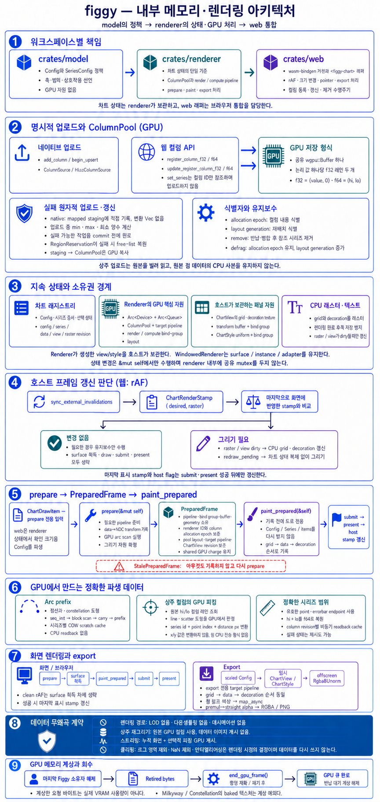


### 아키텍처 그림 읽기

그림의 번호는 각 구성요소의 역할을 구분한다. 네이티브 호스트는 통합 코드와 패널 상태를 보관하고, `Renderer`는 등록된 차트와 GPU 처리를 담당한다. 위에 놓인 구성요소가 아래의 모든 자원을 소유한다는 의미는 아니다. 웹 통합은 별도로 표시했다. 브라우저의 JS·WASM 경계에서 발생하는 복사는 네이티브 업로드에는 해당하지 않는다.

| 영역 | 데이터 흐름과 소유권 |
|---|---|
| **1. 크레이트별 역할** | `model`은 차트 설정·레이아웃·상호작용 정책을 정의하고 GPU 자원을 갖지 않는다. `renderer`는 등록된 차트, GPU 연산, CPU 래스터 렌더링을 관리한다. `web`은 이를 캔버스·입력·브라우저 실행 흐름에 연결한다. 저수준 네이티브 호스트는 차트를 등록하는 대신 `ChartDrawItem`을 직접 전달할 수도 있다. |
| **2. 컬럼 업로드와 정리** | 네이티브에서는 업로드하는 동안만 `ColumnSource`를 빌려 f32 쌍을 매핑된 스테이징 버퍼에 쓰고 최소 양수 값을 계산한다. GPU가 데이터를 풀로 복사한 뒤에는 슬롯과 스칼라 메타데이터만 남기며 CPU 점 배열은 보관하지 않는다. 충분한 첫 빈 공간에 할당하고 인접 빈 공간은 합친다. 실패하면 예약을 취소해 빈 공간 목록을 복구한다. 교체는 관련 상태를 모두 준비한 뒤 확정한다. allocation epoch는 내용 교체를, layout generation은 재배치로 인한 위치 변경을 구분한다. |
| **3. 차트 상태와 패널 자원** | `Renderer`는 등록된 설정·시리즈, 풀, 파이프라인과 공유 장치·큐를 보관한다. 호스트가 보관하는 `ChartView`는 래스터 텍스처와 좌표 변환 자원을, `ChartStyle`은 GPU 바인딩을 갖는다. `WindowedRenderer`는 surface·instance·adapter도 유지한다. 축·텍스트·격자의 CPU 렌더링에는 이미지 버퍼가 필요할 수 있다. 컬럼 업로드의 중간 버퍼를 없앴다고 이 이미지 할당까지 없어지는 것은 아니다. |
| **4. 프레임 갱신 판단** | 렌더러가 발급한 desired/raster 리비전과 마지막 표시 성공 기록을 비교한다. 래스터 설정이나 표시 영역이 바뀌면 축 이미지를 갱신한다. 배경색 같은 호스트 상태는 차트 설정을 바꾸지 않고 다시 그릴 수 있다. 웹에서는 변경이 없는 프레임의 surface 획득과 그리기를 생략하되 필요한 정리·완료 처리는 계속한다. 표시가 실패하면 마지막 성공 기록을 갱신하지 않는다. |
| **5. 준비와 명령 기록** | `prepare(&mut self)`가 입력을 확정하고 GPU 핸들·공유 할당 정보·검증용 상태를 `PreparedFrame`에 담는다. `paint_prepared(&self)`는 기록 전에 이를 검증한다. 뷰, 참조 컬럼, 풀 배치, 출력 파이프라인 또는 등록 차트 리비전이 바뀌면 거부한다. 호스트는 이 변경 전에 기존 명령을 제출해야 한다. 토큰은 외부 명령 버퍼의 제출 순서까지 검사하지 않는다. |
| **6. GPU 파생 데이터** | 누적 경로 길이, 피킹, 실제 도형의 범위는 GPU 컬럼에서 계산한다. 경로 길이 스캔은 청크별 계산 결과를 이어받으므로 시리즈 전체에 1670만 점의 고정 상한을 두지 않는다. 피킹과 범위 계산은 전체 점을 CPU로 복사하지 않고 작은 결과만 반환한다. 캐시와 프레임 토큰이 같은 계산 결과를 공유할 수 있으므로 캐시에서 지워도 자원이 바로 해제되지는 않을 수 있다. |
| **7. 화면 표시와 이미지 출력** | 격자·데이터·장식 순서로 합성한다. 출력할 때는 배율을 적용한 차트·뷰·스타일과 화면 밖 렌더 타깃을 준비한다. 정렬용 여백이 있는 행을 청크 단위로 읽어 오고, 알파가 미리 곱해진 RGBA를 일반 RGBA로 바꾼다. 청크 처리는 읽기 버퍼의 크기를 제한하지만 렌더 타깃·최종 RGBA·PNG의 메모리까지 없애지는 않는다. 상주 출력은 GPU 컬럼을, 스트리밍 출력은 다시 공급받은 원본 구간을 사용한다. |
| **8. 원본 보존과 캐시** | 상주 경로는 데이터 이미지 캐시 없이 GPU 컬럼에서 다시 그린다. 비상주 경로는 누적 이미지를 유지하고, 지원되는 차트에서는 현재 화면에 필요한 원본 행만 모은 GPU 패킹 캐시를 사용할 수 있다. 두 경로 모두 LOD·샘플링·데시메이션으로 데이터를 줄이지 않는다. 화면 밖 자르기, 잘못된 값·로그 범위 밖 값 제외, 안티앨리어싱은 표시 규칙이며 GPU 백엔드 간 픽셀값 일치를 보장하지 않는다. |
| **9. 메모리 집계와 회수** | figgy에서 자원을 참조하는 동안 공유 할당 정보도 유지한다. 마지막 참조가 해제돼도 회수 대기 바이트는 제출 경계를 알리고 GPU 큐의 작업이 끝날 때까지 집계한다. 호스트는 기존 명령을 제출하거나 폐기한 뒤 `end_gpu_frame()`을 호출해야 하며, 네이티브에서는 완료 콜백도 처리해야 한다. 아래에 설명한 스타일 텍스처 등은 집계에서 제외되며 보고값은 실제 VRAM 측정값이 아니다. |

### 원본 데이터 스트리밍과 상주 전환


그림은 상주 렌더링, 스트리밍 누적 이미지, 차트별 GPU 패킹 캐시, 원본을 다시 읽는 이미지 출력을 구분한다. 네이티브 호스트는 재공급할 수 있는 원본을 보관하고 요청된 구간을 전달한다. 브라우저에서는 TypedArray나 `readRange` 공급자를 사용한다. 웹 래퍼는 실행 순서와 구간 요청을 관리하며, 차트 설정·시리즈 순서·소스 리비전·처리 위치·범위 통계·캐시 사용 여부는 렌더러가 관리한다.

자동 스트리밍은 연결된 컬럼 전체를 `ColumnPool`에 넣지 않는다. 원본을 제한된 청크로 GPU에 올려 화면 밖 렌더 타깃에 누적한다. 지원되는 차트에서는 예산이 허용할 때 현재 화면에 필요한 원본 행만 GPU 캐시에 남긴다. 두 경로 모두 원본 도형을 그리며 LOD·샘플링·데시메이션을 적용하지 않는다. 한 페이지에서 상주 차트와 스트리밍 차트를 함께 사용할 수 있다.

스트리밍은 완료된 부분부터 화면에 표시한다. 입력이 바뀌지 않은 완료 결과는 재사용하고, 제목·축 이름만 바뀌면 데이터 처리 위치와 누적 이미지를 유지한다. 표시 범위를 좁힐 때는 패킹 캐시만으로 다시 그릴 수 있다. 캐시 범위 밖을 보거나 물리 해상도가 바뀌면 같은 리비전의 원본을 다시 공급해야 한다.

`job.cancel()`은 새 작업을 멈추고 이미 제출된 GPU 작업이 끝난 뒤 자원을 정리한다. 완료된 패킹 캐시에서는 GPU의 점·선을 선택하고 원본 행 인덱스를 반환할 수 있다. 그 밖의 비상주 스트림은 즉시 피킹을 지원하지 않는다. 배율을 지정한 PNG 출력은 화면 이미지를 늘리는 대신 원본을 다시 읽어 그린다. 따라서 호스트는 다시 그리기와 출력을 위해 원본을 유지해야 한다.

지원 범위와 웹 API는 [WASM 가이드](crates/renderer/WASM.md#exact-streaming)를 참고한다. 원본을 빠짐없이 처리하더라도 GPU 백엔드나 렌더 패스 경계에 따라 안티앨리어싱 픽셀값은 달라질 수 있다.

웹 래퍼의 차트 상태는 렌더러의 레지스트리를 기준으로 한다. 저수준 네이티브 호스트는 `ChartDrawItem`을 직접 전달할 수도 있다. 어느 경로든 `ChartDrawItem`은 준비 단계에서만 사용하며, 명령 기록 단계는 `PreparedFrame`에 보관된 입력을 사용한다.

### 소유권과 수명 경계

`Renderer`는 차트별 `Config`, 순서가 있는 `SeriesConfig`, 상주 `ColumnPool`, 비상주 소스 메타데이터(0.12.0), 렌더링·컴퓨트 파이프라인을 보관한다. 피킹 파이프라인은 공유하고, 현재 차트용 피킹 캐시는 최대 하나만 유지한다. 대기 중인 풀 정리 작업, 렌더러 공통 바인드 그룹, `Arc<wgpu::Device>`와 `Arc<wgpu::Queue>`도 관리한다.

생성해서 반환한 `ChartView`와 `ChartStyle`은 호스트가 패널 상태에 보관한다([egui 예제](crates/renderer/examples/egui_embed.rs)). `PreparedFrame` 역시 GPU 핸들과 공유 할당 정보를 유지하므로 호스트가 뷰·스타일을 해제해도 자원이 즉시 사라지지는 않을 수 있다. `WindowedRenderer`는 추가로 surface·instance·adapter와 선택적인 MSAA 렌더 타깃을 보관한다. `ChartId`는 발급한 렌더러에서만 유효하다. 설정과 시리즈를 함께 편집하려면 `set_chart_state`로 둘을 검증한 뒤 한꺼번에 교체한다.

컬럼 교체·제거·재배치는 풀, 차트, 리비전, 피킹 캐시를 먼저 준비하고 성공했을 때만 반영한다. 동기 준비 과정에서 오류가 나면 기존 상태를 유지하며, 마지막 반영 단계에서는 새 메모리를 할당하지 않는다. `remove_column`은 해당 컬럼을 참조하는 모든 등록 시리즈를 함께 제거하지만 `Config::legend`는 바꾸지 않는다. 범례까지 함께 바꾸려면 `remove_column_with_chart_config`를 사용한다. 이 호출은 풀, 영향을 받는 모든 시리즈, 해당 차트의 새 `Config`를 하나의 트랜잭션으로 반영한다. 웹 래퍼는 자동 범례와 직접 편집한 범례를 구분해 이 API를 사용한다.

Renderer 0.9부터 GPU 피킹은 차트 ID를 받는 API로 제공한다. `enable_gpu_picking()`을 한 번 호출하고, 필요하면 첫 선택 전에 `prepare_gpu_picking_for_chart(chart_id)`로 준비한다. 이후 `pick_chart(chart_id, GpuPickRequest)` 또는 `WindowedRenderer::pick_chart_at`을 호출한다. 축 변환과 데이터 영역 자르기는 렌더러가 `Config`에서 계산한다. 0.7의 저수준 `GpuPickEngine`은 더 이상 공개하지 않는다. 피킹은 GPU 컬럼 풀을 직접 읽으며 CPU 점 복사본이나 내부 `Mutex`를 두지 않는다. 점·막대·셀·등고선을 구분하는 결과가 필요하면 `pick_chart_data` / `WindowedRenderer::pick_chart_data_at`을 사용한다.

`Renderer::prepare`와 출력 준비 과정의 상태 변경은 모두 `&mut self`에서 수행한다. `Renderer::paint_prepared`는 `&self`로 토큰의 명령을 기록하므로 공유 참조만 제공하는 paint 콜백에서도 별도 잠금이 필요하지 않다. `Renderer`는 `Send + Sync`다.

토큰은 확정된 파이프라인·바인드 그룹·버퍼·패널 배치와 함께 컬럼 할당 세대, 풀 배치 세대, 출력 파이프라인 세대, 각 `ChartView`의 내용 리비전을 보관한다. 하나라도 바뀌면 기록 전에 `FiggyError::StalePreparedFrame`을 반환하므로 다음 프레임에서 다시 준비해야 한다.

경로 길이·별 위치와 자동 등고선 라벨 배치 결과는 컴퓨트 입력의 비트값을 키로 삼는 불변 자원이다. 입력이 같을 때만 공유하고, 좌표 변환·데이터 세대·배치 입력이 다르면 새 결과를 만든다. 기존 결과를 덮어쓰지 않는다. 캐시나 토큰이 GPU 핸들을 보관하는 동안 공유 할당 정보도 유지한다. 마지막 figgy 참조가 해제되면 회수 대기 상태로 옮기고, `end_gpu_frame()`으로 제출 경계를 알린 뒤 GPU 큐의 완료 콜백이 실행될 때까지 메모리 집계에 포함한다. 호스트는 이 호출 전에 기존 명령을 모두 제출하거나 폐기해야 한다.

직접 지정한 라벨 배치도 불변 자원이다. 같은 `ChartView`를 다시 작성하거나 참조 컬럼을 교체하거나 풀·출력 파이프라인을 재구성하면 기존 토큰은 무효가 된다. 호스트는 이 변경 전에 토큰으로 기록한 명령 버퍼를 제출해야 한다.

상주 `add_column`은 업로드할 때만 `ColumnSource`를 빌린다. 이후에는 GPU 컬럼과 자동 범위 맞춤용 최소·최대·최소 양수 값만 보관한다. 원본 참조나 점별 CPU 도형 정보는 유지하지 않는다. 점선·별자리에 필요한 누적 경로 길이도 GPU 풀을 스캔해 계산한다. 비상주 경로에서는 소스 메타데이터와 제한된 GPU 작업 상태만 유지하며, 호스트가 원본을 다시 공급할 수 있어야 한다. 렌더러는 원본 전체의 CPU 복사본을 보관하지 않는다.

### 메모리 계상과 회수

`gpu_memory_usage()`는 figgy가 추적하는 GPU 자원의 요청 할당량을 바이트로 반환한다. 실제 VRAM 사용량을 측정한 값은 아니다. 은하수·별자리 스타일이 필요할 때 생성하는 PSF·아틀라스·띠 텍스처는 일반 집계에서 제외된다. 다만 스트리밍 출력의 실행 가능 여부를 검사할 때는 알려진 텍스처 크기를 별도로 고려한다.

사용 중인 자원(`live`)과 회수 대기 자원(`retired`)은 모두 합계에 포함한다. Rust 핸들을 해제해도 제출된 GPU 작업은 계속 실행될 수 있으며, `end_gpu_frame()` 호출만으로 장치 메모리가 반환되지는 않는다. 네이티브 호스트는 새 프레임을 그리지 않을 때도 완료 콜백을 처리해야 한다. CPU 할당, 최종 RGBA·PNG 버퍼, 드라이버 내부 메모리는 이 집계에 포함하지 않는다. 네이티브 업로드의 중간 버퍼를 없앴다는 설명이 브라우저의 JS·WASM 경계 복사까지 제어한다는 의미는 아니다.

진행 중인 `GpuPickTicket`은 결과 읽기용 자원과 제출 당시의 `Arc` 기반 식별자 매핑을 직접 보관한다. 차트·풀이 바뀌거나 렌더러가 해제돼도 해당 요청의 `source_id` / `series_id`가 다른 대상을 가리키게 되지는 않는다.

웹에서도 같은 소유권 경계를 따른다. `<figgy-chart>`는 내부 캔버스, `ready` Promise, rAF 루프, ResizeObserver·DPR 처리, 포인터 변환, 비동기 호출 직렬화, ID 등록·해제를 담당한다. 이 과정을 직접 제어해야 할 때만 저수준 WASM 클래스인 `FiggyChart`를 사용한다.

웹의 초기화와 객체 수명 관리 규칙은 다음과 같다. 첫 프레임 준비는 실제 `GPUQueue.onSubmittedWorkDone()` Promise가 완료될 때까지 기다린다. 큐 요청이 거부되거나 장치가 소멸하면 생성·준비 오류로 전달하며 첫 프레임 성공 이벤트를 보내지 않는다.

| API·상태 | 동작 규칙 |
|---|---|
| 저수준 `FiggyChart` | `create` / `create_with_progress`는 같은 `GPUDevice`에서 모든 렌더링용 WGSL 진입점을 `createRenderPipelineAsync`로 미리 컴파일한다. 임시 JS 파이프라인을 해제하고 빈 차트의 첫 프레임을 제출한 뒤 완료를 기다린다. 선택적인 렌더링·스타일 자원과 경로 길이·범위·피킹·등고선 컴퓨트 캐시는 필요할 때 만든다. `prewarm_all_with_progress(callback)`은 이를 실제 wgpu 캐시에 생성하며 `{ scope, stage, phase }`를 알린다. `prewarm_all()`은 콜백 없이 같은 작업을 한다. `warm_up()`은 첫 프레임 대기용 호환 메서드다. 생성 시 피킹을 켜지는 않으며, `prewarm_gpu_picking()`으로 활성화하고 현재 차트를 준비한다. 재시도와 `pick_point` / `pick_data`도 저장된 활성화 오류를 포함한 같은 렌더러 상태를 사용한다. |
| `<figgy-chart>` 시작 | `web.create / first frame / finished`와 `figgy-ready`를 알린 뒤 백그라운드 피킹 준비를 시작한다. 실패하면 `operation: "prewarm_gpu_picking"`, `recoverable: true`인 `figgy-error`를 보낸다. 이미 완료된 `ready`와 렌더링 루프는 유지한다. |
| 비동기 호출 직렬화 | 연결 세대와 커널을 확인하는 작업 토큰으로 생성, 전체 사전 준비, 피킹 준비, 출력, 첫 프레임 대기, 범위 엔진 준비, 상주 자동 범위 맞춤과 피킹을 직렬화한다. 작업 중에는 rAF·포인터·대리 호출이 WASM에 접근하지 않으며 마지막 크기 변경과 포인터 해제만 보관했다가 종료 후 적용한다. 스트리밍 `auto_fit_all()`은 이 토큰 없이 렌더러에 범위 계산을 요청하고 스트림 완료를 기다린다. 스트리밍 실행기가 커널 호출을 계속하고 최신 차트 상태 요청을 반영한다. 범위 계산 자체는 busy를 켜지 않지만 별도 작업이 실행 중이면 busy일 수 있다. |
| 연결 해제·재연결 | 연결 해제 시 이전 세대를 무효화하고 rAF와 관찰자를 정리한다. 작업 중인 커널은 작업 종료 후 해제한다. 이전 세대의 완료 처리는 새 토큰·커널에 영향을 주거나 새 세대의 크기 변경·포인터 해제·객체 해제를 수행하지 않는다. |

웹 상태 변경 API는 다음과 같다.

| API | 동작 |
|---|---|
| `auto_fit_colorbar(padding)` | 행렬 값 컬럼들의 업로드 통계를 합쳐 공유 Z축 범위를 맞춘다. 색상 막대가 없으면 차트를 바꾸지 않는다. |
| `set_colorbar_axis(json)` | 기존 색상 막대의 전체 `AxisOptions`를 교체한다. 눈금 모양·방향·길이, 축 반전, 라벨 스타일·위치, 제목 옵션을 함께 설정한다. |
| `set_colorbar_title(text)` | 제목을 지정하고 표시한다. 빈 문자열이면 숨기며 `Config.colorbar`가 없으면 실패한다. |
| `set_contour_nice_levels(series_id, target_count, use_colormap_colors)` | 색상 막대 눈금 규칙으로 한 시리즈의 등고선 값을 만들고 필요하면 색상표의 색을 지정한다. 시리즈 설정에 반영한 뒤 레벨 수를 반환한다. |
| `series_draw_info(series_id)` | `{ drawn_count, cols, rows, truncated }`를 반환한다. 저수준 WASM은 JSON 문자열, 웹 래퍼는 객체를 반환한다. |
| `pick_data(x, y, max_distance_px)` | 점·구간·셀·등고선 레벨을 구분하는 식별자를 비동기로 반환한다. 저수준 WASM은 JSON 문자열 또는 `undefined`, 래퍼는 객체 또는 `null`이다. |
| `set_picked_points(json)` | `PickedPointsConfig` 또는 `null`을 담은 JSON 문자열로 `Config.picked_points`만 교체한다. `null`은 선택 표시를 지운다. 참조에는 좌표 대신 `series_id`, 선택적인 `source_id`, `point_index`를 저장한다. |
| `set_picked_data(json)` | `DataSelectionsConfig` 또는 `null`로 `Config.picked_data`만 교체한다. 참조는 출처와 인덱스만 보관하며 현재 도형은 차트의 GPU 자원에서 계산한다. |
| `set_clear_color(r, g, b, a)` | 선형 RGBA 각 성분을 0~1로 제한하고 다시 그리기를 요청한다. 화면 배경 상태이므로 Config JSON을 바꾸거나 축 이미지를 갱신하지 않는다. |

`FiggyChart::load_demo()`는 데모 상태 전체를 한 번에 교체한다. 컬럼 4개, 최종 `Config`와 시리즈 순서, 피킹 상태, 호스트 메타데이터, 유효한 범위 캐시를 함께 반영한다. 동기 준비 중 오류가 나면 기존 전체 상태를 유지한다. 트랜잭션 중에는 범위 계산 명령을 제출하지 않는다. 무효화된 캐시는 변경을 확정한 뒤 기존의 지연 생성·재시도 경로로 다시 만든다.

이 작업은 풀 용량과 같은 크기의 임시 GPU 버퍼 하나와 스테이징 버퍼 4개를 추가로 사용한다. 재배치용 백업이 남아 있으면 원본 풀·백업·임시 풀이 잠시 동시에 존재한다.

원본 컬럼은 변형해 저장하지 않는다. 화면 밖 자르기, 로그축의 0 이하 값 제외, NaN 제외와 안티앨리어싱은 표시 과정에만 적용한다.

### 점선 호장 스캔 (GPU)

점선의 시작 위치와 간격을 맞추려면 각 점까지의 누적 경로 길이가 필요하다. 이 길이는 현재 데이터→픽셀 변환에 따라 달라진다. 계산 키가 달라지면 GPU에서 새로 계산하고, 키가 정확히 같으면 이전의 불변 결과를 재사용한다.

```
pool 컬럼 (x, y) ──┐                        Transform uniform (96 B write)
                   ▼                                   │
   seg_init        dst[i] = |px(pᵢ) − px(pᵢ₋₁)|   ◄────┘
   scan_block      256-블록 inclusive 스캔 (Hillis–Steele, 공유 메모리)
   scan_block/add  블록 합 레벨 (dst → sums0 → sums1)
   carry 체인      min(디스패치 한계 × 256, 256³) 점 단위 청크를 순차 실행;
                   1-원소 carry 버퍼가 각 청크의 누계를 다음 청크에 전파 —
                   n 의 상한은 풀 메모리뿐, 어떤 크기에서도 readback 없음
                   ▼
   호장 prefix buffer ──► 라인 파이프라인 정점 슬롯 4/5 (dash 위상)
```

컴퓨트 명령은 호스트의 렌더 패스보다 먼저 GPU 큐에 제출한다. 따라서 통합 환경에서도 큐의 실행 순서에 따라 계산 결과가 준비된 뒤 그리게 된다.
계산 키에는 풀 배치 세대, X·Y 오프셋과 할당 세대, 길이, 컴퓨트 셰이더가 읽는 모든 좌표 변환 비트, 선택적인 별 배치 간격이 포함된다. 시리즈마다 최근 결과 8개를 보관하며, 없는 키는 새 버퍼에서 계산한다. 기존 결과는 덮어쓰지 않는다.
현재 누적 경로 길이 스캔은 `u32::MAX = 4,294,967,295`로 주소를 표현할 수 있는 범위에서 동작한다. 시리즈 길이나 풀 원소 오프셋이 `u32` 범위를 넘으면 점선용 누적 경로 계산을 생략한다. 새 시리즈 ID를 추가할 때 이미 256개 ID가 캐시에 있으면 무제한 증가를 막기 위해 경로 길이 캐시 전체를 비운다.

<a id="renderer-owned-상태와-frame-invalidation"></a>

### 렌더러 상태와 다시 그리기 판단

차트를 지속적으로 표시하는 호스트는 `Renderer`에 차트를 등록하고, GPU 제출과 화면 표시에 성공한 마지막 `ChartRenderStamp`를 보관한다. 검증된 리비전은 렌더러만 발급한다.

| 상태 | 다시 그리는 조건과 처리 |
|---|---|
| 렌더러의 `desired` 리비전 | 표시 상태 변경, 참조 컬럼 교체, 동기화된 폰트 등록 시 다시 그린다. |
| 렌더러의 `raster` 리비전 | 설정·시리즈·선택·폰트가 바뀌면 그리기 전에 `refresh_axis`를 호출한다. |
| 호스트의 `view_dirty` | 화면 크기·DPR로 미리보기 배치가 바뀌면 축 이미지를 갱신하고 다시 그린다. |
| 호스트의 `redraw_pending` | 배경색 등 화면 상태가 바뀌면 차트 설정을 복제하지 않고 다시 그린다. |

브라우저의 프레임 처리 순서는 다음과 같다.

```rust
renderer.sync_external_invalidations()?;
let stamp = renderer.chart_render_stamp(chart_id)?;
let draw = stamp.needs_draw_since(last_presented_stamp.as_ref());
let raster = stamp.needs_raster_since(last_presented_stamp.as_ref());

if !draw && !view_dirty && !redraw_pending {
    process_maintenance_without_surface_if_needed()?;
    return Ok(());
}
if raster || view_dirty {
    renderer.refresh_axis_with_selection(&mut view, &display_chart, rect, &boxes)?;
}
renderer.draw(clear, &items)?;
last_presented_stamp = Some(renderer.chart_render_stamp(chart_id)?);
view_dirty = false;
redraw_pending = false;
```

마지막 표시 기록과 호스트 플래그는 그리기가 성공한 뒤에만 갱신한다. 실패하면 다음 프레임에서 다시 시도한다. 변경이 없는 웹 rAF에서는 GPU 화면 출력 경로 전체를 생략한다. 상주 경로는 다시 그릴 때 GPU 풀의 원본 도형에서 명령을 만들며 데이터 이미지 캐시를 두지 않는다. 비상주 경로(0.12.0)는 부분 표시를 위한 GPU 누적 이미지를 유지하고, 입력이 바뀌지 않은 완료 결과를 재사용한다. 두 경로 모두 LOD·샘플링·데시메이션으로 데이터를 줄이지 않는다.

`Chart::{data_dirty,raster_dirty}`는 `Chart`를 직접 소유하는 저수준 호스트와의 호환성을 위해 남겨 둔 플래그다. `prepare`는 이 값을 읽거나 초기화하지 않고, 호출될 때 좌표 변환을 기록한다. 외부에서 `Chart`를 관리한다면 호스트가 `raster_dirty`를 확인·해제하고 `refresh_axis`를 호출해야 한다.

<a id="log-scale-gpu-처리"></a>

### GPU의 로그축 처리

`AxisOptions.scale = Logarithmic`이면 다음 규칙을 적용한다.

- 자동 범위 맞춤은 0·음수가 섞여 있어도 저장된 최소 양수 값을 하한으로 사용한다.
- 수동으로 지정한 경계가 0 이하이거나 유효하지 않으면 `1e-12`로 보정한다. 유효한 양수는 `1e-12`보다 작아도 유지한다.
- CPU의 `scatter_transform_from_config`가 보정된 범위를 log10으로 변환하고 해당 축의 `scale_log`를 설정한다.
- GPU 셰이더는 `mix(v, log10(v), is_log)`로 분기 없이 계산한다. 0 이하 데이터는 NaN 처리하거나 그리기에서 제외하며, 이 때문에 설정 전체를 거부하지는 않는다.

<a id="export-파이프라인"></a>

### 이미지 출력 과정

```
export_panel_rgba_async(chart, &[SeriesConfig], scale).await:
    scale ← clamp_export_scale(scale)         // [MIN_EXPORT_SCALE, MAX_EXPORT_SCALE]
    chart.config().scaled(scale)               // 픽셀 dim 모두 비례 확대
        ↓
    임시 ChartView (스케일된 axis 텍스처)
    임시 ChartStyle 들 ← create_style_for_series_scaled(cfg, scale) per cfg
        ↓
    offscreen wgpu::Texture (고정 Rgba8Unorm, COPY_SRC, transparent clear)
    paint(items) — 동일 합성 순서 (grid → data → decoration)
        ↓
    copy_texture_to_buffer 를 **행 청크** 로 (256 byte 정렬 padding; 청크
    높이가 디바이스 max buffer size 에 맞춰 적응 — 초대형 export 도 동작)
        ↓
    map_async (native 는 inline Wait poll, wasm 은 브라우저 yield await)
        ↓
    premul→straight α 변환, 패딩 행 제거 (채널 스왑 없음 — 타겟이 이미 RGBA)
        ↓
    RasterImage { width, height, rgba: Vec<u8> }   ← API 반환
        ↓
    encode_png(&img) → Vec<u8>                      ← PNG 바이트
        ↓
    호출자가 std::fs::write / clipboard / 네트워크 등 자유 처리
```

---

## 라이선스 / 폰트

내장 폰트 Liberation Sans는 SIL OFL 1.1을 따른다. 원문은 `crates/renderer/fonts/LICENSE-LiberationSans.txt`에 있다. 추가 폰트는 웹의 `register_font` 또는 네이티브의 `text_render::register_font_bytes`로 실행 중에 등록할 수 있다. 내용이 완전히 같은 파일을 다시 등록해도 한 번만 저장하며, 글꼴 ID별로 이미 준비한 데이터를 재사용한다. 중복 등록은 전역 폰트 세대를 증가시키지 않는다.
