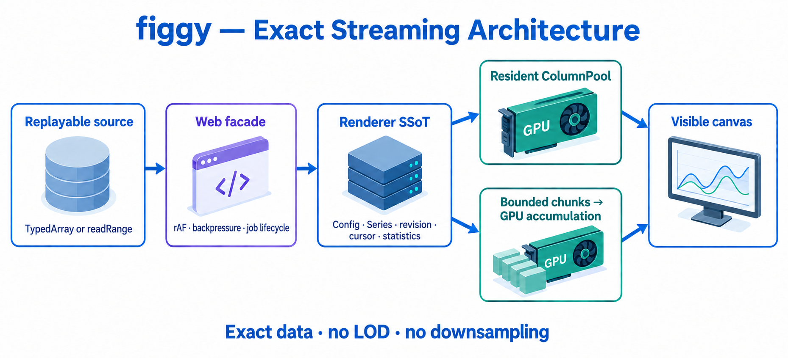

# WebAssembly 빌드와 웹 I/O 가이드

공개 후보 버전: `figgy 0.10.0` / `renderer 0.12.0`.
현재 배포된 버전은 `figgy 0.9.1` / `renderer 0.11.0`이며, 아래 스트리밍
API는 공개 후보의 소스 계약이다. 공개 검증과 배포 전에는 기존 버전에 포함되지 않는다.

`model`/`renderer` 두 crate 모두 `wasm32-unknown-unknown`으로 컴파일된다.
이 문서는 ① 무엇이 어떻게 타겟별로 갈리는지, ② 브라우저에서 다른 웹
컴포넌트와 I/O를 어떻게 이어야 하는지를 정리한다.

확인 명령 (워크스페이스 루트):

```bash
rustup target add wasm32-unknown-unknown
cargo check -p model    --target wasm32-unknown-unknown
cargo check -p renderer --target wasm32-unknown-unknown
```

## 1. 왜 컴파일되는가 — 의존성 구성

| 레이어 | 구성 | wasm |
|---|---|---|
| `model` | 의존성 0 (순수 Rust) | ✅ 무조건 |
| CPU 라스터 (축/라벨/텍스트) | `tiny-skia` + `fontdb` + `swash` — 전부 순수 Rust | ✅ |
| GPU | `wgpu` 30 — 웹에서는 WebGPU 백엔드 | ✅ |
| 블로킹 실행기 | `pollster` — **native 전용 타겟 의존성** | ❌ 컴파일 제외 |

skia-safe는 `wasm32-unknown-emscripten`만 지원해 wasm-bindgen 생태계
(`wasm32-unknown-unknown`)와 혼용이 불가능했고, 그래서 라스터 백엔드를
순수 Rust 스택으로 교체했다. 폰트는 번들 Liberation Sans 4종이 항상
포함되므로 웹에서도 텍스트 렌더가 보장된다. fontdb의 **시스템 폰트
스캔은 native 전용**이지만, `register_font(Uint8Array)` 로 TTF/OTF를
런타임 등록하면 웹에서도 가족명이 해석된다 (등록 폰트 > 시스템 폰트 >
번들 폴백 순).

## 2. 타겟 게이트 — 동기 API는 native 전용, async는 어디서나

웹어셈블리의 메인 스레드는 블로킹이 불가능하다(JS 이벤트 루프와 같은
스레드). 그래서 블로킹 편의 함수들은 `#[cfg(not(target_arch =
"wasm32"))]`로 게이트했고, 같은 일을 하는 async 변형이 모든 타겟에서
제공된다. **수동 feature flag가 아니라 타겟 cfg를 쓴 이유**: 타겟 자체가
플래그라서 "플래그 켜는 걸 잊은 wasm 빌드"가 성립할 수 없다 (wgpu/egui
생태계의 표준 관행).

| 블로킹 (native 전용) | async (모든 타겟) | 내용 |
|---|---|---|
| `Renderer::for_window` | `Renderer::for_window_async` | surface + adapter + device 셋업 |
| `data_render::request_adapter` | `request_adapter_async` | |
| `data_render::request_adapter_for_surface` | `request_adapter_for_surface_async` | |
| `data_render::request_device` | `request_device_async` | |
| `Renderer::export_panel_rgba` | `export_panel_rgba_async` | GPU→CPU readback |
| `Renderer::export_panel_png_bytes` | `export_panel_png_bytes_async` | |
| — | `Renderer::wait_idle` | 웹에서는 no-op (브라우저가 디바이스 폴링) |
| — | `Renderer::wait_submitted_work` / `WindowedRenderer::first_frame_ready` / `warm_up` | 첫 `queue.submit()` 이후 GPU 작업 완료 대기 |

블로킹 버전은 전부 `pollster::block_on(async 버전)` 한 줄 래퍼라 구현은
하나다. export의 readback은 `map_async` 완료를 `futures_channel::oneshot`
으로 await하며, native에서는 `device.poll(Wait)`을 인라인 호출해 즉시
resolve되고 웹에서는 await가 JS 이벤트 루프에 양보한다.

웹 export의 OOM/internal error scope는 동일한 wgpu `Device`가 노출하는 원시
`GPUDevice.pushErrorScope`/`popErrorScope`를 사용하되, export async 함수 전체를
감싸지 않는다. 최초 자원 생성·render submit과 각 readback submit을 각각 하나의
동기 구간으로 취급하여 `push → encode/submit/map 요청 → pop 요청`을 await 전에
끝낸 뒤, 이미 stack에서 제거된 scope의 Promise만 await한다. 따라서 export
future가 취소되어도 활성 scope를 다음 호출에 남기지 않으며, 외부 host가 같은
`GPUDevice`에 둔 outer scope와 await를 사이에 두고 순서가 교차하지 않는다.
동기 구간이 조기 종료되면 RAII drop이 남은 `popErrorScope()` 요청을 즉시
시작한다. 실제 오류 객체의 name/constructor/message는
`FiggyError::GpuResourceAllocationFailed`에 보존하고, 정상 `null`은 오류로
변환하지 않는다. 네이티브 export는 기존 wgpu OOM guard를 그대로 사용한다.

**임베드 경로(`Renderer::try_new`)는 원래 블로킹이 없다** — 호스트가
device/queue를 만들어 `RendererDevice`로 주입하는 구조라서, 웹 호스트가
async로 디바이스를 만든 뒤 넘기면 데스크톱과 동일하게 동작한다.

## 3. 웹 I/O 아키텍처

일반 웹 호스트의 public API는 `crates/web/figgy-chart.js`가 등록하는
`<figgy-chart>` Custom Element다. 이 facade가 내부 `<canvas>` 생성,
wasm async init/create, `ready` promise와 `figgy-ready` event,
`requestAnimationFrame` 루프, async operation busy gate, `ResizeObserver`,
현재 `devicePixelRatio` 기반 backing-store resize, pointer 좌표 변환,
`CustomEvent` dispatch를 맡는다. Raw wasm `FiggyChart` class는 이 facade가
쓰는 low-level kernel이며, 브라우저 수명주기를 직접 소유하려는 advanced
host만 직접 호출한다.

`ready`는 element의 **연결 세대별 Promise**다. 준비되기 전에 disconnect하거나
`free()`하면 그 세대의 Promise는 `AbortError`로 종료되고 다음 연결용 pending
Promise가 설치된다. `free()`는 terminal teardown이므로 다시 DOM에 연결하기
전까지 새 `ready`는 pending이며, 같은 비활성 element에 반복 호출해도 세대나
Promise가 다시 바뀌지 않는다.

Cold-start / lifecycle 요약:

| 표면/상태 | 계약 |
|---|---|
| raw `FiggyChart` | `create` / `create_with_progress`는 동일 GPUDevice에서 모든 render WGSL entry를 Promise 기반 `createRenderPipelineAsync`로 데우고 임시 JS pipeline을 버린 뒤 첫 빈 차트 frame까지 완료한다. Production renderer-owned optional render/style과 arc/fit/picker/contour compute cache는 lazy 상태를 유지한다. `prewarm_all_with_progress(callback)` / `prewarm_all()`이 실제 wgpu cache를 게시하며, `warm_up()`은 first-frame compatibility alias일 뿐 full prewarm이 아니다. create는 production picker를 enable하지 않고, `prewarm_gpu_picking()`과 `pick_point` / `pick_data`가 renderer-owned picker 준비 경로와 sticky activation error를 재사용한다. |
| facade ready | `web.create / first frame / finished` progress와 `figgy-ready`를 먼저 공개한 뒤 picker를 background prewarm한다. 실패는 `figgy-error`의 recoverable picker 오류로 보고하며 fulfilled `ready`와 rendering loop를 취소하지 않는다. |
| facade busy | generation+kernel operation token 하나가 connect/create와 모든 async mutable wasm 호출을 직렬화한다. facade의 `prewarm_all_with_progress` / `prewarm_all`도 이 기존 generation-aware operation gate를 통과한다. busy 중 frame/input/sync proxy는 wasm을 호출하지 않고 최신 resize와 pointer release만 settle 뒤 적용한다. |
| generation 종료 | disconnect/reconnect는 이전 token을 stale로 만든다. active operation의 kernel free는 settle까지 지연되고, stale settle은 새 generation의 token이나 kernel에 영향을 주지 않는다. |

```
JS / 웹 프레임워크                      wasm (figgy)
┌──────────────────────┐             ┌─────────────────────────────┐
│ <figgy-chart>         │  canvas     │ Surface ← SurfaceTarget      │
│  (Custom Element)     │────────────▶│   ::Canvas(HtmlCanvasElement)│
│                       │             │                             │
│ Float64Array ─────────┼─ 복사 1회 ──▶ ColumnSource → GPU pool      │
│ pointer events ───────┼─ 메서드 ────▶ HitMap / drag_by / resize_by │
│ CustomEvent ◀─────────┼─ 콜백 ──────│ 선택 / 드래그 / 리사이즈 결과 │
│ Blob 다운로드 ◀───────┼─ async ─────│ export_png_bytes_async       │
└──────────────────────┘             └─────────────────────────────┘
```

### 3.1 그리기 표면 — 데스크톱과 같은 두 경로

- **Standalone facade (권장)**: JS가 `<figgy-chart>`를 배치하면 facade가
  shadow DOM 내부 canvas를 만들고 raw `FiggyChart.create(canvas)`를 async로
  호출한다. host는 `await element.ready` 또는 `figgy-ready` event 이후
  proxy 메서드(`register_column_f32`, `update_register_column_f32`,
  `set_series`, `export_png` 등)를 호출한다.
- **Raw kernel (advanced)**: `wgpu::SurfaceTarget`이 `HtmlCanvasElement` /
  `OffscreenCanvas`를 받으므로, 직접 canvas를 넘기면 `for_window_async`가
  surface→adapter→device까지 구성한다. 이 경로에서는 host가 rAF, DPR
  resize, pointer mapping, busy gate를 전부 직접 지켜야 한다.
- **Embed**: 웹 호스트(예: eframe 웹 빌드)가 이미 가진 device/queue를
  `RendererDevice`로 주입 — `try_new`는 동기 함수 그대로 사용 가능.

Raw kernel 초기화는 async이므로 JS 이벤트 루프에서 구동한다:

```rust
// wasm-bindgen 스케치 — 저장소에 포함된 코드는 아니고 배선 형태만 보여준다.
#[wasm_bindgen]
pub struct FiggyChart {
    renderer: WindowedRenderer<'static>,
    chart_id: ChartId,
    /* view, derived caches, hitmap, … */
}

#[wasm_bindgen]
impl FiggyChart {
    /// JS: `const chart = await FiggyChart.create(canvas);`
    pub async fn create(canvas: web_sys::HtmlCanvasElement) -> Result<FiggyChart, JsValue> {
        let (w, h) = (canvas.width(), canvas.height());
        let mut renderer = Renderer::for_window_async(
            wgpu::SurfaceTarget::Canvas(canvas), (w, h), 16 * 1024 * 1024,
        ).await.map_err(|e| JsValue::from_str(&e.to_string()))?;
        // picker는 첫 pick 전, 또는 여기서 명시적으로 enable.
        // … 컬럼 등록 …
        let chart_id = renderer.register_chart(config, series).map_err(js_err)?;
        // … ChartView / HitMap::standard_chart() …
    }
}
```

`for_window_async`는 adapter/device await 뒤에 파이프라인 스테이지마다
한 프레임을 양보한다 (`InitEvent` + wasm `requestAnimationFrame`). 그래서
호스트 로딩바가 create 도중에 움직일 수 있다. `<figgy-chart>`는
`create_with_progress`로 각 스테이지를 `figgy-init-progress`
(`{ scope, stage, phase }`)로 내보낸다. 콜백에서 커널 메서드를 부르지
말 것 (객체가 아직 없거나, 생겨도 wasm_bindgen 락).

웹 `FiggyChart.create` / `create_with_progress`는 빈 차트의 첫 프레임을
제출한 뒤 `Queue::on_submitted_work_done`을 기다린다 (`first_frame_ready`).
그 전에 fullscreen/line/scatter/errorbar/bar/field와 모든 style·mapped·
pick-ring·typed data-selection·contour-label render entry를 브라우저의 Promise 기반
`createRenderPipelineAsync`로 순차 준비한다. 임시 JS pipeline은 즉시 버리고
같은 GPUDevice의 shader/driver cache만 데운다. create가 실제로 만든 기본
wgpu 객체 외의 production renderer-owned optional render/style cache는 계속
lazy이며, arc/fit/picker/contour compute cache도 이 단계에서 게시하지 않는다.
각 entry의 started/finished 사이에는 JS 이벤트 루프가 살아 있으므로 호스트의
파일 파싱, 시트 편집, 진행 UI가 renderer 준비와 동시에 동작한다.

`prewarm_all_with_progress(callback)`은 지연 소유 자원까지 완결하고,
`prewarm_all()`은 callback 없이 같은 작업을 한다. precise
line/scatter/errorbar, mapped variants, pick ring, typed bin/cell/contour overlay,
Histogram, heatmap/contour,
Sketch/Milkyway/Constellation, contour label, arc scan, series fit, GPU picker를
모두 실제 renderer cache에 게시하며 `{ scope, stage, phase }`를 callback으로
보고한다. pending 동안 wasm-bindgen mutable borrow가 걸리므로 host는 chart
호출을 busy queue에 넣되 renderer와 무관한 앱 작업은 막지 않아야 한다.
facade의 두 full-prewarm 메서드는 connect/create 때부터 사용하는 동일한
generation-aware operation gate를 통과한다.
완료 뒤 첫 사용자 차트가 새 pipeline을 만들거나 첫 submit 컴파일 비용을
떠안는 것은 회귀다. `warm_up()`은 기존 호환을 위해 `first_frame_ready()`의
alias로 남아 있으며 전체 준비 의미로 사용하면 안 된다.

Startup 측정은 별도 wasm export나 커널 내부 timestamp를 요구하지 않는다.
호스트가 `performance.now()` 같은 monotonic clock으로
`FiggyChart.create_with_progress` Promise의 시작/완료와 각
`{ scope, stage, phase }` callback 수신 시각을 기록한다. normal raw create는
window/renderer 준비, 각 async render entry, `web.create / chart resources`,
`web.create / first frame`의 started/finished pair를 순서대로 내보낸다.
파이프라인별 첫 제출을 비교할 때도 line/scatter/errorbar workload를 표준
register/set/frame API로 각각 구성하고 같은 외부 phase clock을 사용한다.

Picker A/B 측정에서 picker-off는 `prewarm_gpu_picking()`을 한 번도 호출하지
않는다. picker-on은 반드시 `web.create / first frame / finished` callback 뒤에
raw `prewarm_gpu_picking()`을 명시 호출하고 그 Promise duration을 외부 clock으로
따로 기록한다. create duration에 picker compile 시간을 합치거나, 첫 pick의
implicit 준비를 explicit prewarm 측정값으로 취급하지 않는다.

웹 `FiggyChart.create`는 picker를 켜지 않는다. raw kernel이 첫 pick 전에
준비하려면 `await chart.prewarm_gpu_picking()`을 호출한다. 이 메서드와
`pick_point` / `pick_data`는 같은 내부 경로에서 renderer의 `enable_gpu_picking_async` 뒤
현재 chart registry를 준비한다. renderer가 pipeline/cache/revision의 유일한
권위이므로 반복 prewarm과 재시도는 sticky activation error를 포함한 같은
renderer 상태를 재사용한다.

`Renderer`가 chart별 `Config`와 ordered series, `ColumnPool`, picker pipeline
bundle과 파생된 단일 active-chart registry cache, pending maintenance를 소유한다. web
kernel은 UI 파생 metadata와 Promise 변환만 관리하며 picker engine, dirty flag,
pool maintenance 권위를 복제하지 않는다.

Renderer 0.9부터 저수준 `GpuPickEngine`은 public API가 아니다. native/embed
host는 `enable_gpu_picking()` → 선택적
`prepare_gpu_picking_for_chart(chart_id)` →
`pick_chart(chart_id, GpuPickRequest)` 순서로 이전한다. `WindowedRenderer`는
현재 surface에 맞는 panel/scale을 계산하는 `pick_chart_at`을 제공한다. host는
axis transform이나 data-area clip을 복제하지 않는다.

typed 경로는 `pick_chart_data` / `WindowedRenderer::pick_chart_data_at`이다.
`pick_data`의 tagged 결과는 point, histogram bin, canonical matrix cell,
contour level identity와 `distance_px`만 가진다. bar/field compute entry는 보이는
render entry와 같은 transform, pool, style, lattice, level table과 geometry
helper를 읽는다. CPU가 endpoint f64, bar rectangle, cell bounds, contour segment를
복원하거나 보관하지 않는다. 결과 ref를 `set_picked_data`로 `Config.picked_data`에
넣으면 histogram은 같은 edge/value/style bind group, matrix/contour는 같은 field
bind group으로 overlay를 그리므로 축이나 데이터 갱신 뒤에도 표시가 어긋나지 않는다.

### 3.2 렌더 루프 — requestAnimationFrame + renderer stamp

`<figgy-chart>` facade가 `requestAnimationFrame` 콜백에서 데스크톱 데모와
동일한 패턴을 돈다. raw kernel을 직접 쓰는 advanced host는 같은 루프를
직접 구현해야 한다. 아래는 실제 `frame()`의 상태 전이만 줄인 의사 코드다:

```rust
renderer.sync_external_invalidations()?; // process-global font registration
let stamp = renderer.chart_render_stamp(chart_id)?;
let renderer_dirty = stamp.needs_draw_since(last_presented_stamp.as_ref());
let raster_dirty = stamp.needs_raster_since(last_presented_stamp.as_ref());

match frame_decision(
    renderer_dirty,
    raster_dirty,
    view_dirty,
    redraw_pending,
    renderer.has_pending_maintenance(),
) {
    Clean => return Ok(()),
    MaintenanceOnly => {
        renderer.process_pending_maintenance()?; // surface acquire/draw 없음
        return Ok(());
    }
    Draw { refresh_raster } => {
        ensure_internal_render_columns()?;
        renderer.process_pending_maintenance()?;
        let stamp = renderer.chart_render_stamp(chart_id)?;
        if refresh_raster {
            renderer.refresh_axis_with_selection(
                &mut view,
                &display_chart,
                rect,
                &sel_boxes,
            )?;
        }
        renderer.draw(clear, &items)?;

        // submit/present 성공 뒤에만 onscreen 상태를 전진시킨다.
        view_dirty = false;
        redraw_pending = false;
        last_presented_stamp = Some(stamp);
    }
}
```

`WindowedRenderer::draw`는 `Renderer::prepare`(`&mut` — pipeline 준비,
transform uniform write, arc-length compute dispatch)와
`Renderer::paint_prepared`(`&self` — 순수 기록)를 한 `&mut self` 아래
연달아 실행하는 원샷 facade다. wasm 래퍼처럼 렌더러를 단독 소유하는
호스트에는 이 facade가 자연스럽고, paint 콜백이 공유 참조만 주는
호스트(egui/iced embed)는 두 단계를 분리 호출한다 — 자세한 계약은
데스크톱 README의 통합 패턴 절 참조.

clean rAF에도 facade의 다음 콜백 예약, DPR 비교, wasm 상태 확인은 남지만
GPU column 준비, surface acquire, draw/submit/present는 전부 생략한다.
실패한 refresh/draw는 last-presented stamp와 host flag를 전진시키지 않아
다음 rAF에서 재시도한다.
이 최적화는 이전 canvas가 그대로 유효한 프레임만 건너뛰며, 원본 데이터의
sampling·LOD·decimation이나 시간 기반 프레임 누락은 수행하지 않는다.

column upsert/remove/defrag는 renderer 내부에서 provisional pool, 영향받는
chart authority/revision, active picker successor를 먼저 준비한다. 반환 가능한
동기 오류가 나면 전 상태를 보존하고, 성공 시 pool/chart를 공개한 다음 picker와
maintenance 상태를 allocation 없이 게시한다. plain `remove_column`은 참조
series만 cascade 제거하고 legend 문서는 바꾸지 않는다. web처럼 cascade에
따른 파생 legend `Config`도 함께 바꿔야 하는 host는
`remove_column_with_chart_config`를 사용해 한 transaction으로 게시한다.

public `FiggyChart::load_demo()`도 같은 compound failure-atomic 경계를 쓴다.
4개 demo column, 최종 `Config`/ordered series, active picker, web의 column
revision/style/label/color metadata와 여전히 유효한 extent cache를 함께
게시한다. commit 전 동기 오류가 나면 이 상태는 전부 이전 값으로 남는다.
transaction 중에는 extent reduction을 submit하지 않으며, 바뀐 demo column을
참조하던 cache entry는 제거되어 commit 뒤 기존 lazy/retry 경로에서 다시
생성된다. 성공한 호출은 pool capacity와 같은 임시 GPU buffer 하나와 staging
buffer 4개를 추가로 사용한다. 기존 defrag backup이 있으면 순간적으로
primary + backup + 임시 full-pool buffer가 공존한다.

### 3.3 데이터 입력 — 명시적 register/update와 f32 물리 lane

GPU 풀의 물리 lane은 **항상 logical value당 f32 두 개**다. 일반 scalar
column은 `(value as f32, 0)`, `Float64Array`/`HiLoColumnSource` 경로는
`(hi: f32, lo: f32)`를 기록한다. 즉 shader의 native f64가 아니라 두 f32의
합으로 큰 절대값에서 작은 delta를 보존한다. 업로드 설계의 핵심 불변은
native/wasm 공통이다:

```rust
// scalar: logical value → `(value as f32, 0)`
let mut view = staging.slice(..).get_mapped_range_mut();
let writer = ColumnPairWriter::new(view.slice(..)); // renderer pool 내부, crate-private
let stats = source.write_f32_pair_le_into_with_stats(writer);
drop(view);
staging.unmap();
enc.copy_buffer_to_buffer(&staging, 0, &pool, offset);  // 이후는 GPU 내부 복사

// hi/lo: logical f64 value → two f32 lanes in the same mapped staging buffer
let mut view = staging.slice(..).get_mapped_range_mut();
let writer = ColumnPairWriter::new(view.slice(..)); // renderer pool 내부, crate-private
let stats = source.write_f32_pair_le_into_with_stats(writer);
drop(view);
staging.unmap();
```

즉 "f64의 소유권/참조만 받아 변환 결과가 업로드 버퍼에 직접 쓰이는가"는
**그렇다** — 데스크톱에서는 이것이 전부다. source는 pair를 기록하는 같은
loop에서 `ColumnUploadStats`를 반환하며 renderer는 write-only view를 재독하지
않는다. scalar 최소 양수는 실제 기록된 `value as f32`, hi-lo 최소 양수는
기록된 `hi as f64 + lo as f64` 기준이고 finite positive 값만 포함한다.

custom `ColumnSource` / `HiLoColumnSource` 구현은 fused method를 반드시
구현해야 한다. 불완전한 migration은 upload 중 런타임 실패가 아니라 컴파일
오류로 드러나며, mapped byte readback이나 silent fallback은 두지 않는다.

wasm에서 추가되는 비용은 변환이 아니라 **메모리 도메인 횡단**이며, 위
구조 바깥의 플랫폼 사정이다:

1. **JS 출발 데이터에 한해** JS 힙 → wasm 선형 메모리 복사 1회. wasm
   안에서 생성·fetch된 데이터라면 이 복사는 없다 (native와 동일해짐).
2. wgpu 웹 백엔드 내부: wasm은 JS `ArrayBuffer`를 `&mut [u8]`로 직접
   가리킬 수 없으므로, `get_mapped_range_mut`는 wasm 쪽 그림자 버퍼를
   내주고 unmap 시 WebGPU의 실제 mapped range로 동기화한다 (wgpu가
   내부 처리하는 1홉).

경계 타입 선택:

- **`Float32Array` (일반 좌표 권장)** — 경계 트래픽 4 B/elem,
  borrowed source가 staging에 `(value, 0)` pair와 통계를 한 pass로 기록.
- **`Float64Array` (큰 절대 좌표)** — 경계 트래픽과 GPU 저장은 8 B/elem.
  min/max 메타데이터뿐 아니라 GPU vertex 계산도 hi/lo 두 f32 lane을 사용해
  timestamp 크기의 절대값에서 sub-f32 delta를 보존한다.

마샬링 오버헤드까지 줄이려면 wasm이 버퍼를 할당해 ptr/len을 노출하고
JS가 `new Float32Array(memory.buffer, ptr, len).set(src)`로 직접 채우는
패턴을 쓴다 (경계 복사 1회는 동일, wasm-bindgen 인자 변환만 제거).

공개 API는 등록과 교체를 구분한다:

```js
chart.register_column_f32("x", xs);          // 새 id만; 기존 id면 오류
chart.update_register_column_f32("x", next); // 기존 id만; 없으면 오류

chart.register_column_f64("time", times);          // Float64Array → hi/lo
chart.update_register_column_f64("time", nextTimes);
```

매트릭스(heatmap·contour)는 컬럼이 수천 개라 단건 등록이 성립하지 않는다. **평탄 버퍼
하나**로 한 번에 등록한다:

```js
// z 는 ids.length 개 컬럼 × valuesPerColumn 개 값, id 순서로 이어붙인 하나의 배열
const ids = Array.from({ length: 5000 }, (_, c) => `z${c}`);
chart.register_columns_f32(ids, z, 5000);   // 업로드 1회
chart.register_columns_f64(ids, z64, 5000); // f64 는 hi/lo 분할 유지
```

컬럼별 배열의 배열이 아니라 평탄 버퍼인 이유: 매트릭스는 정의상 직사각형이고 평탄 버퍼가
**그 메모리 레이아웃 그대로**다(fetch·ndarray·이미지에서 온 데이터가 이미 그 모양이다).
배열의 배열이면 JS 순회 + 컬럼당 경계 통과가 다시 생겨 없애려던 비용이 남는다. 사본은 생기지
않는다 — 각 컬럼은 그 버퍼의 슬라이스를 빌려 스테이징 버퍼에 직접 쓴다.

- **새 id 전용**이고 **all-or-nothing**이다. 거부된 배치는 id를 하나도 등록하지 않고 업로드도
  하지 않는다(배치 내 중복 id, 이미 등록된 id, `data.length !== ids.length × valuesPerColumn`
  모두 거부).
- 길이가 서로 다른 ragged 배치는 지원하지 않는다 — 그건 매트릭스가 아니고, 단건
  `register_column_*`로 그대로 된다.
- 리비전은 **컬럼마다 하나씩** 올라간다(배치 하나에 하나가 아니다).
- `register_columns_f64`는 단건 `register_column_f64`와 같은 `(hi, lo)` 정밀도를 지킨다 —
  f32로 캐스팅하지 않는다.

빈 배열은 거부한다. 승인된 `update_register_*` 호출은 같은 내용이더라도
명시적 교체 요청이므로 매번 failure-atomic upload를 수행한다. hash-only
동일성 판정이나 묵시적 no-op은 없다. `set_series`는 등록된 column id 중
무엇을 그릴지만 바꾸며 column upload를 수행하지 않는다.

### 3.4 이벤트 입력 — 포인터를 모델 정책으로 그대로 전달

선택/드래그/리사이즈 정책(`Selectable`/`Draggable`/`Resizable`/`HitMap`)은
전부 `model`에 있고 model은 wasm에서 무수정으로 동작한다. 일반 host는
`<figgy-chart>` facade가 변환한 pointer event를 쓰면 된다. raw kernel을
직접 쓰는 경우에만 canvas 포인터 이벤트를 픽셀 좌표로 바꿔 넘긴다:

```js
const rect = canvas.getBoundingClientRect();
const sx = canvas.width / Math.max(1, rect.width);
const sy = canvas.height / Math.max(1, rect.height);
const x = (event.clientX - rect.left) * sx;
const y = (event.clientY - rect.top) * sy;
const selected = kernel.on_press(x, y); // Rust Result<bool, JsValue>: 오류는 throw
kernel.on_move(x - lastX, y - lastY);   // Rust Result<(), JsValue>
kernel.on_release();                    // infallible state clear
```

facade는 매 event에서 canvas CSS rect와 backing-store 크기의 비율을 사용해
physical pixel 좌표를 계산한다. `FiggyChart` kernel은 저장된 logical
`chart_area`를 현재 surface에 uniform scale + letterbox로 맞춰 그리고,
drag/resize delta는 내부에서 logical document 좌표로 되돌린다. 따라서
브라우저 viewport resize는 preview zoom이며, Export 문서 크기나 폰트
크기를 바꾸지 않는다.

### 3.5 이벤트 출력 — CustomEvent로 프레임워크 중립

선택 변경·드래그 종료 등의 결과는 facade가 `CustomEvent`로 dispatch하므로
React / Vue / Svelte가 표준 방식으로 구독한다. 이벤트는 custom element에서
`bubbles: true`, `composed: true`로 나간다:

```js
chartEl.addEventListener("figgy-select", (e) => {
  console.log(e.detail.selected);
});
chartEl.addEventListener("figgy-init-progress", (e) => {
  // { scope, stage, phase: "started" | "finished" } — ready 이전에도 발생
  console.log(e.detail.scope, e.detail.stage, e.detail.phase);
});
```

### 3.6 PNG export — async 필수, `Uint8Array` 반환

```rust
pub async fn export_png(&mut self, scale: f32) -> Result<js_sys::Uint8Array, JsValue> {
    let export_chart = Chart::new(
        self.renderer
            .chart_config(self.chart_id)
            .map_err(js_err)?
            .clone(),
    );
    let series = self
        .renderer
        .chart_series(self.chart_id)
        .map_err(js_err)?
        .to_vec();
    let bytes = self.renderer
        .export_panel_png_bytes_with_clear_async(
            &export_chart,
            &series,
            scale,
            self.clear_color,
        )
        .await
        .map_err(|e| JsValue::from_str(&e.to_string()))?;
    Ok(js_sys::Uint8Array::from(bytes.as_slice()))
}
// JS: const png = await chart.export_png(2.0);
// 필요할 때 host가 new Blob([png], { type: "image/png" })로 변환한다.
```

블로킹 `export_panel_png_bytes`는 웹에 존재하지 않는다(컴파일 제외) —
실수로 메인 스레드를 데드락시킬 방법 자체가 없다.

### 3.7 프리셋 — fieldless enum 그대로 노출

`model::AxisPreset`(축 프레임 5종)과 `model::ColorCycle`(색 로테이션
5종)은 **fieldless enum**이라 wasm_bindgen이 정수 enum으로 그대로
노출한다. 래퍼는 같은 이름의 미러 enum + `From` 변환만 가진다:

```js
chart.apply_axis_preset(AxisPreset.OpenOutward);   // 4축 일괄
chart.apply_color_cycle(ColorCycle.ColorblindSafe); // 시리즈 재색칠 + 범례 동기
color_cycle_css(ColorCycle.Vivid);  // → ["rgb(0 32 240 / 1)", …] 호스트 스와치용
```

### 3.8 SSoT I/O — Config/Series 전체를 JSON으로 라운드트립

옵션 트리(`Config`)와 시리즈 선언(`Vec<SeriesConfig>`)은 GPU 핸들 없는
순수 데이터라서, model의 **`serde` feature**(기본 off — 켜지 않으면
의존성 0 유지)를 켜면 전체가 JSON으로 직렬화된다. 래퍼가 이를
`get_config / set_config / get_series / set_series`로 노출한다:

```js
// 처음엔 auto-fit으로 생산하고, SSoT를 꺼내 자유 편집 후 되돌린다.
const cfg = JSON.parse(chart.get_config());
cfg.left_y.scale = "Logarithmic";          // 스케일
cfg.left_y.major_spacing = 1.0;            //   └ 로그는 decade 단위로 함께!
cfg.left_y.label_style.format = "Power";   // 라벨 포맷 (10ⁿ)
cfg.bottom_x.tick = "Both";                // 틱 모양
cfg.bottom_x.major_tick_length = 12.0;     // 틱 길이
cfg.bottom_x.label_style.color = { r: 0.8, g: 0.1, b: 0.1, a: 1.0 };  // 색
cfg.chart_title.text.font_size = 34;       // 글씨
chart.set_config(JSON.stringify(cfg));     // → renderer revision 갱신 → 다음 frame()에 반영

const series = JSON.parse(chart.get_series());
series[0].render_type.Line.line.line_width = 4.0;
series[0].render_type.Line.line.line_color = { r: 1, g: 0, b: 1, a: 1 };
chart.set_series(JSON.stringify(series));  // GPU 스타일 재빌드 포함
```

<!-- contour-contract: scope=wasm max-levels=1024 -->
`set_series(json)`에서 `Contour`와 `HeatmapContour`의 `contour.levels` 허용
길이는 `0..=1024`다. 1025개 이상이면 JavaScript 예외를 반환하고 이전
config, series 선언, GPU style을 그대로 유지하므로 다음 frame도 이전 상태를
그린다. WASM 전용으로 더 작은 상한을 두거나 배열을 조용히 자르는 경로는 없다.
Contour label도 automatic/explicit 공통으로 1024개까지 지원한다. `spacing_px`는
숨김/명시 anchor 여부와 무관하게 유한한 양수여야 하며, automatic 배치에서만
clamp된 frame/export scale과의 곱을 다시 검사한다. label atlas가 WebGPU adapter의
texture dimension 한계를 넘거나 그 곱이 overflow해도 frame/export는 GPU 상태를
바꾸기 전에 실패하고 이전 chart와 resource를 유지한다.

`set_config`는 JSON을 검증한 뒤 renderer-owned `Config`를
`set_chart_config(chart_id, config)`로 교체한다. 이 호출이 desired/config/
raster revision을 갱신하므로 다음 `frame()`의 `ChartRenderStamp` 비교가
draw와 raster refresh를 요구한다.
**주의**: 스케일을 바꾸면 `major_spacing` 해석도 바뀐다 (Linear = 데이터
단위, Logarithmic = decade 단위). `set_x_range`류 헬퍼는 자동으로 맞춰
주지만 SSoT 직접 편집은 호출자가 함께 고쳐야 한다.
`AxisOptions.inverted` 역시 별도 wasm 메서드가 아니라 Config JSON 필드이며,
축 라스터·데이터 렌더링·`pick_point`·`pick_data`가 같은 반전 mapping을 사용한다.

**전체 JSON 스키마는 [`crates/web/SCHEMA.md`](../web/SCHEMA.md)** —
`Config`/`SeriesConfig` 전 필드의 직렬화 형태, enum 허용 문자열, serde
표현 규칙(externally-tagged enum 등), 편집 시 의미 결합 주의사항을
담는다. 이 문서의 JSON 블록은 Rust 소스에서 생성되며 동기화 테스트
관련 검증은 `cargo test -p model --features serde`로 수행한다.

### 3.9 async 메서드와 객체 잠금 (필독)

wasm_bindgen은 async 메서드의 **프로미스가 pending인 동안
객체를 잠근다** — 그 사이 같은 객체의 다른 메서드를 부르면 "recursive
use of an object" 예외가 난다. facade는 이 규약을 내부에서 지킨다.
raw kernel 직접 호출 시 host 규약:

- rAF 루프에서 `requestAnimationFrame(tick)`을 **wasm 호출보다 먼저**
  예약해 예외가 루프를 죽이지 못하게 한다.
- create/connect, `prewarm_all_with_progress`/`prewarm_all`,
  `prewarm_gpu_picking`, export,
  `first_frame_ready`/`warm_up`, `ensure_extent_engine`, `auto_fit_all`,
  `pick_point` / `pick_data` 동안 generation+kernel `busy` token으로
  `frame()` / 포인터 / resize / proxy 호출을 모두 건너뛰거나 거부한다.
  `auto_fit_all`은 Promise가 끝날 때 Config에 직접 commit하므로 pending
  중 `frame()`을 부르면 안 된다.
- facade는 busy 중 최신 resize 하나와 pointer release만 보관한다. 현재
  operation settle 뒤 release와 resize를 wasm에 적용한 다음 token을 놓는다.
  disconnect는 active kernel free를 settle까지 미루며, 이전 generation의
  settle은 새 generation의 token을 해제하지 않는다.

`crates/web/index.html`은 facade 사용 레퍼런스다. raw kernel 직접 배선은
advanced host가 위 규약을 그대로 복제할 때만 선택한다.

## 4. 제약과 주의사항

- **단일 스레드**: CPU 라스터(축 크롬)는 메인 스레드에서 돈다. 패널 단위
  데코 래스터는 글리프 캐시 적용 후 ~0.4 ms/frame(release, 600×460)이라
  상호작용 중에도 문제없다. 더 큰 작업이 필요해지면 `OffscreenCanvas` +
  Web Worker로 전체를 옮기는 선택지가 있고, wasm 스레드(SharedArrayBuffer)
  를 쓰려면 서버에서 COOP/COEP 헤더(cross-origin isolation)가 필요하다.
- **WebGPU 가용성**: Chrome/Edge 안정판, Firefox 141+, Safari 26+. 구형
  브라우저 대응이 필요하면 wgpu의 `webgl` feature로 WebGL2 폴백을 켤 수
  있다 (이 경우 WebGPU 전용 한계치 차이에 유의).
- **폰트**: 번들 Liberation Sans에는 CJK 글리프가 없다 — 한글 등은
  호스트가 `register_font(Uint8Array)` 로 폰트 파일(TTF/OTF)을 가져와
  등록해야 한다 (등록 후 SSoT `font` 가족명으로 사용; 반환값이 가족명).
  woff2는 fontdb가 파싱하지 못하므로 TTF/OTF를 받을 것.
  **손그림(sketch) 모드는 텍스트 폰트를 자동으로 번들 손글씨 폰트(Comic
  Neue, OFL)로 강제한다** — 별도 등록 불필요. Comic Neue가 글리프를
  갖지 않는 문자(CJK·그리스 등)는 문자 단위로 일반 해석 체인(등록 폰트 →
  Liberation)으로 폴백하므로, 한글 라벨은 sketch 모드에서도 등록해 둔
  CJK 폰트로 그대로 그려진다.
- **pollster 함정**: 직접 wgpu 코드를 추가할 때 wasm에서 `block_on`을
  쓰면 데드락이다. 이 저장소의 규약대로 — 블로킹 변형은
  `#[cfg(not(target_arch = "wasm32"))]`, 본 구현은 async — 를 따를 것.

## 5. 빌드 산출물 — `crates/web` → `pkg/`

래퍼 crate는 `crates/web`(패키지명 `figgy` — 대외 산출물 이름)이고,
릴리즈 빌드는:

```bash
npx wasm-pack build crates/web --release --target web
```

산출물 (`crates/web/pkg/`, 프론트엔드에 통째로 전달):

| 파일 | 내용 |
|---|---|
| `figgy_bg.wasm` | 릴리즈 wasm 본체 (~3.6 MB — wgpu + 번들 폰트 4종 포함) |
| `figgy.js` | ES module 글루 — `import init, { FiggyChart, … }` |
| `figgy.d.ts` | **TypeScript 정의 자동 생성** — raw wasm kernel 시그니처 레퍼런스 |
| `package.json` | npm 호환 메타 |

`crates/web/figgy-chart.js`가 public facade다(`pkg/` 산출물이 아니라 함께
배포하는 JS entry). 내부 canvas, rAF 루프, DPR
좌표 변환, 포인터 선택/드래그/리사이즈, ResizeObserver, ready/event
수명주기, async operation busy gate를 포함한다. `crates/web/index.html`은 이 facade를
사용하는 동작 레퍼런스고,
[`crates/web/SCHEMA.md`](../web/SCHEMA.md)가 SSoT JSON의 전체 스키마
레퍼런스다. 로컬 확인:

```bash
cd crates/web && python -m http.server 8137   # wasm은 file:// 불가
```

`<figgy-chart>` facade API 표면:

| 분류 | 메서드 |
|---|---|
| 수명 | `<figgy-chart>` element · `ready` promise · `figgy-ready` / `figgy-init-progress` / `figgy-error` / `figgy-select` / `figgy-drag` / `figgy-release` / `figgy-resize` events · `free()`. 첫 frame 완료와 ready 공개 뒤 background picker prewarm을 시작한다. prewarm 실패는 `operation: "prewarm_gpu_picking"`, `recoverable: true`인 `figgy-error`이며 ready를 취소하지 않는다 |
| 폰트 | `register_font(Uint8Array)` → 가족명 배열 (TTF/OTF/TTC). 등록 후 SSoT `font` 가족명이 해석됨 — 등록 폰트가 시스템 폰트보다 우선이라 웹/데스크탑 해석이 동일. byte-for-byte 동일 파일의 재등록은 저장소와 font generation을 늘리지 않는 멱등 동작이며, resolved face backing도 face id별로 재사용한다. 미등록·미해석 가족명은 내장 Liberation Sans 폴백 (CJK 글리프 없음 — 한글은 폰트 등록 필요) |
| 스타일 파라미터 | *(free 함수)* `draw_style_modes()` → 모드 태그 JSON 배열 · `draw_style_param_specs(mode)` → `{key, min, max, default, integer}` JSON 배열. **슬라이더 범위의 단일 진실 원본** — min/max는 권장 범위(SSoT는 그 밖의 값도 수용, 렌더러는 안전 가드만 적용), default는 model의 `Default` 구현과 테스트로 고정. 호스트는 이걸로 스타일 UI를 자동 생성하고 범위를 하드코딩하지 말 것 |
| 컬럼 등록/갱신/해제 | `register_column_f32/f64(id, TypedArray)` *(새 id만)* · `register_columns_f32/f64(ids, TypedArray, valuesPerColumn)` *(새 id만, 평탄 버퍼 하나 → 업로드 1회, all-or-nothing)* · `update_register_column_f32/f64(id, TypedArray)` *(기존 id만, 승인된 호출은 항상 upload)* · `remove_column(id)` |
| 시리즈 등록/해제 | `add_line_series(id, x, y, width, label)` *(업서트)* · `remove_series(id)` |
| 범례 | `set_series_label(id, label)` — `'\n'` 줄바꿈·유니코드 첨자 지원, 빈 문자열 = 해당 행 제거. `set_series` / `apply_color_cycle` 은 자유 편집된 텍스트를 덮지 않고 인식 가능한 자동 엔트리의 심볼만 갱신한다. 전체 재작성은 `reset_legend_from_series_labels()` 를 명시 호출할 때만 수행한다. 자유 편집은 SSoT `legend.content` 하나의 리치 문서로: 줄바꿈은 `"\n"` 세그먼트, `"\t"` 는 표형 열 구분자, 심볼은 **고정폭 필드 세그먼트**(`field_em` — 어떤 형태든 정확히 2.0 em; 선 마크는 `rule:true`, 점선은 `rule_dash` em 패턴) + 색 오버라이드라 위치·줄배치·폭이 전부 명시적. `content.font` / `content.font_size` / 세그먼트별 오버라이드는 그리기 시점에 그대로 적용 |
| 히트테스트 | `hit_test(x, y)` → 요소 id 문자열 또는 `null` (`"data_area"` · `"axis_bottom"` · `"tick_labels_left"` · `"axis_title_left"` · `"colorbar"` · `"colorbar_axis"` · `"colorbar_tick_labels"` · `"colorbar_title"` …). 컬러바 세부 요소는 각각 선택 표시되고 드래그하면 축선/라벨/제목 offset이 갱신된다. `pick_point(x, y, max_distance_px)` → `Promise<{ source_id: string \| null, series_id, point_index, distance_px } \| null>`; point/scatter는 실제 marker 크기(스타일 매핑 포함)를 기준으로, line 계열은 stroke 근처 클릭을 해당 segment의 가까운 endpoint 데이터 점으로 스냅한다. errorbar stem/cap 자체는 pick target이 아니다. 좌표가 필요하면 host가 `point_index`로 자신이 등록한 원본 column을 조회한다. 선택 상태 무변경 — 렌더러 자체 레이아웃이 답하므로 호스트가 박스 위치를 복제할 필요 없음 |
| 전체 준비 | `prewarm_all_with_progress(callback)` *(Promise)* — 모든 render/style/arc/fit/picker/contour compute pipeline을 실제 renderer cache에 게시하며 `{ scope, stage, phase }` 보고 · `prewarm_all()` — callback 없는 동일 작업. facade에서는 둘 다 기존 generation-aware operation gate를 통과한다 · `warm_up()`은 first-frame compatibility alias일 뿐 full prewarm이 아님 |
| picker 준비 | facade는 ready 뒤 background 실행. `prewarm_gpu_picking()` *(Promise)*은 명시 재시도/선행 준비용이며 raw/facade 모두 renderer-owned pipeline과 현재 chart cache를 재사용한다. web에 별도 picker revision/state를 두지 않는다 |
| 범위 | `auto_fit_all(pad)` *(Promise)* — **등록된 전 시리즈의 원본 primitive data domain** x/y 합집합에 4방 균일 비율 마진(`0.0` = 딱 맞춤, `0.05` = 5%). line/scatter/errorbar는 원본 GPU 컬럼을 전수 reduce하고, Histogram과 matrix-backed 시리즈는 업로드 메타데이터를 같은 합집합에 더한다. GPU readback이 끝나면 같은 호출이 renderer-owned Config에 직접 commit하고 Promise를 resolve한다. wasm-bindgen이 pending 동안 객체를 잠그므로 host/facade는 `frame()`을 포함한 다른 커널 호출을 busy gate로 막고, 끝난 뒤 다음 rAF에서 새 범위를 그린다. 범위 끝 라운딩 없음 — 틱은 범위 안 nice 값에 자동으로 떨어지므로 호스트가 범위를 재가공하지 말 것 · `auto_fit_colorbar(pad)` — 모든 matrix z 컬럼의 업로드 메타데이터 합집합으로 공유 z 축을 맞춤 · `auto_fit_x/y(col, pad)` (단일 컬럼 upload metadata, 에러바 미반영) · `load_demo()` *(멱등)* |
| 필드/막대 진단 | `set_contour_nice_levels(series_id, target_count, use_colormap_colors)` — 컬러바 축의 tick 규칙으로 explicit contour level을 계산해 series SSoT에 기록하고 level 수를 반환 · `series_draw_info(series_id)` — raw wasm `FiggyChart`는 `{ drawn_count, cols, rows, truncated }` JSON 문자열을 반환하고 facade는 이를 파싱한 object를 반환 |
| 피킹 기준 | 최종 스타일/래스터 픽셀이 아니라 원본 시리즈 primitive를 판정한다. scatter는 원본 데이터 점 위치와 설정된 marker hit 반경을 사용하고, line은 인접한 원본 데이터 점 사이의 직선 segment를 검사해 가까운 endpoint로 스냅한다. dash 공백, square-cap 래스터 모서리, sketch 등 장식용 변형은 pick 경로를 바꾸지 않는다. |
| SSoT I/O | `get_config()` / `set_config(json)` · `get_series()` / `set_series(json)` · `set_colorbar_axis(json)`은 기존 컬러바의 전체 `AxisOptions`(틱 외형/방향/길이, 반전, 라벨, 제목)를 교체 |
| 프리셋 | `apply_axis_preset(AxisPreset)` · `apply_color_cycle(ColorCycle)` · `color_cycle_css(cycle)` |
| 상호작용 | facade가 pointer event를 내부 처리. Advanced proxy: `on_press(x, y)` · `on_move(dx, dy)` · `on_release()` · `has_selection()` |
| 선택 overlay | `set_picked_points(json)` — `PickedPointsConfig` 또는 `null` JSON 문자열. renderer-owned `Config.picked_points`만 교체하고 `null`은 overlay를 지운다. `set_picked_data(json)`은 point/bin/cell/contour typed 선택을 같은 방식으로 교체한다. 둘 다 stable provenance/index만 보관하며 원본 좌표·geometry CPU mirror는 만들지 않는다 |
| surface 배경 | `set_clear_color(r, g, b, a)` — linear RGBA를 성분별 `0..1`로 clamp하고 redraw를 예약한다. host/surface 상태라 Config JSON을 바꾸지 않으며 clear color 변경만으로 axis raster를 refresh하지 않는다 |
| 출력 | `export_png(scale)` *(async → Uint8Array)* |
| 타이틀 | `set_title` · `set_x_title` · `set_y_title` · `set_colorbar_title`(빈 문자열은 숨김) |

Per-point style mapping is configured only through `set_series(json)` / `get_series()`.
Precise scatter uses `point_style_table` / `point_style_index_column` / `point_style_overrides`;
precise errorbars use `error_bar_style_table` / `error_bar_style_index_column` /
`error_bar_style_overrides`. These fields do not add separate wasm methods, and styled draw
modes ignore the mappings.

Advanced escape hatch: `element.kernel`은 raw wasm `FiggyChart`를 반환한다.
이 경로는 facade의 busy gate와 browser lifecycle 캡슐화를 우회하므로, 일반
host 계약이 아니라 디버깅/특수 embed용이다.

<a id="exact-streaming"></a>

### 공개 후보: 자동 실행과 원본 구간 공급

아래는 0.10.0 공개 후보 API이며 현재 배포 버전의 기능을 뜻하지 않는다.
`render_chart()`가 실행기를 소유하므로 앱은 `auto_stream_chart_step()`이나
`frame()`을 반복 호출하지 않는다. 네이티브 Rust의 빌린 `ColumnSource`와 명시적
청크 실행 API는 그대로 유지한다.



이 그림은 화면 표시 경로만 나타낸다. 책임과 재실행 조건은 다음과 같다.

| 계층 | 소유하는 상태와 역할 |
|---|---|
| 호스트 원본 저장소 | 동일 revision의 TypedArray 또는 `readRange` 공급자를 재생·조회가 끝날 때까지 유지한다. 파일 파싱과 Worker I/O도 여기서 한다. |
| 웹 facade | 필요한 구간만 요청·전달하고 rAF, GPU 완료 대기, 중단 신호, 진행 통지와 Promise 수명주기를 처리한다. 전체 데이터를 별도로 복제하거나 스트림 커서·통계의 권위를 갖지 않는다. |
| 렌더러 | `Config`·시리즈·소스 revision·커서·청크 통계의 단일 진실 원본이다. 참조 관계로 연결된 컬럼 전체의 상주 가능 여부를 판단하고, 상주 풀 또는 청크 누적 경로를 고른다. |
| GPU 화면 경로 | 상주 시 `ColumnPool`의 원본 primitive를 그리고, 비상주 시 제한된 청크를 업로드해 오프스크린 면에 누적한다. 두 경로 모두 LOD·데시메이션 없이 처리한다. |

화면의 누적 이미지는 피킹 결과나 PNG 출력의 데이터 원본이 아니다. 완료
revision의 피킹은 원본 컬럼 또는 필요한 구간을 GPU에 재공급하며, 배율 지정
PNG는 별도의 해상도로 원본을 다시 그린다. 따라서 완료 직후 소스 공급자를
버리면 이 작업과 resize/DPR 재생을 보장할 수 없다. 같은 revision의 원본은
불변이어야 하며, 변경할 때는 새 revision으로 등록한다. 정확한 원본 primitive
처리와 서로 다른 GPU 백엔드·렌더 패스에서의 안티앨리어싱 RGBA 바이트 일치는
별개의 계약이다.

```js
await chart.ready;
// 값은 예시 정책이다. 실제 사용량과 admission 결과에 맞춰 정한다.
chart.configure_streaming(1, 2, 8, 2 * 1024 ** 2, 16 * 1024 ** 2);
const columns = [
  { id: "x", revision: 1, length: rowCount, encoding: "f64" },
  { id: "y", revision: 1, length: rowCount, encoding: "f32" },
];
chart.register_streaming_column_sources(
  columns.map(c => c.id), columns.map(c => c.revision),
  columns.map(c => c.length), columns.map(c => c.encoding),
);
chart.add_line_series("signal", "x", "y", 1.5, "Signal");
const job = chart.render_chart({
  columns,
  // 원본 저장소의 구간 읽기: 배열 길이는 반드시 length와 같아야 한다.
  readRange: ({ id, revision, offset, length, encoding }) =>
    sourceStore.readRange({ id, revision, offset, length, encoding }),
  maxPrimitivesPerChunk: 262144,
  maxFrameTimeMs: 8,
  stallTimeoutMs: 30000,
  onProgress: progress => updateProgress(progress),
});
await job.done;
const hit = await chart.pick_point(pixelX, pixelY, 8);
const png = await chart.export_png(2);
// 화면을 버릴 때: await job.cancel();
```

- `columns`는 임의 N개 컬럼이다. 전체 배열을 이미 갖고 있다면 각 항목을
  `{ id, revision, values: typedArray }`로 주고 `readRange`를 생략한다.
  facade는 배열 참조만 보관한다. 구간 뷰를 만들 때 전체 배열을 복사하지 않으며,
  필요한 구간만 WASM의 write-only staging에 기록한다. Worker에서 생성한 구간은
  transferable buffer로 넘길 수 있다. 파일 파싱·저장소·Worker I/O는 호스트 책임이다.
- 완료 뒤에도 원본 참조 또는 `readRange`를 유지한다. resize/DPR 변경, 정확한 출력,
  피킹에는 같은 revision의 재공급이 필요하기 때문이다. 같은 revision의 값은
  바꾸거나 버퍼를 detach하지 않는다. 변경은 새 revision으로 명시한다.
  `job.cancel()`이나 컴포넌트 해제로 해당 실행의 보관 참조를 놓는다.
- `Config`, 시리즈, 소스 revision과 청크 커서의 권위는 렌더러다. facade는 GPU 계산이나
  피킹을 재구현하지 않고 구간 요청과 완료 통지만 연결한다. 데이터 축소·LOD는 없다.
- `maxFrameTimeMs`는 측정된 동기 제출 시간을 이용한 적응형 청크 목표다. 브라우저의
  스케줄링, 공급자 코드, GPU 명령의 실행 시간을 강제로 제한하는 보장은 아니다.
  작업은 MessageChannel과 GPU 완료 통지로 진행하며 화면 표시는 rAF에 맞춘다.
- `job.done`은 완료·상주·취소·대체 상태를 반환하고 실패 시 reject한다.
  `job.cancel()`은 제출된 GPU 작업의 자원 회수까지 기다린다. GPU 명령 자체를
  선점하지 않으며 늦게 도착한 원본 응답은 새 실행에 제출하지 않는다.
- `stream_status()`는 read-only다. 완료 후에도 누적 primitive 수, revision,
  job id를 유지한다. 동일 입력의 재요청은 원본을 다시 읽거나 그리지 않는다.
- 데이터·뷰 변경은 다음 실행 경계에서 최신 스냅샷으로 교체한다. 제목 등 장식만
  바뀌면 데이터 커서와 누적면을 보존한다. resize/DPR 변경에는 새 물리 해상도로
  원본을 다시 그린다. `await auto_fit_all()`은 통계에 따른 축 commit과 렌더 완료를
  기다린다. 통계는 최초 구간 업로드 때 수집하고 렌더러가 revision별로 재사용한다.
- 선택 변경은 데이터 스트림을 재시작하지 않는다. 선택된 원본 구간만 요청하고,
  새 선택의 GPU 자원이 모두 준비될 때까지 이전 선택 표시를 유지한 뒤 한 번에
  교체한다. 공급 실패 시에도 이전 표시를 유지하며 `figgy-error`로 알린다.
  취소되거나 더 새 선택으로 대체된 요청의 지연 응답은 반영하지 않는다.
  내보내기는 시작 시점의 선택을 유지하므로 이후 화면 선택 변경과 섞이지 않는다.
- 완료된 스트림의 `pick_point`/`pick_data`/`export_png`는 기존 facade API를 사용한다.
  피킹은 GPU가 전역 인덱스·identity·`distance_px`만 반환한다. PNG는 문서 크기와
  출력 배율로 원본을 재생하며 화면 텍스처를 늘려 쓰지 않는다. 화면 작업의 커서와
  누적면은 변경하지 않는다. 진행 중인 revision은 miss로 속이지 않고 오류로 알린다.
- `inspect_column_admission(metadata)`는 encoded bytes, 한도, 거절 이유를 조회한다.
  예약이나 모든 파생 자원의 admission 보장은 아니다. `configure_auto_residency()`로
  전체 GPU 예산과 상주 한도를 정하면, TypedArray와 구간 공급자 경로 모두 렌더러가
  참조 관계로 연결된 전체 컬럼의 상주 가능 여부를 판단한다. 구간 공급자는 후보 GPU
  버퍼에 필요한 범위만 차례로 업로드하며 전체 CPU 배열을 만들지 않는다. 기존 완료
  화면은 후보가 준비될 때까지 유지한다. 후보 실패는 기존 화면을 지우지 않는다.
  참조 관계·소스 revision이 바뀌거나 영향을 받는 다른 차트가 렌더링 중이면 전환을
  게시하지 않는다. 명시적인 `job.cancel()`은 해당 작업과 표시 자원을 정리한다.
- Heatmap은 렌더·GPU 행렬 셀 피킹·선택·출력을 지원한다. 피킹은 좌표 컬럼만 재공급하고
  전역 셀 인덱스를 반환한다. 선택 표시는 해당 셀 경계 계산에 필요한 축 이웃만 읽는다.
  오토스케일은 기존 GPU 격자 범위 계산을 재사용하고 결과를 revision별로 캐시한다.
- `streaming_capabilities()`는 현재 Config/Series의 지원 여부와 이유를 반환한다.
  `operations_require_completed_revision`은 조회·출력의 완료 조건이다. 미지원 조합은
  묵살하거나 다른 스타일로 그리지 않는다. contour는 지원 범위에서 제외한다.
  Milkyway의 스트림 선·별 연결은 보류 상태다. Precise/Sketch 및 Constellation의
  점선은 원래 arc scan의 연산 순서를 유지하며 청크 크기로 위상을 다시 시작하지 않는다.

실제 브라우저 회귀 페이지는 `crates/web/tests/streaming-contract-probe.html`이다.
430만 점, Worker 구간 공급, 상주 차트 동시 표시, 리사이즈, 취소, fit,
전역 인덱스 피킹과 1배·2배 출력을 검사한다.

`pick_point`의 JSON/object/null payload와 rejection 전달 계약은 0.8에서도
그대로다. 제출된 ticket은 readback 자원과 제출 시점의 `Arc` 기반
`source_id`/`series_id` identity mapping을 소유하므로, Promise가 pending인
동안 chart/pool이 바뀌거나 renderer가 해제되어도 결과 identity가 바뀌지
않는다. point 좌표의 CPU mirror는 만들지 않는다.

### 등록/해제 모델 — 메모리는 내부 자동 관리

차트는 캔버스당 인스턴스 하나를 두고, 내용은 id 기반 등록/해제로
관리한다. 풀 내부(용량 통계·defrag 정책·핸들)는 노출하지 않는다:

- **`register_column_f32/f64(id, data)` 는 새 id 전용**: 기존 id면 오류.
- **`register_columns_f32/f64(ids, data, valuesPerColumn)` 도 새 id 전용**이고 배치 전체가
  all-or-nothing이다. 매트릭스용 경로이며 업로드가 배치당 1회다(컬럼당 1회가 아니다).
- **`update_register_column_f32/f64(id, data)` 는 기존 id 전용**: 없는 id면
  오류. 호출 자체가 내용 교체 의사이므로 승인된 호출은 같은 값이어도 매번
  failure-atomic upload를 수행한다. hash-only no-op 판정은 사용하지 않는다.
- **`set_series(json)`은 column id 지정만 변경**: 등록/교체 upload를
  수행하지 않는다.
- 업로드 시 auto-fit 용 스칼라 통계(min/max/최소 양수)가 캐싱된다. 점선
  호장(arc-length) 위상 같은 per-point 지오메트리는 GPU 컴퓨트 스캔
  (`line_arc.wgsl`)이 풀 데이터에서 직접 계산한다.
- **에러바 방향은 style uniform이 소유**: `PrimitiveStyle::primitive_flags`의
  Y=bit 0, X=bit 1이 단방향/양방향을 명시한다. 미사용 vertex slot은 anchor
  컬럼을 placeholder로 재사용하고 셰이더가 읽기 전에 접으므로 숨은 zero-fill
  컬럼과 예약 id가 없다. web façade는 길이 계산이나 metadata 복제를 하지 않으며
  `set_series` 자체도 어떤 column도 upload하지 않는다.
- **`remove_column(id)`** 은 그 컬럼을 참조하는 시리즈까지 자동으로 내려서,
  해제된 데이터를 가리키는 프레임이 존재할 수 없다. 자동 관리 범례에서는
  대응 행도 제거하고, `set_config` 로 자유 편집된 범례에서는 사용자 텍스트를
  보존한 채 남은 인식 가능 심볼만 갱신한다.
- **defrag 자동**: 제거/교체로 생긴 풀 구멍은 renderer-owned pending
  maintenance로 기록되고 다음 `frame()` 시작에서 1회로 통합 압축된다(GPU
  내부 복사). 연속 교체 중 일시 단편화는 `OnAllocFailure` 정책이 흡수하며,
  web은 별도 defrag flag나 picker rebind 상태를 보관하지 않는다.
- **`add_line_series`도 series_id 업서트** — 기존 id는 제자리 교체(색
  유지), 새 id는 색 로테이션의 다음 색. 빈 label 로 기존 id를 업서트해도
  기존 범례 텍스트는 제거되지 않는다. 비어 있지 않은 label 은 해당 행의
  텍스트만 갱신한다.
- **인스턴스 해제 = `free()`** (wasm-bindgen 자동 생성): drop 체인이 풀
  버퍼·파이프라인·텍스처·surface까지 내린다. GC FinalizationRegistry
  폴백이 있지만 비결정적이므로 **SPA 언마운트 시 `free()` 명시 호출**이
  규약이다.

`wasm-opt`는 비활성 상태다 (wasm-pack 번들 binaryen이 최신 rustc 출력
기능에서 크래시 — `crates/web/Cargo.toml`의 메타데이터 참고). Rust
릴리즈 최적화는 적용되어 있으며, 사이즈 추가 절감이 필요해지면 최신
binaryen으로 다시 켠다.
